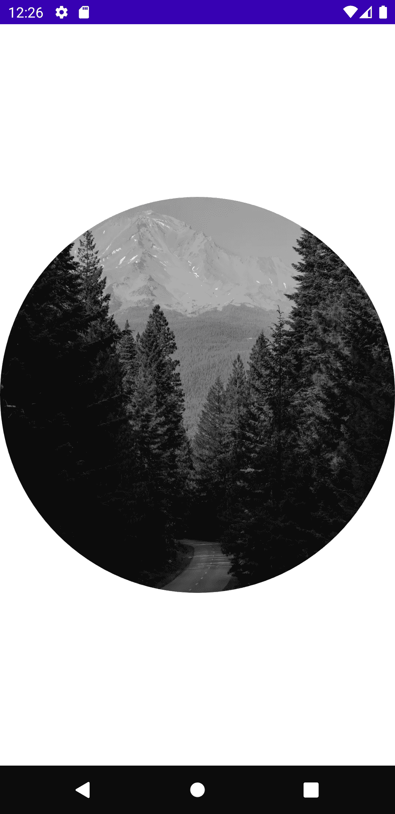

# Jetpack 合成:使用线圈加载图像

> 原文：<https://medium.com/geekculture/jetpack-compose-image-loading-using-coil-647a8098c217?source=collection_archive---------1----------------------->

**Coil**(**Co**routine**I**mage**L**loader)是一个用于 Android 的 Kotlin-first 图像加载库，它在幕后使用了 Kotlin 协程。

> **为什么使用线圈？**
> 
> 它快速、现代且易于使用。
> 
> 它通过自动处理网络请求、图像缓存、请求取消、错误处理、内存管理等，简化了从互联网加载图像的过程。
> 
> 与其他图像加载库不同，Coil 在很大程度上与片段和视图分离。

 [## 喷气背包组合线圈

### 要添加对 Jetpack Compose 的支持，请导入扩展库:然后使用 rememberImagePainter 函数创建…

coil-kt.github.io](https://coil-kt.github.io/coil/compose/) 

1.  **包含依赖关系**

2.**添加权限**

3.**下载图像**

*   我们可以使用`rememberImagePainter`函数创建一个`ImagePainter`,它可以由`Image`组件绘制:
*   `ImagePainter`管理异步图像请求，并处理绘制占位符/成功/错误可画图。

阅读更多关于 [**的内容。**](https://developer.android.com/reference/kotlin/androidx/compose/ui/layout/ContentScale)

4.**变换(高级素材)**

*   转换允许我们在图像从请求返回之前对其进行修改。
*   例如:GrayscaleTransformation(将图像转换为灰度)，CircleCropTransformation(以圆形边界显示图像)，BlurTransformation(模糊整个图像)，RoundedCornersTransformations(将图像的角转换为圆形)，等等。

**多重转化同时进行。**

# 摘要

这是关于 Coil 的基本信息，如果你喜欢它，想探索更多，或者想尝试一下，请点击下面的链接。

[线圈文件](https://coil-kt.github.io/coil/)。

接下来，我们将探索一些其他与 Jetpack Compose 相关的特性。

**到那时快乐作曲。**