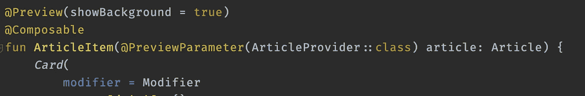
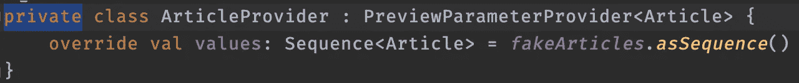

# jetpack Compose:@ Preview parameter 导致预览消失！

> 原文：<https://medium.com/geekculture/jetpack-compose-previewparameter-causes-preview-to-disappear-296cf9423207?source=collection_archive---------25----------------------->

*甚至没有一个错误显示出来*

Photo by [Jason Strull](https://unsplash.com/@jasonstrull?utm_source=unsplash&utm_medium=referral&utm_content=creditCopyText) on [Unsplash](https://unsplash.com/s/photos/home-office?utm_source=unsplash&utm_medium=referral&utm_content=creditCopyText)

我最近一直在探索 Kotlin 多平台移动设备，并在我的 Android 应用程序上使用 Jetpack Compose。

我遇到了一个非常奇怪的情况，我的预览不显示！Android Studio 中甚至没有出现一个错误。🤨

Composable function

以上是我想预览的可组合功能，但 Android Studio 实际上没有显示**任何内容**。空白。空的。我一直来来回回地试图找出是什么导致了这个问题(甚至谷歌搜索也没有帮助)。

## 解决方案🤦‍♂️是…

原来我在`private`中声明了我的`PreviewParameterProvider`,然后把它变成了`public`,或者简单地移除可见性修饰符就可以修复它。

private PreviewParameterProvider

> 这甚至没有记录！

我希望谷歌在文档中说清楚，或者至少在 Android Studio 中给出一个错误，这样开发者就不会遇到这种令人沮丧和浪费时间的情况。

我写这篇文章是希望能帮助一些人。

## 这篇短文就到这里。编码快乐！