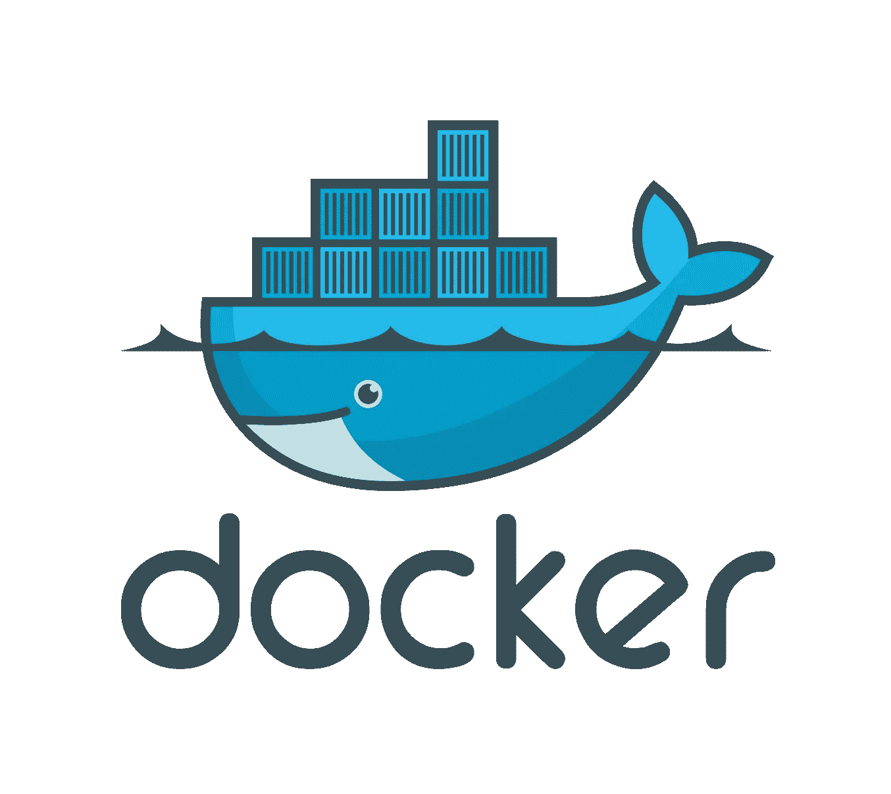
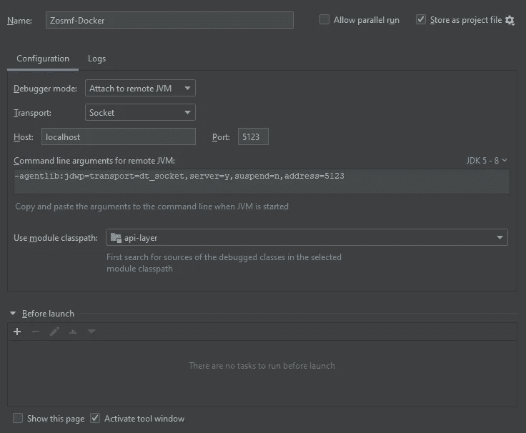
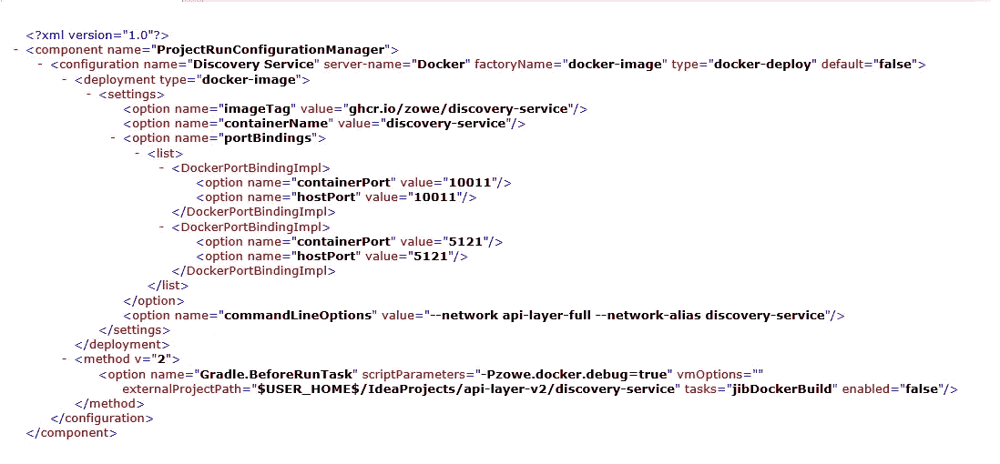

# API 中介层中的 Jib 容器

> 原文：<https://medium.com/geekculture/jib-containers-in-the-api-mediation-layer-a2cf2eefc7de?source=collection_archive---------49----------------------->

上个月，我们引入了 GitHub Actions 作为 Zowe API 中介层的基础设施。主要原因是 GitHub 操作的稳定性和易用性。随着 Zowe 中围绕高可用性(HA)的最新改进，我们需要一个类似于 Zowe 中 HA 设置的设置。



[https://www.shadowandy.net/2015/05/docker-a-highly-portable-and-lightweight-software-container.htm](https://www.shadowandy.net/2015/05/docker-a-highly-portable-and-lightweight-software-container.htm)

GitHub 动作提供了一个简洁的选项，可以在管道实际运行之前通过服务块启动服务。下面是服务的 HA 设置的摘录。完整设置如下:[https://github.com/zowe/api-layer/blob/master/.github/workflows/containers . yml](https://github.com/zowe/api-layer/blob/master/.github/workflows/containers.yml)

```
services:
    nginx:
        image: nginx:latest
        ports:
            - 443:443
        volumes:
            - /$(pwd)/docker/nginx/load-balancer.conf:/etc/nginx
            - /$(pwd)/keystore/docker:/etc/ssl/private
    gateway-service:
        image: ghcr.io/balhar-jakub/gateway-service:${{ github.event.pull_request.number || 'latest' }}
        env:
            APIML_SERVICE_DISCOVERYSERVICEURLS: https://discovery-service:10011/eureka/,https://discovery-service-2:10011/eureka/
    gateway-service-2:
        image: ghcr.io/balhar-jakub/gateway-service:${{ github.event.pull_request.number || 'latest' }}
        env:
            APIML_SERVICE_HOSTNAME: gateway-service-2
            SERVER_INTERNAL_PORT: 10027
            APIML_SERVICE_DISCOVERYSERVICEURLS: https://discovery-service:10011/eureka/,https://discovery-service-2:10011/eureka/
```

为了能够利用这种机制，我们需要能够从我们的服务中构建 Docker 容器。我们选择了 jib 作为选择的方法。Gradle 和 Java 应用程序的工具和集成非常好，分层构建方法非常有效。这也有助于 Docker 本身不需要构建工件。

在这个过程中，我们需要解决几个问题:

*   为特定的拉取请求(PR)获取正确的容器运行
    在上一个版本中，我们依赖于拉取请求的编号来作为在 PR 中使用的特定容器的标签。
*   允许容器化应用程序的本地调试？
    jib . container . JVM flags = project . has property(" zowe . docker . debug ")？['-agent lib:jdwp = transport = dt _ socket，server=y，suspend=n，address=' + debugPort]: []
    基于 zowe.docker.debug 参数我们可以提供远程调试所需的 JVM 参数。一旦提供，它可以通过调试端口远程调试。
*   在容器中配置应用程序
    这是 docker 特有的外部化配置的组合。yml 文件和环境变量，并依靠 Spring 来正确理解它们。

*更新的 app 参数:*jib . container . args =['—spring . config . additional-location = file:/docker/'+component name+'。yml '，'— spring.profiles.include=dev，debug']

*环境变量示例:*API ml _ SERVICE _ DISCOVERYSERVICEURLS:[https://discovery-SERVICE:10011/eureka/，https://discovery-SERVICE-2:10011/eureka/](https://discovery-service:10011/eureka/,https://discovery-service-2:10011/eureka/)

# 如何在本地使用当前版本？

您需要在机器上安装 docker，您希望在机器上运行存储在 Docker 容器中的 API 中介层的完整设置。

构建供本地使用的容器。该命令构建服务的当前版本，并将它们打包到存储在本地 docker 注册表中的容器中。

```
./gradlew jibDockerBuild -Pzowe.docker.debug=true
```

如果您希望能够正确地与本地机器上的容器进行交互，您将需要更新 hosts 文件。在 Windows 计算机中，它存储在 C:\ Windows \ System32 \ drivers \ etc \ hosts 中。在 Linux 和 MacOS 中通常位于/etc/hosts 中。添加以下行:

```
127.0.0.1 caching-service
127.0.0.1 gateway-service
127.0.0.1 discovery-service
127.0.0.1 api-catalog-services
127.0.0.1 metrics-service
127.0.0.1 mock-zosmf
127.0.0.1 discoverable-client
```

*注意:容器化的 API 中介层运行在自己的网络中，主机名代表容器的名称。在网络内，容器通过 URL 相互通信，例如:*[*https://gateway-service:10010/*](https://gateway-service:10010/)*对主机文件的更改允许正确运行集成测试。如果您只想运行容器，则不需要对主机进行更改。容器将在 https://localhost:{ relevant port }*上可用

通过以下方式创建容器将使用的网络:

```
docker network create api-layer-full
```

基于创建的图像创建实际的容器:

```
docker create --name caching-service --network api-layer-full -p 10016:10016 -p 5126:5126 ghcr.io/zowe/caching-service
docker create --name gateway-service --network api-layer-full  -p 10010:10010 -p 10017:10017 -p 5120:5120 ghcr.io/zowe/gateway-service
docker create --name mock-zosmf --network api-layer-full -p 10013:10013 -p 5123:5123 ghcr.io/zowe/mock-zosmf
docker create --name discovery-service --network api-layer-full -p 10011:10011 -p 5121:5121 ghcr.io/zowe/discovery-service
docker create --name discoverable-client --network api-layer-full -p 10012:10012 -p 5122:5122 ghcr.io/zowe/discoverable-client
docker create --name api-catalog-services --network api-layer-full -p 10014:10014 -p 5124:5124 ghcr.io/zowe/caching-service
```

运行容器:

```
docker start mock-zosmf
docker start discovery-service
docker start gateway-service
docker start api-catalog-service
docker start caching-service
docker start discoverable-client
```

此时，您应该能够从主机通过 [https://localhost:10010、](https://localhost:10010,)[https://localhost:10011、](https://localhost:10011,) …或者如果您通过[https://gateway-service:10010、](https://gateway-service:10010,)[https://discovery-service:10011/](https://discovery-service:10011/)更新了您的 hosts 文件

## Intellij Idea 设置

在 Idea 的两个版本(Community 和 Ultimate)中，都可以远程调试容器。运行配置被标记为远程 JVM 调试。mock-zosmf 容器的有效设置如下所示。重要的部分是用来连接的端口。



mock-zosmf debug setup

## 终极简化

在 Idea 的终极版中，可以很好地与 Docker 集成。这允许运行配置启动 docker 容器，并在启动容器之前依赖于 jibDocker 任务的运行。


Visual example of docker configuration for mock-zosmf service



Xml example of configuration for run of specific service