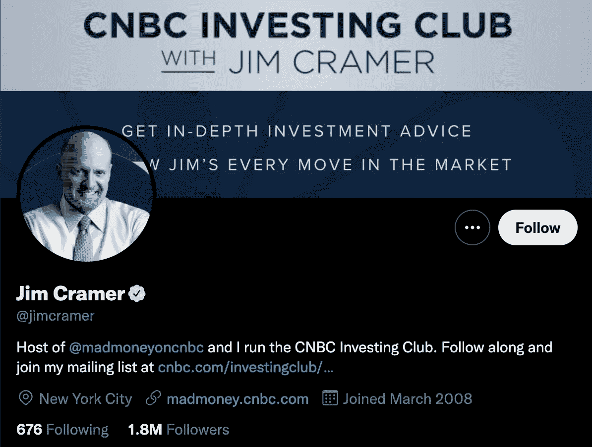
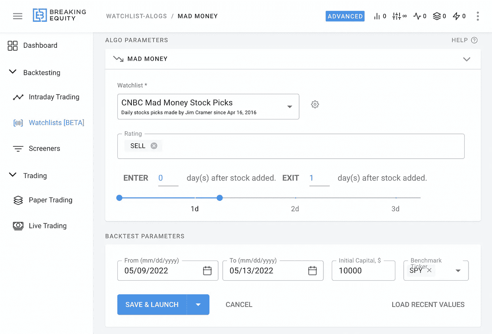
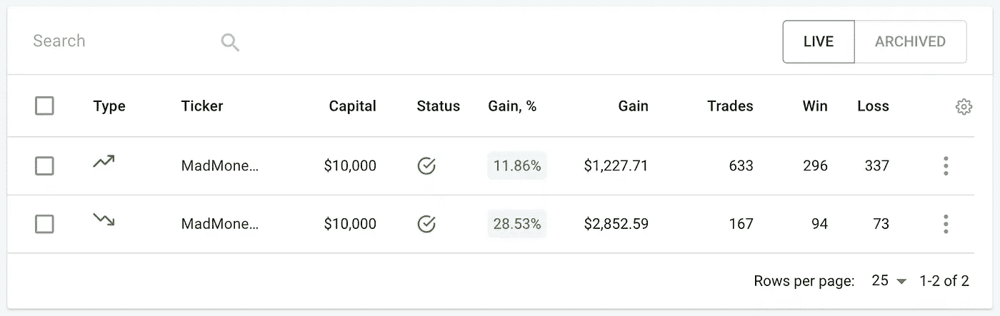
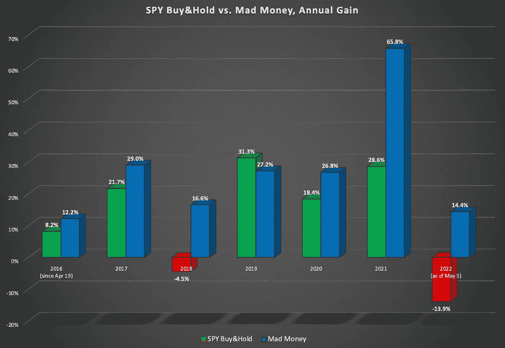

# 吉姆·克拉姆:爱他还是恨他？这里有一个有效的疯狂赚钱策略

> 原文：<https://medium.com/geekculture/jim-cramer-love-him-or-hate-him-heres-a-mad-money-strategy-that-works-24b63170e09f?source=collection_archive---------10----------------------->

有没有想过吉姆·克莱默的选择背后有什么东西？在这里找到答案。

爱他还是恨他:吉姆·克莱默对交易界有着不可否认的影响力。他的节目《疯狂的钱》(Mad Money)在美国东部时间周日晚上 6 点在美国消费者新闻与商业频道播出，每天吸引成千上万的观众，他们利用克莱姆的股票建议寻找进入市场或保持领先的完美公式。

对他的追随者来说，克莱姆的话就是黄金。然而，他的批评者认为，你应该“反其道而行之”。这些观点中哪一个是正确的？

为了更好地了解克拉姆和他的策略的有效性，让我们看看他的背景，并体验和分析他的策略在过去是如何有效的。

# 谁是吉姆·克莱姆，为什么你会关心？

吉姆·克莱默是美国电视节目主持人，前对冲基金经理，企业主和投资者。他出生于 1955 年，父母分别是艺术家和企业家，在涉足投资之前，他曾是一名记者。Cramer 拥有哈佛大学的政府文学学士学位和哈佛法学院的法学博士学位，他用自己的交易利润为哈佛法学院融资。

据估计，克拉默拥有 1 亿美元的净资产，他的财富来自他在对冲基金的工作以及他多样化和创造大量收入流的能力。学术和实践背景看起来令人印象深刻，但他能在实践中准确地应用这些吗？

# 克莱姆的怀疑者

根据 2005 年至 2012 年间的一项研究，Cramer 的准确率为 [46.8%，](https://www.cxoadvisory.com/individual-gurus/jim-cramer-comments-on-our-evaluations-of-his-advice/)在被评估的交易者/公司中处于中间位置。名列榜首的是大卫·纳萨尔，准确率为 82.8%，垫底的是罗伯特·普雷希特，准确率为 20.8%。

克拉默的怀疑者通常会很快指出他的建议中的错误，以下几点通常会浮出水面:

**克拉默反弹**——克拉默在他的《疯狂金钱》节目中推荐的股票在宣布后 [3 到 12](https://www.investopedia.com/terms/c/cramerbounce.asp) 天之间上涨的现象。然而，在这段时间后，股票往往会回到他们的“正常”率。一些研究把这归因于交易启发法。

**Action Alert PLUS**——一项分析 Cramer 的 Action Alerts PLUS 的研究显示，与标准普尔 500 指数的 7.07%相比，该公司的年度回报率约为 [4.08%](https://jor.pm-research.com/content/6/1/45) ，这是其华尔街业务的一部分，其中包括他的许多疯狂投资建议。

**Twitter 的反向 Cramer ETF**——一个专门的 [Twitter 账户](https://twitter.com/CramerTracker)致力于做任何与疯狂资金建议相反的事情。该频道拥有超过 5 万名粉丝，影响力巨大，并利用其平台宣传克莱姆的错误。

# 克拉默的追随者

> *“这是世界上最客观的行业。如果你的数字很糟糕，你就出局了。如果你的数字不错，你会得到更多的钱。这是最符合达尔文主义的，它是美丽的，它是残酷的，它是有效的。”*
> 
> 吉姆·克莱默

从克拉姆的电视节目的寿命来看(超过 15 年)，再加上他的净资产超过 1 亿美元和交易背景，可以顺理成章地假设他对市场略知一二。

他的追随者认为，他热情的个性和向他人教授交易世界的开放态度使他成为新一代交易者的鼓舞力量。让我们看看数字会说些什么…

# 策略:克莱姆反弹

[Breaking Equity](https://www.breakingequity.com/) 追踪自 2016 年以来克莱姆的所有选股，并允许将它们转化为自动化策略。这里有一个特别关注“克莱姆反弹”效应的例子:

*   每天早上 9:30 行动(演出后的第二天)
*   对每一个“买入”交易建立多头头寸，对每一个“卖出”交易建立空头头寸
*   坚持到第二天上午 9:30，平仓，新开仓，每天重复

Strategy Setup in [https://www.breakingequity.com/](https://www.breakingequity.com/)

YTD 结果(2022 年)相当可观: **+11.86%** 长边， **+28.53%** 短边。

这里有一个更好的部分——与 2016 年以来买入并持有$SPY 相比，年同比表现令人印象深刻。虽然手动持续执行这一策略几乎是不可能的，但通过[打破平衡](https://www.breakingequity.com/)，你只需点击几下鼠标就能让它生效。

Performance year over year vs. buying and holding $SPY (LONG & SHORT combined)

# 外卖

说到交易，特别是跟随另一个交易者的话，找到一个你信任的策略是很重要的。永远深入市场，不要盲从。此外，以下建议总是有用的:

*   **交易前先试一试**——虽然市场节奏很快，但通过演示平台先学习基础知识可以让你在拿资本冒险前掌握基础知识。你不必一开始就用活钱交易。
*   **了解更多关于其他交易者的信息**——社交交易包括信任你追随的人做出可靠的市场决策。这就是为什么做你的研究和探索他们过去和现在的市场表现很重要。
*   **像专业人士一样交易**——了解基本知识，了解更多你想追随的交易者或你想探索的策略？太好了！打破公平让你像专业人士一样交易，获得所有最新的数据，更多的是算法交易。

[Breaking Equity](http://breakingequity.com/) 是一个自动化交易平台和市场，供散户投资者构建、购买和出售主动策略。它让积极策略变得更实惠、更包容，以确保散户投资者利用对冲基金的技术和数据，从而创造公平的竞争环境。

免责声明:不是财务/投资建议。在交易或投资前做好调查和尽职调查。