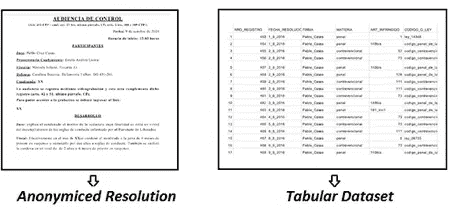

# 阿根廷的差别隐私和公开司法:对公开数据计划的贡献

> 原文：<https://medium.com/geekculture/joint-work-with-pablo-roccatagliata-8b912f72ff29?source=collection_archive---------48----------------------->

与 [Pablo Roccatagliata](https://medium.com/u/ef7c80e54cec?source=post_page-----8b912f72ff29--------------------------------) 合作

Photo by [Jan Antonin Kolar](https://unsplash.com/@jankolar?utm_source=medium&utm_medium=referral) on [Unsplash](https://unsplash.com?utm_source=medium&utm_medium=referral)

与大多数民主国家一样，在阿根廷，司法裁决被视为公共查阅记录，因为它们代表政府行为，因此向公众开放。然而，尽管这些记录是公开的，并涉及政府行为，但它们通常涉及个人数据，这些数据受到各种法律的保护，如欧洲的 GDPR 和阿根廷的个人数据保护法。决议通常包括涉及被告和受害者个人情况的信息。在这种情况下……我们能做些什么来保护个人隐私并保证公众信息的获取吗？

在本文中，我们介绍了一种在阿根廷实施开放司法计划的方法，该方法利用差分隐私框架的发展来发布包含司法判决相关信息的结构化数据集，包括隐私保障。我们根据当前公开司法计划中公布的数据集进行了这项工作，该计划由布宜诺斯艾利斯自治市第 10 法院执行，由 Pablo Casas 法官负责。这项工作的结果表明，有可能实现一个基于不同的隐私输入的解决方案。但是，我们也得出结论，处理大量记录是很方便的。因此，建议司法系统内不同行为者之间进行协调，以集中尽可能多的记录。

## 阿根廷司法信息的获取

Argentina’s Supreme Court House — Photo by [Rafael Leão](https://unsplash.com/@raflfc?utm_source=medium&utm_medium=referral) on [Unsplash](https://unsplash.com?utm_source=medium&utm_medium=referral)

自 2012 年以来，阿根廷参加了世界开放政府联盟。该倡议旨在促进其成员国的透明度和公民参与做法。鉴于这些社会的共和和民主性质，民间社会对国家行政程序的信息和知识的公开构成了对机构质量的基本要求。这些举措已经反映在国家和省级的各种法律和数据开放方案中。在司法领域，主要举措之一是[公开司法方案](http://datos.jus.gob.ar/)，该方案在网上发布联邦和州两级检察机关和法院的活动信息。与该计划并行和互补的是，一些法院实施了公开信息倡议。

根据这些数据开放计划，司法决议的网上公布是根据所谓的 Heredia 规则进行的。这套规则承认网上自由获取政府司法法令的权利，但也承认在互联网上公布上述文件意味着对人们隐私的威胁。因此，它建议删除任何可识别个人身份的信息(PII)以便公布。除了决议文件外，还在网上公布了一个匿名的表格数据集(即不包括任何 PII ),其中载有与决定、案件所涉罪行、被告和受害者有关的信息，特别关注性别暴力的原因。通过这种方式，这些节目不仅寻求宣传政府行为，而且还与调查公众分享相关信息，以了解一些相关的社会事实。

Current Publishing Strategies used un Open Justice Programs

## 隐私挑战

虽然这些信息披露策略遵循有关隐私保护的常规建议和实践标准(例如通过删除 PII 进行匿名化)，但我们会发现这些策略还可以进一步改进。仅仅驱逐 PII 本身并不能保证所涉个人的隐私得到保护。最近有几起案件声名狼藉，这也是原因之一。大概最著名的就是 Netflix 奖案了。2005 年，这家流媒体公司组织了一场比赛来改进其推荐系统，并向参赛者提供了一个据称匿名的数据集(不包括任何 PII)，其中包含用户给出的电影评级。德克萨斯大学的一组研究人员成功地将这个“匿名”数据集与从 IMDb 提取的公共在线数据集联系起来，允许对大量用户进行重新识别(Narayanan & Shmatikov，2006)。

梅奥诊所(Schwartz*et al .)的工作揭示了另一个证据，即通过对以前被认为匿名的信息进行去匿名化，技术能够将我们的隐私置于风险之中。艾尔。*，2019)，该研究已经证明，个人的面部图像可以从核磁共振成像中重建出来，并最终得到识别。Yilung & Kosinsky (2018)提出了另一个令人担忧的发现，他们表明深度神经网络能够检测个人的性取向，甚至比人更精确。

除了这些具体案例，根本问题是我们的虚拟存在越来越多，而且有更强大的技术来处理数据。互联网已经成为一个巨大的个人信息储存库，在过去的几十年里，软件和硬件利用互联网的能力呈指数级增长。因此，像侧写这种在模拟时代只能在理论层面上想象的危险，在数字时代已经变得相当真实。

## 保护个人数据的工具:差分隐私

Photo by [Dan Nelson](https://unsplash.com/@danny144?utm_source=medium&utm_medium=referral) on [Unsplash](https://unsplash.com?utm_source=medium&utm_medium=referral)

鉴于隐私面临的挑战越来越大，近年来一系列被称为隐私增强技术的技术得到了巩固。这些发展使我们能够应对隐私方面的一些挑战，例如上面提到的挑战以及其他挑战。我们将利用差分隐私的贡献，这是一种允许数据共享但限制可以了解的个人信息数量的发展。换句话说，使用差分隐私处理过的数据集将只显示有限的隐私信息。通过这种方式，我们可以确保我们正在共享的任何数据集都不会暴露我们想要的私人信息。对于任何开放数据程序来说，这都是一个伟大的工具！

差分隐私是如何工作的？一个深入的发展将是广泛而复杂的，也有关于这个问题的优秀文章，如[这个](https://becominghuman.ai/what-is-differential-privacy-1fd7bf507049)和[这个其他的，](https://desfontain.es/privacy/differential-privacy-awesomeness.html)，所以这里我们将限制自己提出主要的见解和影响。首先要指出的是，差分隐私本身并不是一种算法，而是指一种源于数学限制的保证。这个保证告诉我们，在一定条件下，任何算法只要符合其形式定义所施加的限制，都可以实现差分隐私。定义差异隐私的直观方法提出了以下建议:

> *因为 D 是具有 n 个记录的原始数据库，并且 D’是包含原始数据库的 n-1 个记录的数据库，所以我们说查询功能机制符合 DP，如果:*

这个直观的定义告诉我们，如果在包含所有记录的数据库上运行时，其结果与在包含相同记录(除了个人记录)的数据库上运行时没有太大差异，则该机制符合差异隐私。如果在两个数据库上该机制的输出非常相似，那么它实际上不会揭示关于个体差异的信息。

实现差分隐私的算法是基于在真实数据上添加噪声。给定查询的输出添加噪声使得任何人都很难知道查询的原始值。最多，您会怀疑查询响应的原始值可能是多少，但是您永远无法知道它们的确切值。通过引入噪声，该算法设法“掩盖”数据集中特定个人的存在，保护他们的隐私。

## 阿根廷司法公开计划的策略

Photo by [Tingey Injury Law Firm](https://unsplash.com/@tingeyinjurylawfirm?utm_source=medium&utm_medium=referral) on [Unsplash](https://unsplash.com?utm_source=medium&utm_medium=referral)

利用差异隐私的发展，我们提出了一个 MVP(最小可行产品)来评估这种方法在处理阿根廷公开司法项目中公布的表格数据集方面的有效性。我们使用了布宜诺斯艾利斯自治市负责 Pablo Casas 法官的第 10 号刑事、不当行为和轻罪法院发布的数据集。

在整个实施过程中，我们得出了实施此类解决方案的某些相关结论:

*   差分隐私算法是“数据饥渴”。为了实现保证信息质量和可靠的安全级别的输出，必须有大量的记录可用。从这个意义上说，并鉴于司法系统的原子性质，其中有大量的利益攸关方，出现了协调的挑战。
*   记录的可用性决定了要采用的出版格式。虽然我们之前没有深入探讨这一点，但我们必须记住，差分隐私算法允许以各种格式处理信息，从简单的单变量频率分布表到双变量列联表，最后是合成数据集。然而，当我们从简单的格式转向更复杂的格式时，产生这些输出的最少记录数也会增加。在我们的练习中，我们已经处理了来自一个法院的数据(包含大约 4000 条记录，不到 800 条关于性别暴力原因的记录)，我们只能构建单变量频率分布表。
*   基于差别隐私的发布策略必须执行非常精确的操作，以确定您想要发布什么信息。必须认真考虑这些数据用户的信息需求。发布的信息必须按优先顺序排列，并以满足用户需求的方式呈现。这不仅意味着公共信息的使用和目的存在深刻的问题，而且意味着各机构之间要进行协调，以实现收集和发布信息的统一标准。
*   我们认为，有必要考虑这种类型的开放数据项目的最佳隐私级别。在这次辩论中，必须首先考虑这样一个事实，即决议的书面文本总是可以以某种方式获得(记住这是一项法律要求)。另一方面，我们还必须考虑这些隐私级别如何影响输出质量。隐私级别越高，算法引入的噪音就越多，因此记录就越远离现实。在这一点上没有技术上的答案，因为理想是社会、道德、政治和法律考虑的结果。然而，我们认为，这是一个必须解决的问题，无论最终决定如何，这样数据开放计划可以最大限度地提高整个社会的福祉，而不会陷入以前没有考虑过的隐私风险，并且只假设那些是社会可以接受的。

## 参考资料:

[1]:您可以在这里访问法院 N 10 [的公共存储库。](https://drive.google.com/drive/folders/0B9wNhp3GjjazZ2VCQVZmM3MwTTQ?resourcekey=0-s10MrFRR0gmOd1TgrDZs7g)此外，你可以查看他们的[推特账户](https://twitter.com/jpcyf10)，他们在那里发布相关事件和项目的信息和更新(如开放数据和参与式政府项目)。

[2]:美国国家标准与技术研究院对 PII 的定义是“由某个机构维护的关于个人的任何信息，包括(1)可用于区分或追溯个人身份的任何信息，如姓名、社会安全号、出生日期和地点、母亲的娘家姓或生物特征记录；以及(2)与个人相关或可与之相关的任何其他信息，如医疗、教育、财务和就业信息。”

[3]:关于差分隐私的深入讨论，我们推荐阅读 Dwork & Roth (2014)的著作。

## 书目:

巴伯格雷森。(2006).《政府档案中的个人信息:保护隐私中的公共利益》*。*在*路易斯酒吧。L. Rev.* ， *25* ，63。

德沃克，辛西娅&罗斯，亚伦。(2014).“差分隐私的算法基础”。在*理论计算机科学的基础和趋势*，9(3–4)，211–407。

纳拉亚南，阿尔温德&什马蒂科夫，维塔利。(2006).“如何打破网飞奖数据集的匿名性”。在*密码学与安全*中，eprint arXiv:cs/0610105。

克里斯托弗·施瓦茨；沃尔特·k·克雷默斯；特里·瑟诺；理查德·夏普；杰弗里·冈特；维木里、普拉尚提；李北的阿拉尼；安东尼·斯皮查拉；坎塔尔奇、凯哈尔；戴维·克诺普曼；罗纳德·彼得森；克利福德·r·小杰克(2019)。“使用面部识别软件识别匿名 MRI 研究参与者”。在*新英格兰医学杂志*， *381* (17)，1684–1686。

丹尼尔·索洛夫(2002 年)。隐私法的现代研究:数据隐私立法的通知、自治和执行:访问和汇总:公共记录、隐私和宪法。在*明尼阿波利斯市*， *86* ，1137–1174。

王，伊伦&科辛斯基，米哈尔。(2018).“深度神经网络在从面部图像中检测性取向方面比人类更准确”。在*人格与社会心理学杂志*，114 卷 2 期，246 页。