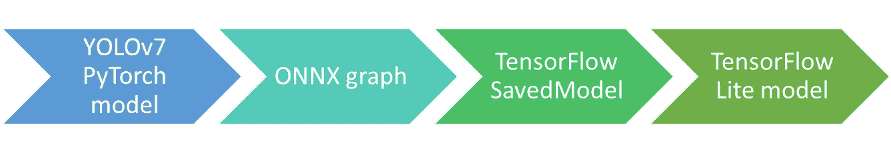
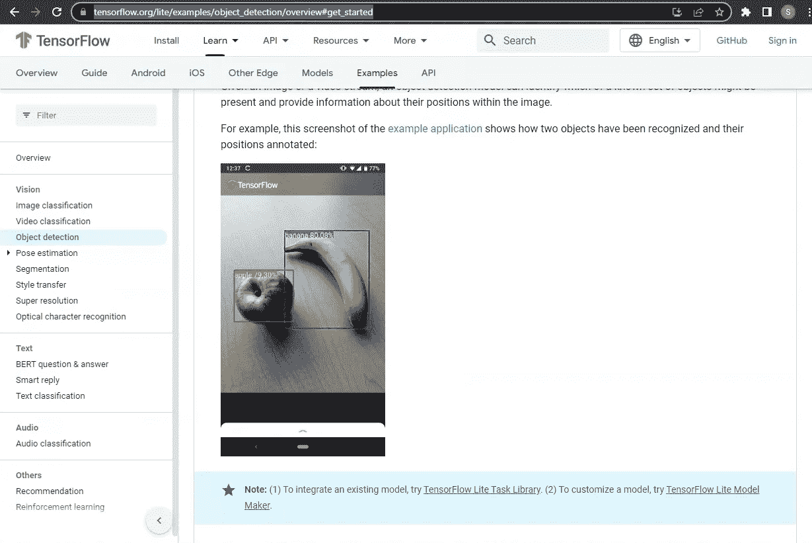
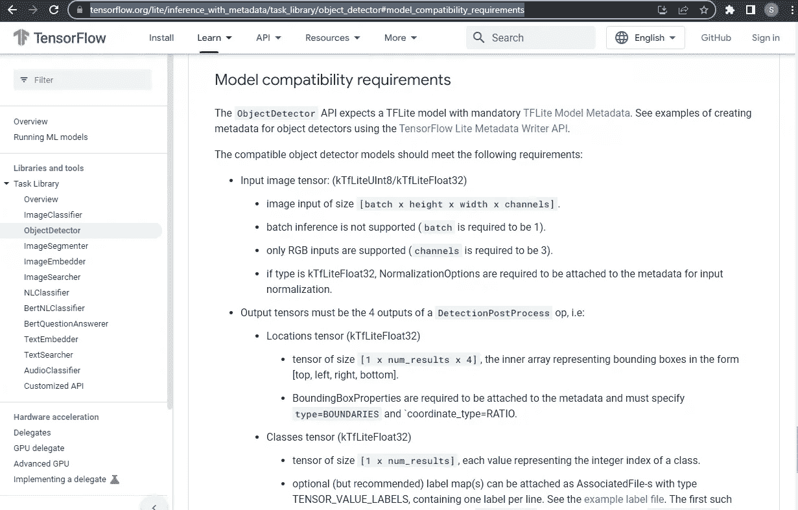
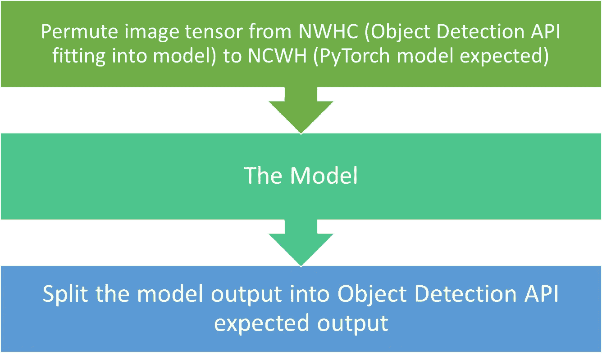
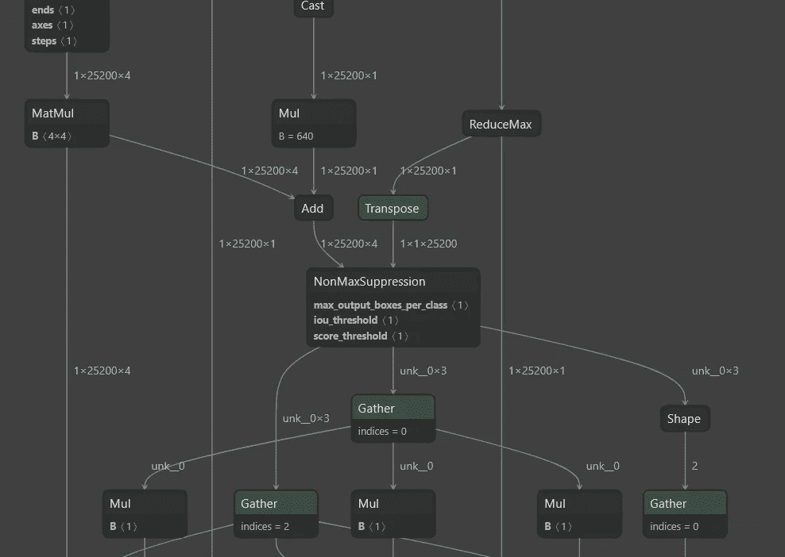
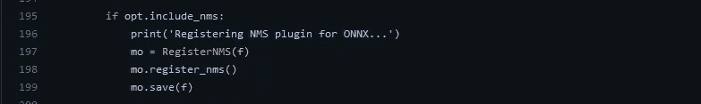
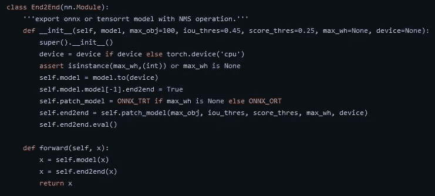
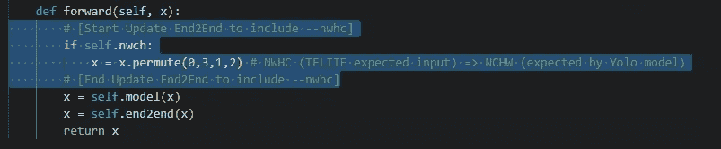
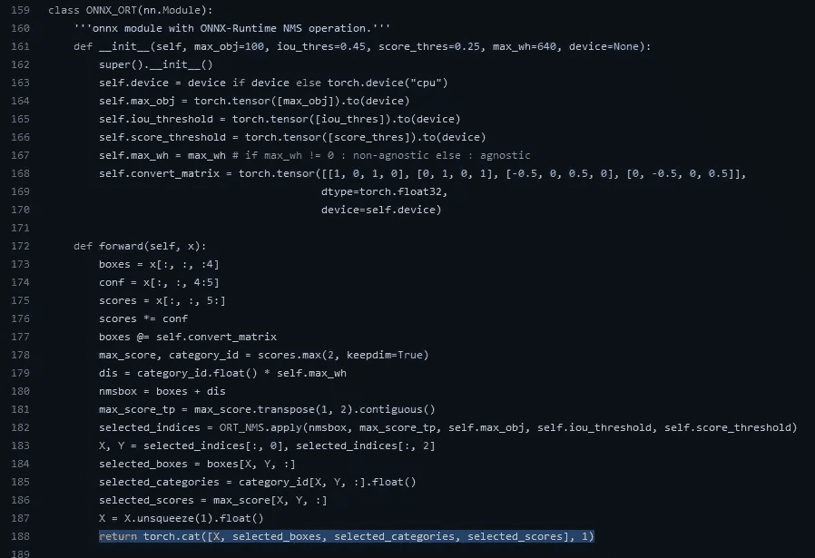
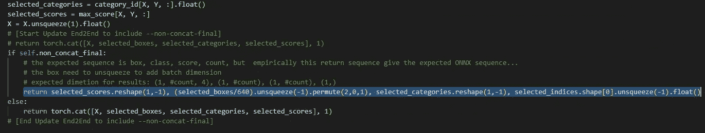

# 将 YOLO v7 模型放入运行在 Android 上的 TensorFlow Lite(对象检测 API)模型的旅程

> 原文：<https://medium.com/geekculture/journey-putting-yolo-v7-model-into-tensorflow-lite-object-detection-api-model-running-on-android-e3f746a02fc4?source=collection_archive---------1----------------------->

# 前言

这篇文章不是关于如何将 PyTorch 模型转换为 Tensorflow Lite 模型的教程，而是我尝试在边缘设备(例如，Android)上使用 YOLO v7(微型)PyTorch 模型的旅程的总结。

这篇文章可能没有使用最佳选项，因为它主要局限于我自己的技能和我的目标。

## 我的技能

我认为自己足够了解 PyTorch，在使用 Tensorflow.js 和 Keras 方面经验很少，但绝对没有使用 TensorFlow v1 和 TensorFlow Lite 的经验。

此外，我主要用 React Native 开发移动应用程序，因此学习如何开发 Android 应用程序是另一个挑战。

## 那为什么不 TensorFlow.js + React Native 呢？

我看到人们使用 TensorFlow.js 和 React Native 在移动设备上放置模型。但我的目标是将它放在边缘设备上，如 Raspberry Pi 或甚至 ESP32/Arduino 设备(不太可能有 YOLOv7 这样的巨型模型)，所以我坚持使用 TensorFlow Lite(甚至 TensorFlow Lite micro，这可能更具挑战性)

## 前言结束

我希望这篇文章能为那些想做同样或类似练习的人提供一些有用的信息。

# 我的皈依之旅



这是我努力实现目标的道路。网上有很多关于如何将 PyTorch 模型转换为其他格式的文章(有些文章确实有相同的目标— TensorFlow Lite)，那么我的旅程有什么特别之处呢？

## 我使用的图书馆

1.  **PyTorch to ONNX** — YOLO v7 源代码提供了代码，它不仅覆盖了图形，而且令人惊讶的是，非最大值抑制操作也包含在图形中
2.  **ONNX to TensorFlow** —一个叫 onnx-tensorflow ( [Github 链接](https://github.com/onnx/onnx-tensorflow/))的库，我相信这是 ONNX github 组织下最官方的库了
3.  **TensorFlow 到 TensorFlow Lite** —官方 TensorFlow Python 库中的 TensorFlow Lite 转换器(tf.lite.TFLiteConverter)

# 打嗝/障碍

## PyTorch YOLO v7 模型与 TensorFlow Lite 对象检测 API 要求之间的输入/输出差异

***首先，为什么坚持使用 TensorFlow Lite 对象检测 API？***

这是因为我不想从头开始开发 Android 上的客户端应用程序，所以我重用(更新)了 TensorFlow Lite 中的示例应用程序，它使用了对象检测 API。

另一种方法是使用较低级别的 TensorFlow Lite 解释器 API，它可以在解释器会话运行之前和之后做任何事情，但需要对 Android 应用程序进行大量修改。



[https://www.tensorflow.org/lite/examples/object_detection/overview](https://www.tensorflow.org/lite/examples/object_detection/overview)

***问题/症状***

因此，在经历了从 PyTorch 到 TensorFlow Lite 模型的转换代码后，将模型加载到应用程序中，应用程序抱怨它无法模仿模型。

在“adb logcat”的帮助下[这是为了提醒自己是如何实现的]，我看到错误是关于期望的输入维度的。

根据[型号兼容性要求](https://www.tensorflow.org/lite/inference_with_metadata/task_library/object_detector#model_compatibility_requirements):



***输入差值***

PyTorch 图像处理使用布局 NCWH(批量大小、通道、宽度、高度)，而 TensorFlow Lite 要求 NWHC(批量大小、宽度、高度、通道)，这需要张量轴的置换。

***输出差值***

这是关于 YOLOv7 模型预测输出，该模型会将每个检测结果的边界框、置信度得分和类别连接成大小为 6 的 1 个张量，如下所示:[x0，y0，x1，y1，score，class]

***我尝试过/考虑过的***

**1。[失败 Android 应用程序/ TensorFlow Lite 库级别**

我探索的第一件事是在 Android 应用程序级别，我发现对象检测 API 似乎不是用 Java 编写的，TensroFlow Lite Java 库通过 jni 与之交互，人们可以在 [tflite-support github 查看源代码以获得对象检测的 jni 实现](https://github.com/tensorflow/tflite-support/blob/master/tensorflow_lite_support/java/src/native/task/vision/detector/object_detector_jni.cc)(用 C 编写)，所以看起来像是使用对象检测 API。

**2。【使用】模型(在链中)级别**

另一个想法是用转换步骤包装模型，以使预期的输入和输出一致。



这条道路上有许多模式:

**tensor flow Lite model**——这是以 flatbuffer 格式存储的，看起来不会被篡改

**TensorFlow SavedModel** —以我对 TensorFlow 有限的了解，这个保存的模型应该被认为是静态图，虽然人们可能能够将其转换为 Keras 模型(或者 ONNX 导出到 Keras 模型，而不是这个静态图模型)并执行修改，但我选择通过。

**ONNX graph** —这是我最初的候选，我相信有一种方法可以执行这样的操作，因为它实际上是一个图形(模型中的每一层都被视为图形节点，计算是边)。

这种方法在 Nvidia 的 TensorRT onnx-graphsurgeon 库中是可行的，他们有如何修改图形的[示例](https://github.com/NVIDIA/TensorRT/tree/main/tools/onnx-graphsurgeon/examples)，所以我想在原始输入之前添加一个置换(NWHC 到 NCWH)节点，并在最后删除 concat 节点。

我最终放弃了这个想法，因为我当时对图形结构不是太确定。

**PyTorch 模型** —我没有考虑在 PyTorch 模型中执行“外科手术”作为首选，因为这涉及到模型向前传递后的“非最大抑制”操作，所以即使我可以用前面的置换操作包装 PyTorch 模型(nn.module)，我仍然需要弄清楚非最大抑制如何进入 ONNX 导出的模型(作为图形操作而不是某种循环程序代码，我承认当我看到它时感到非常惊讶)。



the NonMaxSupression operation inside the ONNX exported graph, visualized with Netron ([https://netron.app/](https://netron.app/))

所以我所做的是打开源代码并跟踪 YOLOv7 [export.py](https://github.com/WongKinYiu/yolov7/blob/main/export.py) 代码，我看到试图为 ONNX 注册 NMS 插件的行，所以我猜测，非最大值抑制是在 ONNX 中预实现的，所以这就是神奇发生的地方。



***我的【方案】***

找到了神奇的地方，我决定将 github 项目民间化并更新源代码。

对于输入 NWHC => NCWH，我更新了 experiemental.py 中的 End2End 模块



Original



Updated with an permute action (conditioned)

为了“分割”输出，我在 experimental.py 文件的 ONNX_ORT 模块中设置了条件



Original



Updated to return 4 elements instead of concatenated result

```
return selected_scores.reshape(1,-1), (selected_boxes/640).unsqueeze(-1).permute(2,0,1), selected_categories.reshape(1,-1), selected_indices.shape[0].unsqueeze(-1).float()
```

共有 4 个部分:

1.  **输出序列**—tensor flow Lite 模型的预期序列应该是 ***(包围盒，置信度得分，类别，检测结果数)*** 但是这里我返回了 ***(得分，包围盒，类别，检测结果数)*** ，这纯粹是经验主义的，不确定在操作的转换链中哪里弄乱了序列，Android 应用程序会抱怨 dimension(这花了我不少时间才弄明白)
2.  **边界框除以 640**—yolov 7 tiny 模型运行在固定的 640 x 640 输入上，边界框输出范围是(0，640)，但是对象检测 API 期望比率，所以简单的做法是用 640 除它(这里是固定的，所以现在是硬编码的)
3.  **检测到的项目数** —我第一次使用 len(selected_boxes)时，出现了一个错误(我忘了是因为 Android 应用崩溃还是因为导出)，但原因很简单，ONNX 导出期望跟踪张量的图形数据流，而 len(selected_boxes)切断了跟踪路径，因此对于检测到的结果数，输出将会丢失，经过一些尝试和错误，这个***selected _ indexes . shape[0]。unsqueze(-1)。(*** 浮空招数
4.  为什么？float()？—这是因为 PyTorch Tensor.shape 输出是整数，这使得它不同于其他 3 个元素(它们都是浮点的)，TensorFlow Lite 不喜欢它

# 中断

还有一些关于 Android 应用程序的部分，但我想我会暂停在这里，提供更多的更新。

无论如何，通过这个旅程导出的 TensorFlow Lite 模型确实可以在 Android 应用程序中工作，但它太慢了(CPU 2 线程推理花费了大约 1500 毫秒，相比之下，高效 Det v2 量化仅为大约 400 毫秒，而 MobileNetv1 量化为大约 80 毫秒)

YOLO v7 的量子化……是我一直在做的一项任务，但至今没有任何成果……

(待续……)