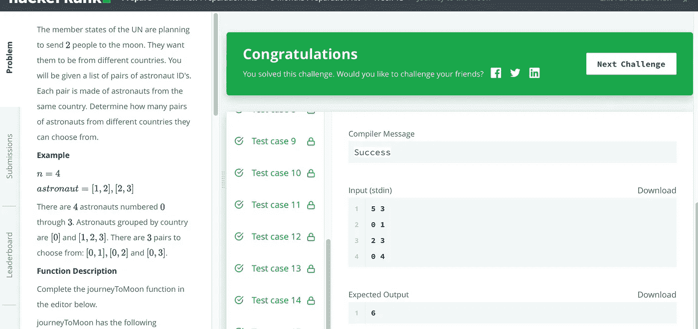

# 月球之旅——黑客难题

> 原文：<https://medium.com/geekculture/journey-to-the-moon-hackerrank-hard-problem-29fd999aedd0?source=collection_archive---------8----------------------->

## 解决黑客难题，月球之旅，在 Java 中


Photo by [Markus Spiske](https://unsplash.com/@markusspiske?utm_source=medium&utm_medium=referral) on [Unsplash](https://unsplash.com?utm_source=medium&utm_medium=referral)

《月球之旅》是一个 HackerRank 难题，但却是一个典型的联合问题。使用 union 或 group lib 可能很简单。这里将实现一种高效的 Java 方式。

## 问题

联合国成员国正计划将两个人送上月球。他们希望他们来自不同的国家。你会得到一份宇航员身份证的清单。每一对都由来自同一个国家的宇航员组成。确定有多少对来自不同国家的宇航员可供选择。

HackerRank 原始问题:

[](https://www.hackerrank.com/challenges/journey-to-the-moon/problem) [## 月球之旅| HackerRank

### 联合国成员国正计划把人送上月球。他们希望他们来自不同的国家。你…

www.hackerrank.com](https://www.hackerrank.com/challenges/journey-to-the-moon/problem) 

## 解决办法

这里将用 Java 实现它，以便于理解。请注意:在 Java 中使用 long 表示一个大的数字。您需要修改现有的 HackerRank 代码以使其工作。

```
import java.io.*;
import java.math.*;
import java.security.*;
import java.text.*;
import java.util.*;
import java.util.concurrent.*;
import java.util.function.*;
import java.util.regex.*;
import java.util.stream.*;
import static java.util.stream.Collectors.joining;
import static java.util.stream.Collectors.toList;

class Result {

    /*
     * Complete the 'journeyToMoon' function below.
     *
     * The function is expected to return an INTEGER.
     * The function accepts following parameters:
     *  1\. INTEGER n
     *  2\. 2D_INTEGER_ARRAY astronaut
     */

    public static long journeyToMoon(int n, List<List<Integer>> astronaut) {
    // Write your code here
        int [] parent = new int [n];
        long [] num = new long [n];
        for (int i = 0; i < parent.length; i++) {
            parent[i] = i;
            num[i] = 1;
        }

        for (List<Integer> ast : astronaut) {
            int p1 = findPar(ast.get(0), parent);
            int p2 = findPar(ast.get(1), parent);
            if (p1 != p2) {
                union(p1, p2, parent, num);    
            }
        }

        long total = 0;
        long prvNum = -1;
        for (int i = 0; i < parent.length; i++) {
            if (i == parent[i]) {
                if (prvNum == -1)
                    prvNum = num[i];
                else {
                    total += prvNum*num[i];
                    prvNum += num[i];
                }    
            }    
        }

        return total;
    }

    static int findPar(int p, int[] parent) {
        if (p == parent[p]) return p;
        return parent[p] = findPar(parent[p], parent);    
    }

    static void union(int p1, int p2, int[] parent, long[] num) {
        if (num[p1] <= num[p2]) {
            parent[p1] = p2;
            num[p2] += num[p1];
        }    
        else {
            parent[p2] = p1;
            num[p1] += num[p2];
        }
    }
}

public class Solution {
    public static void main(String[] args) throws IOException {
        BufferedReader bufferedReader = new BufferedReader(new InputStreamReader(System.in));
        BufferedWriter bufferedWriter = new BufferedWriter(new FileWriter(System.getenv("OUTPUT_PATH")));

        String[] firstMultipleInput = bufferedReader.readLine().replaceAll("\\s+$", "").split(" ");

        int n = Integer.parseInt(firstMultipleInput[0]);

        int p = Integer.parseInt(firstMultipleInput[1]);

        List<List<Integer>> astronaut = new ArrayList<>();

        IntStream.range(0, p).forEach(i -> {
            try {
                astronaut.add(
                    Stream.of(bufferedReader.readLine().replaceAll("\\s+$", "").split(" "))
                        .map(Integer::parseInt)
                        .collect(toList())
                );
            } catch (IOException ex) {
                throw new RuntimeException(ex);
            }
        });

        long result = Result.journeyToMoon(n, astronaut);

        bufferedWriter.write(String.valueOf(result));
        bufferedWriter.newLine();

        bufferedReader.close();
        bufferedWriter.close();
    }
}
```

以上在 Java 8 中 100%通过，如下:



编码快乐！

*问题，想法？在这里留下评论。跟随我成为有趣的解决问题之旅的一部分。*