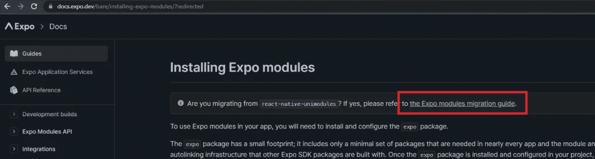
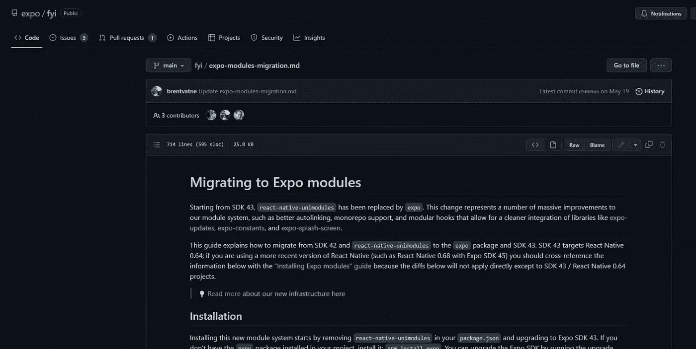
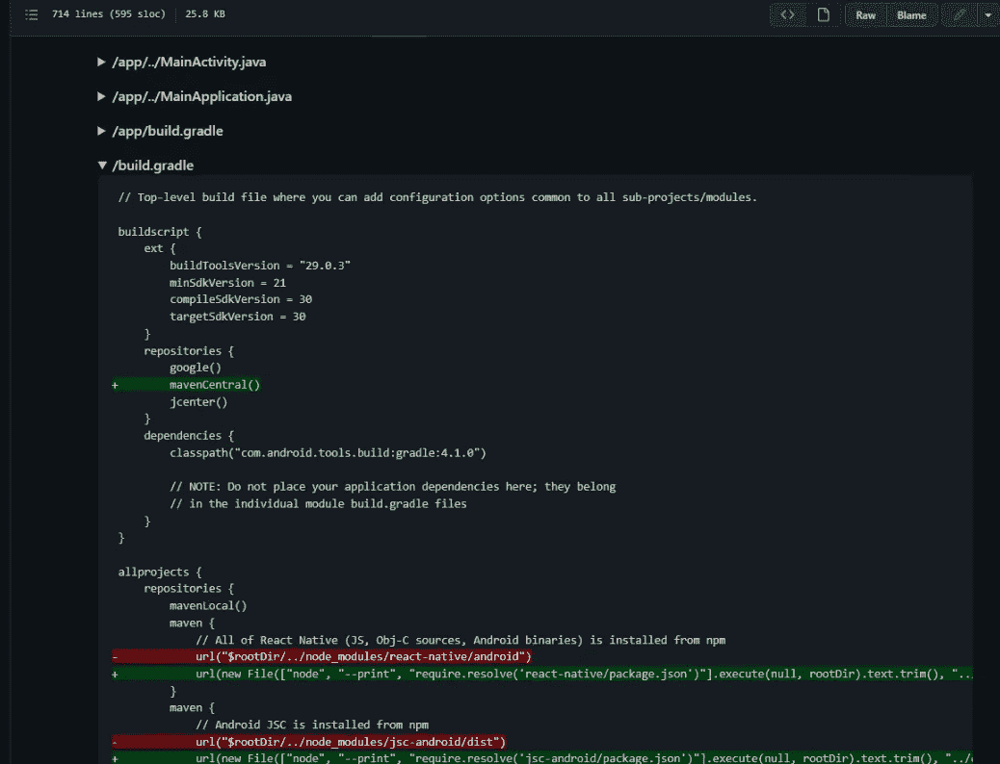
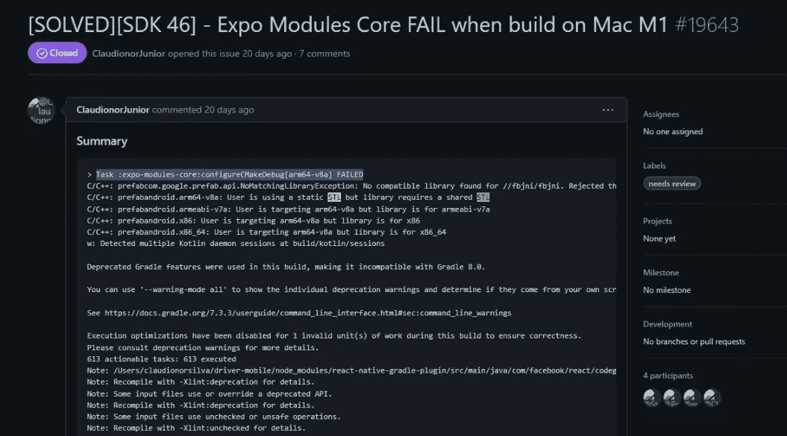

# 更新过时的被驱逐的世博会反应原生项目之旅

> 原文：<https://medium.com/geekculture/journey-to-update-an-outdated-ejected-expo-react-native-project-9f808134bf13?source=collection_archive---------7----------------------->

# 背景

有一个我正在做的反应性本地项目，如下所示:

1.  自然反应 0.67
2.  (弹出)世园会 SDK 40
3.  反应 16.13.1
4.  瞄准 Android SDK 30
5.  瞄准 iOS 11

弹出的 expo 加上旧的 react 原生包引入了一些问题，比如新的包会与旧的版本冲突，因此构建会失败。

还有一些次要问题，那就是 react-native-uni module 和 expo 模块之间的冲突。

# 方法

## 更清洁的方法(我相信)

即使有一个退出的博览会项目，一篇文章建议删除“ios”和“android”文件夹，升级博览会，然后再次退出，然后跟进

我相信，这将使博览会能够解决之前手动引入的所有问题，并遵循最佳实践。

顺便说一下，expo 有模板来帮助理解他们的 [git repo](https://github.com/expo/expo/tree/main/templates) 中的预期工作“ios”和“android”文件夹(作为样板),这实际上在整个旅程中对我帮助很大。

## 为什么不采取更干净的方法(对我来说)？

我看到有一些自定义模块引入了对 app build.gradle 的编辑，以包括一些额外的自定义 Java 模块以及初始化和注册，通过使用更简洁的方法，可能会破坏或丢失这些代码(我对此并不了解)。

# 任务和问题

## 去除反应-天然-单模块

即使我们退出了 expo，我们的项目中也使用了相当多的 expo 包，所以仍然会有对 expo 模块的引用(从 Expo SDK43 开始，它正在取代 react-native-unimodules )?) )，所以我决定一劳永逸地摆脱反应原生单模块。

任务不知何故是直截了当的，我按照世博会的[文件如下:](https://docs.expo.dev/bare/installing-expo-modules)

follow this link and land at [https://github.com/expo/fyi/blob/main/expo-modules-migration.md](https://github.com/expo/fyi/blob/main/expo-modules-migration.md)

They have steps to edit which file and expected changes

请注意，上面的文章假设移除了 expo-updates 包，这对我来说是有意义的，因为我正在退出 expo，所以没有必要通过 expo-updates 更新应用程序(到 expo 应用程序)。

## 包装升级(使用纱线)

这应该是直截了当的，但是我采取了谨慎的方式来检查是否有任何突破性的变化，比如关于包版本的 API 变化(例如，react-native-resimated)

**问题:得到“任务:Expo-modules-core:configurecmakdebug[arm 64-v8a]FAILED”**

它抱怨 fbjni 没有兼容库，并显示错误消息“用户正在使用静态 STL 购买库需要共享 STL”

与下面 Expo 上的这个[问题](https://github.com/expo/expo/issues/19643)完全相同的错误(这个问题的解决方案是重建不适合我的环境，另一个提到的[问题](https://github.com/expo/expo/issues/18473)也不适合我的情况)

我尝试更新的东西有几个:app build.gradle(参考[这个](https://github.com/facebookincubator/fbjni/issues/50))

1.  include externalnativebuild . cmake . arguments(包括-DANDROID_STL=c++_shared)配置
2.  add Android . build feature . prefab = true
3.  使用 NDK 建立和设置类似的 STL 设置

由于配置试图使用 prefab 来打包 fbjni，而 cmake 配置位于 expo-core-modules 中(在 node_modules 内部),所以上面的方法不起作用，所以我也试图在 expo-core-modules 中添加 externalnativebuild . cmake . arguments，但仍然不起作用。

我检查了 expo-core-modules 的 cmake.txt 已经明确地将 stl 设置为使用 c++_shared，但是 expo-core-modules 的 build 文件夹中生成的“prefab_command”仍然将 STL 设置为 c++static。

***解***

我的解决方案是将世博核心模块从 0.11.8(由世博 SDK 46 作为对等依赖项安装)升级到世博核心模块^1.0.0，这样就不需要进行上述所有“不起作用”的更改，问题也就解决了。

请注意，因为 Expo SDK 46 相关模块(如 expokeepalive、expolineargradient、exp localization……)针对的是 iOS 12，而 expo-core-modules ^1.0.0 针对的是 iOS13，所以在构建时会有错误。解决方案是转到 XCode，在左侧面板 Pods > DevelopmentPods 组，本地投诉的 Pods，打开他们的 podspec 文件，将目标 iOS 更新到 13，然后进入终端并执行“pod 安装”，清理构建和重建，这样就可以工作了。

# 什么没有被改变

以下是我没有尝试过的一些事情:

使用世博新架构——因为我们正在开发世博工作流程，所以我不会花时间在这上面

使用 hermes 引擎——这一个被跳过，只是因为在某些时候有一些参考说移除 hermes 将修复一些问题，并且我不敢回去启用 hermes，当事情目前工作正常时。

# 结论

我开始重新考虑 react native 和 Flutter 这种一次编写并应用多个平台的方式。

我仍然喜欢 React Native，我喜欢它允许我快速制作原型，但是在某些时候(在我的项目中)，当引入新的包时，我面临的包冲突几乎会时有发生。

此外，从这次练习中，我学到了很多关于 iOS 和 Android 的 Gradle 设置、部署和打包的知识，我希望它能帮助我在将来排除故障(本机或 React 本机应用程序)。