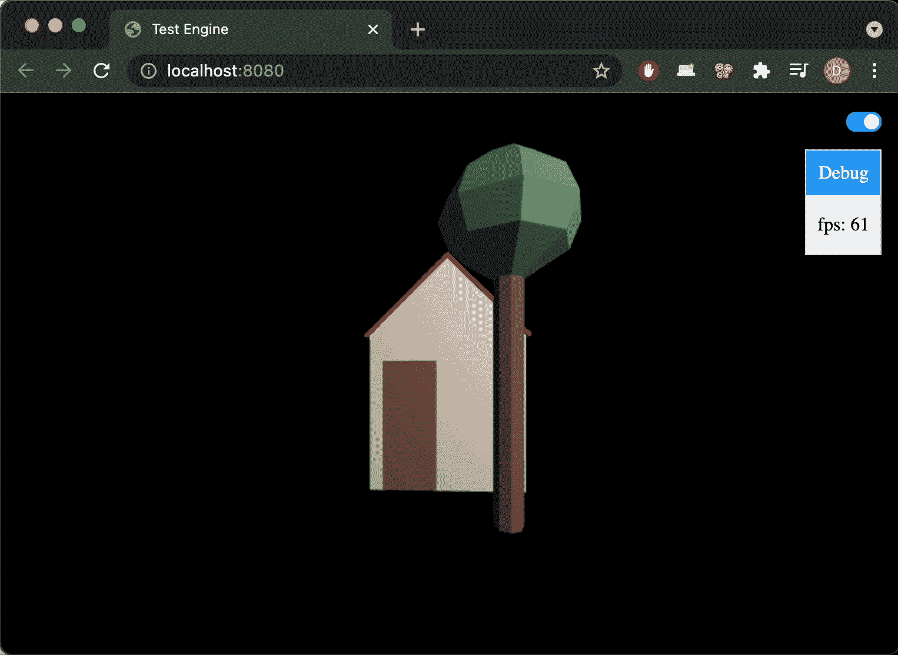
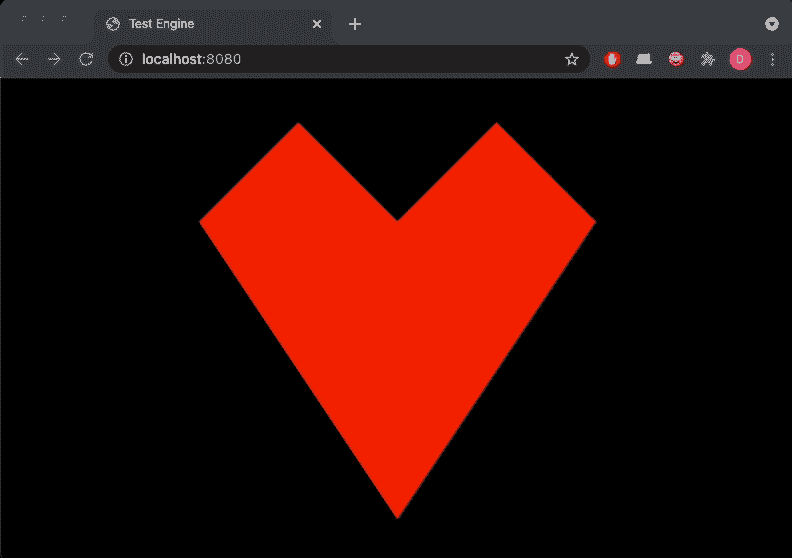

# 欢乐与痛苦|一个月的网络日志

> 原文：<https://medium.com/geekculture/joy-and-misery-a-month-of-webgl-d050ef3f93e6?source=collection_archive---------11----------------------->

初学者回顾展。

# 介绍

显然，YouTube 算法已经厌倦了在凌晨 3 点向我展示令人垂涎的烹饪视频，而是决定让[视频游戏开发讲座](https://www.youtube.com/watch?v=ZW8gWgpptI8)和[开发博客](https://www.youtube.com/user/ThinMatrix)风靡一时……所以……一件事接着一件事，我现在就在这里，过去一个月几乎所有的空闲时间都在用 WebGL 学习浏览器的图形编程。

***(注意:gif 可能需要一两分钟渲染)***

Result after a month of work (FPS reduced for GIF)

最终，我没有造出一款游戏。或者游戏引擎。公平地说，在目前的状态下，它只是一个 3D 资产浏览器——而且是一个可笑的准系统。虽然这可能是最痛苦的，但却是我从学习编码的早期就开始的有趣而有意义的学习之旅。因此，我觉得有必要写一篇关于我使用 WebGL 的经历的回顾，要么让你对尝试一下 web GL 感到非常兴奋，要么让你做出明智而有意识的尝试，不惜一切代价避免它。

# WebGL 是什么？

WebGL 是一个用于浏览器的图形渲染 API，并且是支持一些众所周知的框架如 [three.js](https://threejs.org/) 的底层技术。简单来说，WebGL 的工作就是消耗数据(顶点位置，法线，纹理等。)，处理上述数据(通过着色器)，并决定屏幕上任何给定像素的颜色。如果你要显示的东西应该以任何方式移动或改变，你最好希望每个像素每秒移动 30 或 60 次。WebGL 负责的区域是 WebApp 中 HTML Canvas 元素所占据的区域。

为了完成这样的壮举，你希望能够利用 GPU。要在浏览器中实现这一点，您可以使用 JavaScript ( [或任何其他编译成 WASM](https://www.freecodecamp.org/news/how-to-use-webgl-shaders-in-webassembly-1e6c5effc813/) 的应用程序)与 WebGL API 进行交互。在内部，您的浏览器会将任何 WebGL API 调用映射到 OpenGL API 调用，这在语法方面本质上是相同的，并且是由您的操作系统提供的 API，由您的 GPU 实现。因此，任何 WebGL 操作最终都将直接在 GPU 上执行。

虽然 WebGL 是目前唯一被浏览器广泛支持的图形渲染 API，但重要的是要注意 OpenGL 远不是唯一可用的图形 API 规范。OpenGL 的好处是它被设计成一个跨平台的 API，不像 Windows 的 DirectX 或者苹果的 Metal。在这个模块上还有一个相当新的跨平台图形 API，叫做 Vulkan，它也有一个 W3 草案，通过一个目前叫做“WebGPU”的 API 来支持浏览器。Vulkan 的好处是对 GPU 的低级控制，并且具有更大的优化潜力和更好的性能。我们预计最初的浏览器支持将于 2022 年开始，但要获得足够广泛的支持来保证实现 WebGPU 可能还需要一段时间。所以现在只能期待了。

My very first successful render — gotta feel the love

# 2021 年何必再纠结 WebGL？

WebGL 从 2010/11 年就出现了，但它感觉现在构建复杂的图形应用程序以直接在浏览器中运行变得越来越可行。随着 PWAs、WASM 近乎原生的性能以及浏览器变得越来越强大，它们越来越成为应用程序开发领域的中心。因此，现在可能是学习图形编程以及在您的浏览器环境中可以做些什么的最佳时机。

# 学习 WebGL 的理由？

那么，我能用它造出什么了不起的东西呢？或者换句话说:我为什么要费心去了解它呢？嗯，如果你同意浏览器将成为未来应用程序的“首选”平台这一假设，那么将我们自己限制在 DOM、CSS、图像和简单的画布上进行可视化表示对于任何涉及复杂图形的用例来说都是一个巨大的限制。

例如，想象构建具有网络提供的互联性的所有好处的 VR 应用程序——从一个应用程序平稳地跳到另一个应用程序，就像打开一个新的浏览器标签，交叉链接体验和无缝协作。本质上，你可以用“网络第一”的心态来构建虚拟现实世界，甚至只是为其他虚拟现实应用程序构建独立的附加组件，用户可能会为了某个特定的任务而被临时重定向到这些附加组件。

还有很多例子可以让你在浏览器中使用 WebGL 做一些事情，这些例子听起来可能不像虚拟现实中的万维网那么超前:

*   构建 2d 或 3d 游戏，甚至整个游戏引擎
*   渲染可以实时操作的场景或对象，并响应 DOM 交互
*   图形编辑软件，从滤镜到图像、电影或 3d 动画的全功能编辑软件
*   基于用户输入实时呈现的高质量动画和可视化效果
*   真实环境的漫游“数字双胞胎”(例如，办公空间漫游、数字化美术馆、3d 购物环境)与所有其他网络功能交织在一起

基本上，你正在解决的问题是复杂的图形对你的用户提供价值的关键，你正在努力或考虑把它实现为一个网络应用？在这种情况下，WebGL 可能适合你。如果你只是想做一些快速的原型制作，而不需要花费几天或几周的时间来设置低级的样板代码，那么你可能想看看一些构建在 WebGL 之上的强大的[抽象。然而，在从头开始学习基础图形编程时，有一个充满知识的宝库，其中许多知识超越了图形领域，对于提高您的编程技术总体来说是有价值的。此外，如果您正在构建的东西需要从 WebGL 中榨取每一点性能，那么您最终可能需要构建自己的自定义渲染器。](https://gist.github.com/dmnsgn/76878ba6903cf15789b712464875cfdc)

# 我完成了什么？

总的来说，我在 4 周的时间里投入了大约 60 个小时。在那段时间里，我设法构建了一个 3D 资产查看器，它可以解析并动态地重新加载波前格式。对象网格信息。mtl 材质信息、图像纹理)，使用单个光源渲染它们，支持环境光和漫射光、简单的对象变换(缩放、旋转、平移)、即时和动画以及相机移动。github 上有[的代码，尽管整个代码结构相当混乱，因为当你没有真正理解你当时实际上在构建什么的时候，它往往是混乱的。还有**很多**我还没有做:法线贴图，批量渲染，基于材质设置的动态着色器，阴影和反射的光线跟踪，渲染字体，场景管理，骨骼动画等等。](https://github.com/ResoluteError/webgl-sandbox/settings)

总的来说，我从未像使用 WebGL 时那样对缺少适当的错误消息感到如此沮丧。其中一个例子是我遇到的一个错误，图像纹理根本没有显示，我花了几个小时才意识到我忘记将 VertexTexturePositionBufferLayout 绑定到顶点数组对象。这就像寻找一个丢失的分号，但是您得到的唯一提示是程序遇到了语法错误，而没有提到遇到了什么类型的语法错误或者您可能想去哪里寻找它。

The effect of forgetting to bind the texture position and layout buffer

另一方面，这是我开始编程以来最有收获的学习旅程之一。写一堆代码，调试错误，然后突然看到一个 3d 物体出现在屏幕上，导致多巴胺激增，超出了你的理性预期。

# 我的外卖是什么？

就学习而言，图形编程确实迫使你以一种很少其他 web 开发任务所做的方式来考虑优化。如果一行代码每秒钟执行数百次，并且您在没有外部库或依赖项的情况下监督整个管道，那么您开始以不同的方式思考如何编写代码。老实说，作为 web 开发人员，我们认为很多性能是理所当然的。我们主要在十年前被认为是超级计算机的机器上运行本质上基于文本的应用程序和数据库查询。通常，“优化”的重点是防止前端框架中不必要的 DOM 刷新，如 React 或修复一些设计糟糕的查找模式或阻止后端操作。除此之外，很少有情况下我们真的被迫去做一些事情，比如测量单独代码行的执行时间。“可伸缩性”的领域倾向于在高级系统架构的神秘空间中解决，通常远离编写代码的日常事务。在图形编程中，每一行都有潜在的影响力。

除了优化，进入 WebGL 还有很多其他的学习副作用。仅举几个例子:

*   WebGL 作为一个复杂的状态机运行，如果您以前没有真正使用过，那么使用它会很有趣
*   对现代图形引擎能力的新认识
*   精细的调试方法(当提到错误消息时，WebGL 是糟糕的)
*   对图形编程中使用的术语有信心
*   在 WebApp 上管理相对大量的数据
*   刷新过去十年几乎没接触过的矩阵数学技巧

总的来说，如果你打算做任何种类的图形编程，我强烈建议学习 WebGL 的基础知识，即使你最终决定使用一个高级框架。它不仅拓宽了我的技术视野，而且在使用 three.js 这样的框架，甚至是使用 Blender 这样的 3D 工具时，也给了我一个全新的基本理解。哦，我有没有提到一旦你度过了最初的灵魂粉碎阶段，这将是一个超级大的回报？

# 如何入门？

预先快速提示:直接从基于 OpenGL ES 3.0 规范的 WebGL 2.0 开始，它提供了比以前版本更好的功能和更简洁的 API。OpenGL ES 3.0 又是 OpenGL 的一个子集，重叠是如此的显著，以至于你在开始时不会注意到两者之间的区别。因此，在开始图形编程时，无论您是从 WebGL 还是 OpenGL 资源开始，都没有关系。

作为一名视觉学习者，我首先在 YouTube 上观看了 [Cherno 的 OpenGL](https://www.youtube.com/playlist?list=PLlrATfBNZ98foTJPJ_Ev03o2oq3-GGOS2) 系列，它大约有 8 个小时长，带你从完全没有到批量渲染有纹理的 3D 对象。最初，我努力为所有单独的部分(着色器程序、顶点数组对象、全局 WebGL 状态、缓冲区等)创建一个心理模型。)，直到我在 WebGlFundamentals.org 上偶然发现了这一系列令人惊叹的[交互式可视化，这仍然是概念化某些错误可能发生在哪里的无价资源。他们还有一个令人惊讶的书面教程列表，如果在直接观看视频时有些东西没有点击，这将非常有帮助。](https://webglfundamentals.org/webgl/lessons/resources/webgl-state-diagram.html)

除此之外，它并没有真正区别于任何其他学习体验:*学习—编码—调试—谷歌—执行—重复*。

# 包扎

你玩过 WebGL 吗？如果有，你的学习之旅是什么样的，你做了哪些牛逼的东西？如果你没有使用过 WebGL，这可能会激发你的好奇心。我渴望听到你的想法！

对我个人来说，我的 WebGL 之旅已经进行了一个月，我仍然很着迷。有相当多的其他项目越来越多地争夺注意力，但我希望至少在这里和那里花几个小时来推进我的小渲染器/引擎。老实说，我迫不及待地想要最终实现重力、碰撞检测、反射和阴影。此外，当 WebGPU 问世时，我想看看它如何将 WebGL 体验转化为更低级的 API，也许可以在我的项目中添加一个 WebGPU 渲染器，并将 WebGL 作为后备。

一如既往，有太多的东西要学，太多的东西要建…谢谢你的阅读，下次再见！