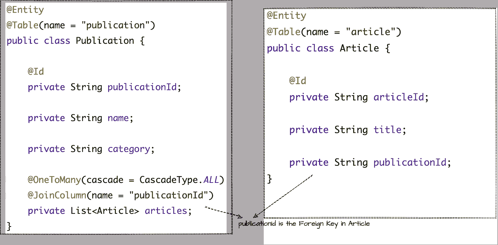
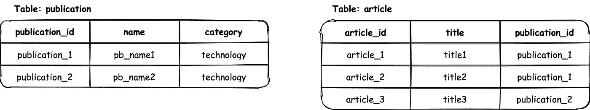
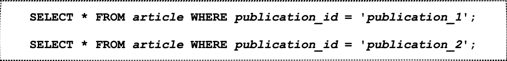
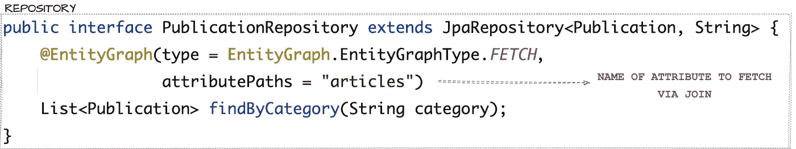

# JPA 实体图:N+1 查询问题的解决方案

> 原文：<https://medium.com/geekculture/jpa-entitygraphs-a-solution-to-n-1-query-problem-e29c28abe5fb?source=collection_archive---------2----------------------->

## 解决 N+1 查询问题:以 Spring Boot 为例

***N+1 查询问题*** 据说当一个 ORM，比如 hibernate，执行 1 个查询来检索父实体，执行 N 个查询来检索子实体时就会出现。随着数据库中实体数量的增加，单独执行的查询很容易影响应用程序的性能。本文将通过 spring boot 中的一个例子演示 N+1 查询是如何发生的以及它们的解决方案。

# N+1 查询问题

考虑一个内容管理系统，它根据*出版物*存储一个*文章列表*。一个*出版物*可以有一个*类别*和*文章列表*与之关联。以下是出版物和文章的简化实体。

*simplified entities for the purpose of explaining N+1 queries

一个发布与一个文章实体有一对多的关系。假设数据库当前有以下数据，其中 *publication_1* 有两篇文章，而 *publication_2* 有一篇文章。

现在，当我们试图获取某个类别下的所有出版物时，比如说*技术*，使用 ***findByCategory('技术')，***
首先执行一个*选择*查询来从出版物表中获取记录。

* simplified queries for understandability.

上述查询返回两条 id 为' *publication_1* '和' *publication_2* '的记录。现在，对于这些出版物中的每一个，您需要从*文章*表中获取相应的文章，JPA 在内部生成另外两个*选择*查询:

* simplified queries for understandability.

正如您在这里看到的，在第一个从发布表中获取数据的查询之后，生成了两个额外的查询 **(N=2)** ，用于从子表中获取相关的文章。因此，为了获取数据，生成了 **N+1** 个查询，其中 **N** 是父表中实体的数量。

# JPA 实体图

EntityGraphs 通过定义需要使用 SQL 连接从数据库中检索哪些实体，提供了一种制定性能更好的查询的方法。

entityGraphs 有两种类型， ***Fetch*** 和 ***Load*** ，定义 entityGraphs 的 attributeNodes 指定的 ***而不是*** 的实体是应该被懒洋洋地*还是急切地*。entityGraph 的 attributeNodes 指定的属性总是被*急切地获取*。**

> ****提取类型:**由 entityGraph 的 attributeNodes 指定的属性被视为 FETCH TYPE。EAGER 和其余属性被视为 FetchType.Lazy。**
> 
> ****加载类型:**由 entityGraph 的 attributeNodes 指定的属性被视为 FetchType。根据指定的或默认的 fetchTypes 处理 EAGER 和其余属性。**

**实体图可以用两种方式定义:**

## ****1。使用 NamedEntityGraph 标注****

**要使用 NamedEntityGraph，首先用 JPA 的 **@NamedEntityGraph** 注释来注释实体类 Publication，然后用图的名称将 **@EntityGraph** 注释附加到存储库方法。**

****

## **2.不带 NamedEntityGraph 批注**

**您也可以使用***attribute paths***定义一个特定的 EntityGraph，而不需要在实体上使用 NamedEntityGraph 注释。***attribute paths***应该包含要急切获取的实体的名称。**

****

**专用实体图更具动态性，用于单一或特定的用例。当在同一个实体上有多个查询时，命名标识图比临时标识图更有用。对于所有查询，可以在 NamedEntityGraph 中只指定一次每个查询中通过 JOIN 获取的属性。
JPA 使用 EntityGraphs 后生成的查询:**

****

**因此，N+1 查询减少到只有一个查询，使用 JOIN 从两个表中获取数据。
EntityGraphs 提供了一种机制，通过这种机制，可以在单个 select 语句中从数据库中快速提取实体，从而帮助提高应用程序的性能。您还可以使用子图来定义子类的实体，这些实体需要和父类一起获取。**