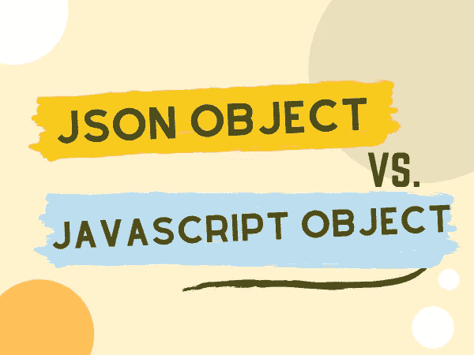
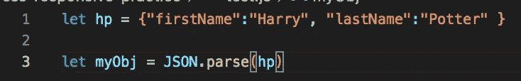
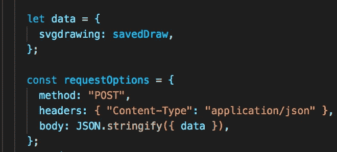
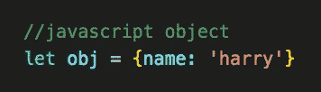
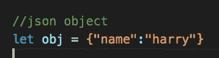

# JSON 对象与 JavaScript 对象

> 原文：<https://medium.com/geekculture/json-object-v-javascript-object-f00ae788cc1f?source=collection_archive---------3----------------------->

最近在我找工作的时候，我参加了一次面试，被问到一个我认为很有趣的面试问题。所以，我决定我想打开这本书更广泛的主题！

**面试官的问题:“JSON 对象和 Javascript 对象有什么区别？”**

# JSON 是什么？

首先，它代表 **J** 阿瓦 **S** 脚本 **O** 对象 **N** 旋转。JSON 语法源自 Javascript 对象，但是 JSON 格式是纯文本格式，这意味着 JSON 对象实际上就是一个字符串。

在这个代码示例中可以看到 JSON 对象的样子:

JSON Object

很多时候你会发现一个 JSON 对象被写成一个带有键/值对的字符串。看到“名字”是指向哈利的关键。

# 我们什么时候使用 JSON 对象？

JSON 用于从 web 服务器读取数据，然后将数据显示在网页上。当我们在浏览器和服务器之间交换数据时，它只能是文本，因此我们可以使用 JSON。

现在是我们准备 JavaScript 对象的时候了！

我们想读取一个 JSON 对象(本质上是我们的数据串),并将其转换成一个 JavaScript 对象。最好的方法是使用这个内置的 JavaScript 函数 JSON.parse()。

# 方法来转换 JSON。

**接收数据**

JSON.parse()将文本转换成 JavaScript 对象。

JSON text Object getting converted into a JavaScript Object, * hp variable needs to written into JSON object syntax otherwise you will get an error while trying to parse the data

另一方面，我们还想使用 JSON 将 JavaScript 对象转换成 JSON，这样数据就可以发送到 web 服务器并被读取。

**发送数据**

JSON.stringify()将把 JavaScript 对象转换成 JSON 对象，然后发送到 web 服务器。

JSON.stringify is turning our ‘data’ JavaScript object into a JSON Object

# JavaScript 对象与 JSON 对象语法

Javascript 对象的语法与 JSON 相似，它使用花括号和键/值对。

javaScript Object syntax

语法上的主要区别在于，在 JSON 对象中，键必须是用*双引号*写成的字符串。

JSON Object syntax

在 JavaScript 中，键可以是字符串、数字或标识符名称，字符串可以用单引号或双引号括起来。

# JSON 数据类型

当发送我们的 JSON 文本时，它必须具有有效的 JSON 数据类型，包括:

*   一根绳子
*   一个数字
*   一个对象(JSON 对象)
*   阵列
*   布尔型
*   空

JSON 值不能是:

*   一项功能
*   约会
*   不明确的

# 结论

总的来说，当比较 JSON 对象和 JavaScript 对象时，我们知道 JSON 对象是信使。JSON 只作为文本编写，是在浏览器和服务器之间发送 Javascript 数据的无缝方式。我们将通过使用 *JSON.parse()* 将 JSON 对象转换回 JavaScript 对象来转换 JavaScript 对象，并且我们将使用 *JSON.stringify()* 将 Javascript 对象转换成作为我们的 JSON 对象的字符串。