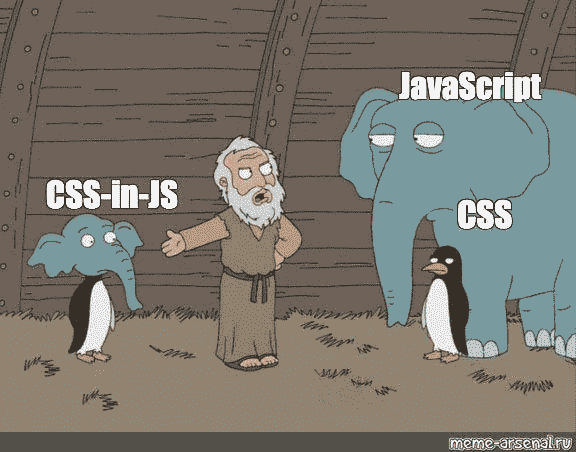

# JSS 或 CSS…用什么，为什么？

> 原文：<https://medium.com/geekculture/jss-or-css-what-to-use-and-why-829dc117a5ba?source=collection_archive---------3----------------------->

如果你们没有听说过 JSS，它的 CSS 是 JS 风格的。它非常受欢迎，在某些情况下非常方便。希望这篇文章能帮助你理解使用 JSS 的细微差别，以及你应该为你的需求选择什么。

# 什么是 JSS(JS 中的 CSS)

JSS 是一个 CSS 创作工具，它允许你使用 JavaScript 来描述样式…