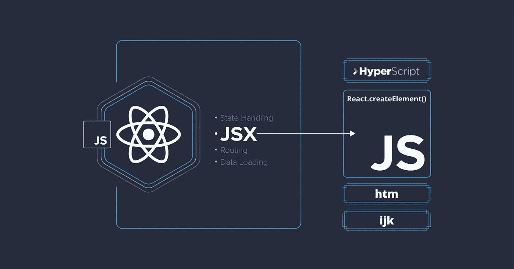
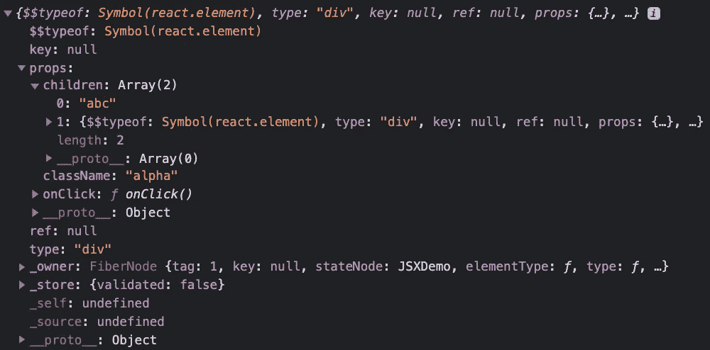

# JSX 替代品

> 原文：<https://medium.com/geekculture/jsx-alternatives-5d06639a8ba4?source=collection_archive---------8----------------------->

如今，JSX 是各种框架中非常流行的模板选择，而不仅仅是在 React 中。然而，如果你不喜欢它，或者有一个项目你想避免*使用它，或者只是好奇没有它你怎么写你的 React 代码呢？最简单的回答是— **是的，除了 JSX** 还有各种各样的选择。让我们在本文中逐一探究。



**免责声明:就我个人而言，我喜欢 JSX，并在我所有的 React 项目中使用它。然而，我对这个话题做了一些研究，想分享一下我的发现。*

# JSX——什么和怎么做？

在我们进入替代方案之前，让我们了解一下什么是 JSX，它是如何工作的？

随着 React 的推出，术语 JSX 变得相当流行。JSX 代表`**JavaScript XML**` 用于 React to *轻松地将 HTML 和 JavaScript 编写在一起。*

您可能会惊讶地发现，JSX 并不是使用 React 的必要条件。根据 React 的官方文档，

> 从根本上说，JSX 元素只是调用`React.createElement(component, props, ...children)`的**语法糖**。

在下面的例子中，我们从`MyDemo`组件返回 JSX，并使用`ReactDOM.render`方法将其呈现在屏幕上。

```
**class** MyDemo **extends** React.Component {
  render() {
    **return** (
      <div className={"alpha"} onclick={some}>
        {"abc"}
        <div>xyz</div>
      </div>
    );
  }
}
```

这是 React 中简单的 JSX 代码。但是浏览器不理解这个 JSX，因为它不是有效的 JavaScript 代码。

因此，为了将其转换为浏览器可理解的 JavaScript 代码，我们使用了一个工具，如 JavaScript 编译器/transpiler。

当巴别塔执行上述 JSX 时，它会将其转换为以下代码:

```
**class** MyDemo **extends** React.Component {
  render() {
    **return** React.createElement("div", {
        className: "alpha",
        onclick: some
    }, "abc", React.createElement("div", **null**, "xyz"));
  }
}
```

每个 JSX 都被转换成浏览器理解的`React.createElement`函数调用。

> ***知道如何将 JSX 转换成*** `***React.createElement***` ***作为一个 React 开发者来说是非常重要的(也是一个比较热门的面试问题)。***

# JSX 替代品

让我们从提高代码可读性和避免构建环境中编译复杂性的角度来探索 JSX 的替代方案:

## 1.React.createElement 函数

`React.createElement`的语法如下:

```
React.createElement(type, [props], [...children])
```

我们来看看`createElement`函数的参数。

*   类型可以是一个 HTML 标签，比如 h1、div，也可以是一个 React 组件
*   道具是你希望元素拥有的属性
*   **子**包含其他 HTML 标签或者可以是一个组件

`React.createElement`调用也将被转换成对象表示，如下所示:



如果将 JSX 赋给某个局部变量，并将其记录在控制台中，就可以看到这种对象表示。所以，你可以用 JSX 做的任何事情也可以用普通的 JavaScript 来完成。

提示:如果你想看到 JSX 到`React.createElement`的转换代码，你可以导航到[这个应用程序](https://babel-repl-clone.now.sh/)，你可以在左边写你的 JSX 代码，在右边看到转换后的代码。

## 2.重命名 React.createElement 函数

虽然生成的代码完全有效，并且我们可以用这种风格编写所有的 React 代码，但是这种方法有几个问题。

第一个问题是它非常冗长。像*真的*啰嗦，而这里的主犯是`React.createElement`。

所以第一种解决方案只是将其保存到一个变量中，通常以 [hyperscript](https://github.com/hyperhype/hyperscript) 命名为`h`。这将为你节省大量的文字，并使其更具可读性。为了说明这一点，让我们重写我们过去的例子:

```
**const** h = React.createElement;**class** MyDemo **extends** React.Component {
  render() {
    **return** h("div", {
        className: "alpha",
        onclick: some
    }, "abc", React.createElement("div", **null**, "xyz"));
  }
}
```

## 3.超级脚本

如果你玩一下`React.createElement`或者`h`，你会发现它有几个缺陷。首先，这个函数*需要* 3 个参数，因此在没有属性的情况下，您必须提供`null`，或者`className`，这可能是最常见的属性，每次都需要编写一个新的对象。

作为替代，你可以使用 [react-hyperscript](https://github.com/mlmorg/react-hyperscript) 库。它不需要提供空的道具，也允许你以类似于**emmet**的风格指定类和 id:

`div#main.content`->-`<div id="main" class="content">`

因此，我们的代码会变得稍微好一点:

```
**const** h = require('react-hyperscript');**class** MyDemo **extends** React.Component {
  render() {
    **return** h("div.alpha", { onclick: some }, [
      "abc",
      h("div", "xzy")
    ]);
  }
}
```

## 4.html 文件的后缀

如果你本身不反对 JSX，但是不想在你的构建环境中设置编译——在普通 JavaScript 中使用 [htm](https://github.com/developit/htm) —类似 JSX 的语法——不需要 transpiler。它的目标是和 JSX 做的一样(看起来也一样)，但是使用了[模板文字](https://developer.mozilla.org/en-US/docs/Web/JavaScript/Reference/Template_literals)。这无疑增加了一些开销(您必须在运行时解析这些模板)，但是对于您的情况来说这可能是值得的。

它通过包装元素函数来工作，在我们的例子中是`React.createElement`，但它可以是任何其他具有类似 API 的库，并返回一个函数，该函数将解析我们的模板并返回与 babel 完全相同的代码，但只是在运行时。

```
**const** html = htm.bind(React.createElement);**class** MyDemo **extends** React.Component {
    render() {
        **return** html`
            <div className=${"alpha"} onclick=${some}>
                ${"something"}
                <div>something</div>
            </div>
        `
    }
}
```

如你所见，它与皇家 JSX 几乎一样，我们只需要以稍微不同的方式插入变量；然而，这些主要是细节，如果您想展示如何在没有任何工具设置的情况下使用 React，这可能会很方便。

## 5.类似 Lisp 的语法

这种方法的思想类似于 hyperscript，但是，这是一种很好的方法，值得一看。还有很多其他类似的 helper 库，所以选择纯属主观；它可能会给你自己的项目带来灵感。

库 [ijk](https://github.com/lukejacksonn/ijk) 带来了只使用数组编写模板的想法，使用位置作为参数。这是一个很小的递归工厂函数，允许您编写简洁的虚拟 DOM 树的声明性表示。它并不试图模仿 HTML 或 JSON 语法，而是用一系列嵌套数组来表示用户界面。

最主要的好处是你不需要不断地写`h`(是的，即使那样也可以重复！).以下是如何使用它的示例:

```
**function** render(structure) {
  **return** h('nodeName', 'attributes', 'children')(structure)
}
**class** MyDemo **extends** React.Component {
  render() {
    **return** render([
      'div', { className: 'alpha', onClick: some}, [
        'abc',
        ['div', 'xyz']
      ]]);
  }
}
```

上面对`h`的调用返回了一个虚拟 DOM 树，它的命名属性符合所提供的模式。

# JSX 抓到你了

*   **JSX 允许我们用 JavaScript** 轻松地编写 HTML 元素并将它们放在 DOM 中，而不需要任何`createElement()`和/或`appendChild()`方法。
*   要在 JSX 中添加一个类，我们需要使用`className`而不是`class`——这是 JavaScript 中的一个保留关键字。
*   在 React 中，所有的属性名都是用 camelCase 写的，比如`className`、`onChange`、`htmlFor`等。
*   HTML 代码必须包装在一个顶级元素中。

```
const body = (
  **<div>**
    <h1>I am a Header</h1>
    <h1>I am a Footer</h1>
  **</div>**
);
```

如果 HTML 不正确，或者 HTML 缺少父元素，JSX 将抛出一个错误。

> 使用 [**做出反应。Fragment**](https://reactjs.org/docs/fragments.html) 对一系列子节点进行分组，而无需向 DOM 添加额外的节点。

*   要在多行中编写 HTML，**将 HTML 放在括号内**:

```
const body = **(**
  <ul>
    <li>Apples</li>
    <li>Bananas</li>
    <li>Cherries</li>
  </ul>
**)**;
```

*   要将表达式添加到您的 JSX，**将表达式放在花括号** `{ }`中:

```
const header = <h1>React is **{**5 + 5**}** times better with JSX</h1>;
```

表达式可以是 React 变量、属性或任何其他有效的 JavaScript 表达式。JSX 将执行表达式并返回结果。

> 在 JSX 内部使用时，**未定义**、 **null** 和 **boolean** 等值不会显示在 UI 上。

*   要给你的 JSX 添加评论，**将它包在** `**/***` **和** `***/**` **评论符号**内，如下所示:

```
**{/*** <p>This is some text</p> ***/}**
```

> 您可以使用`Cmd + /` (Mac)或`Ctrl + /`快捷键来添加或删除注释，而不是手动键入注释。

*   JSX 遵循 XML 规则，因此 HTML 元素必须正确结束。

```
const inputForm = <input type="text" **/>;** const headerSection = <div>React is AWESOME**</div>;**
```

# 结论

所以，你可以用 JSX 做的任何事情也可以用普通的 JavaScript 来完成。当您不想在构建环境中设置编译时，使用不带 JSX 的 React 特别方便。

这篇文章并没有说你不应该使用 JSX，或者它是否是一个坏主意。这篇文章的目的仅仅是回答——没有 JSX 你怎么写你的代码，你的代码看起来会是什么样子— *好奇心是学习之母*😎

# 参考资料:

[引进 JSX](https://reactjs.org/docs/introducing-jsx.html) ，[深入 JSX](https://reactjs.org/docs/jsx-in-depth.html)，[反应没有 JSX](https://reactjs.org/docs/react-without-jsx.html) ， [JSX 备选](https://www.infoq.com/news/2020/02/htm3-htm-jsx-alternative-caching/)，[反应像 JSX 图书馆](https://areknawo.com/best-react-like-jsx-ui-libraries-in-2020/)

*感谢阅读，别忘了* *分享、评论，给尽可能多的*👏*尽可能*😎