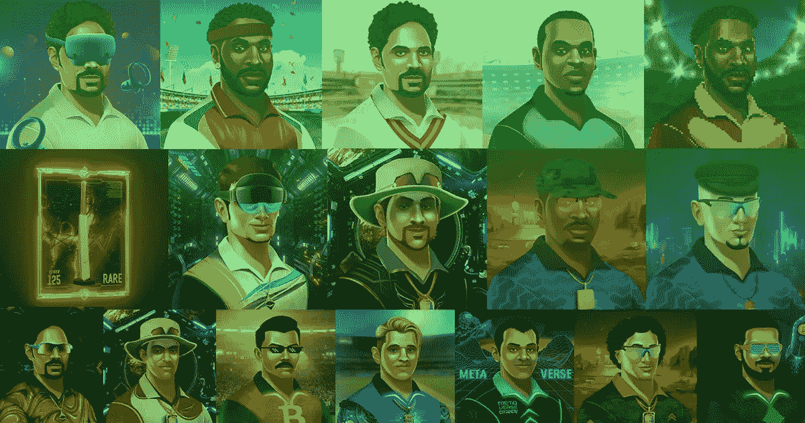
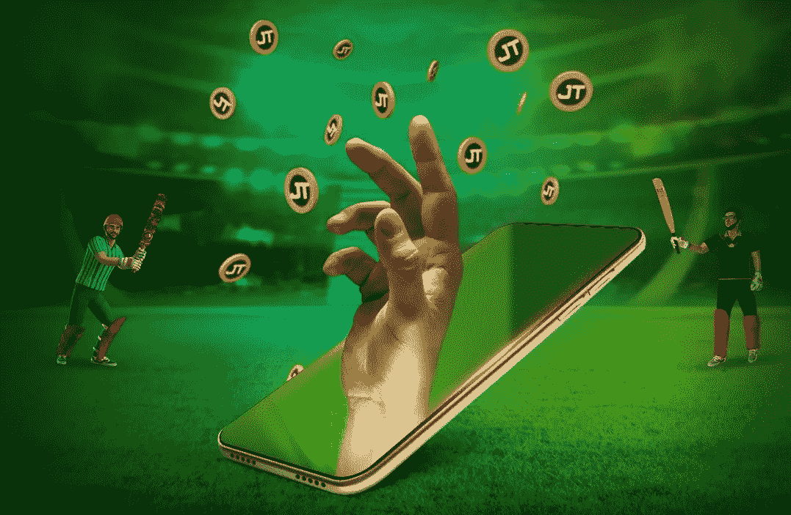

# NFT 市场:终极指南

> 原文：<https://medium.com/geekculture/jump-trade-nft-marketplace-an-ultimate-guide-900df0d62fe?source=collection_archive---------10----------------------->

“玩到赚”的 NFT 游戏现在正主导着游戏产业。比起传统游戏，今天的游戏玩家更喜欢 P2E 游戏，因为这些游戏不仅有趣，而且有益。除了游戏，有一项运动将世界上 25 亿人团结在一起，那就是板球。当板球比赛开始时会发生什么？向您介绍世界上第一次发挥赢得 NFT 板球比赛-元板球联盟与跳跃。贸易板球 NFT 市场。让我给你讲更多的故事。该游戏是一个元宇宙基地 P2E 游戏，将给板球迷一个全新的世界，在元宇宙体验板球。

这个 NFT 游戏平台将游戏社区、NFT 爱好者和板球迷聚集在一起。如果你是 NFTs，板球，甚至游戏的爱好者，这是一个你为自己的时间，努力和游戏技巧获得回报的平台。

**jump . trade 上的一次演练**

Jump.trade 是最受信任的 NFT 市场，在那里你可以购买 NFTs，使你有资格参加**元板球联盟**。Marketplace 在 Marketplace 上以 25 美元的底价**放弃了官方 NFTs。此次拍卖还包括 3 件被拍卖的世界杯 NFT 藏品(1983 年、2003 年和 2011 年世界杯藏品)。所有的**5.5 万台 NFT 在短短 9 分钟**内全部售罄，拍卖的 NFT 经过严格的竞价大战，最终以数千美元的价格成交。**

对 NFTs 的需求是巨大的，人们希望得到这些通行证，让他们在 web3 世界见证板球。Jump.trade marketplace 一上线就看到了巨大的交易量。如果你期待进入 MCL 的世界，那就跳吧。贸易应该是你的第一站。

**JT 入门**

正如我前面所说，从 Jump.trade 购买 NFT 将是开始的第一步。Jump.trade NFT 市场在 google play 商店和 Mac App store 中提供。该游戏现仅面向安卓用户，游戏的 apk 文件可从 Jump.trade 网站自行下载。

*   要从 Jump.trade NFT 市场购买 NFT，您需要使用您的电子邮件地址和密码在网站上创建一个帐户。
*   一旦您创建了一个帐户，您将从网站上收到一条欢迎信息和动态口令。您必须通过输入 OTP 来验证您的 id。
*   之后，你可以点击网站上的 explore 按钮来查看你可以购买的 NFT 列表。
*   你至少要有一个击球手 NFT 和一个投球手 NFT 才有资格玩这个游戏。
*   你也可以随时通过挂牌出售来出售你已经购买的 NFT。
*   你只需要选择你想要出售的 NFT，然后点击市场上的列表(直接出售或拍卖)，你的 NFT 就会被出售。

现在你可能想知道当有几类非功能性食物可供选择时，你应该买什么。

**从购买 NFT 到玩游戏**

*   NFT 分为三种类型:击球手、投球手和击球手。有许多种类的非功能性测试。
*   在 MCL 玩家 NFTs 中，等级范围的类别按升序排列为新手、稀有、传奇和传奇。
*   在 MCL 签名的蝙蝠，有两类-单和双。这进一步有子类-稀有，超稀有，超稀有，和不朽。
*   所有的玩家和蝙蝠都有自己的力量。

虽然球员有他们自己的优势和统计数据，但蝙蝠增加了得分。虽然你可以使用游戏自带的默认球棒，但作为 NFT 单独购买的签名球棒或其他球棒在计算得分时会有额外的优势。

**游戏、奖励和升级系统**

[**Meta Cricket lega UE**](https://www.jump.trade/mcl-game/?fsz=Raja)是一款简单的板球游戏，任何懂板球的人都能轻松上手。玩这个游戏，你不需要特别的游戏技巧。你只要掌握好出手的时机，就能打出四分和六分。

*   要参加任何锦标赛，你必须和你的 NFT 球员一起参加你的球队选秀。
*   如前所述，你必须选择至少一名击球手和一名投球手进入游戏。
*   但是要组成一个完美的团队，你可以增加一个签名棒，一个击球手，四个投球手来加强你的团队。
*   根据你的队伍实力、帐户等级和你正在玩的玩家的类别，你可以和另一个玩家匹配。
*   每跑一分，您就可以获得 JT 积分，每获得一个 JT 积分，您将获得等值的 USDT 奖励。

**即将到来**

这只是游戏的第一阶段，更多的还在后面。一些有趣的功能将很快添加到游戏中，包括以下内容。

*   为游戏带来能量系统和玩家耐力的游戏机制还没有到来。
*   游戏的附加元素是天气条件，球场条件，球员的健康和受伤，等等。
*   租赁系统，玩家可以借出或出租他们的 NFT 参加锦标赛。
*   解说和改进的多人游戏版本。
*   体育场和元宇宙锦标赛将这项运动推向了新的高度。

**什么使人跳跃。贸易和 MCL 特别？**

你可能已经听到了来自游戏开发商和游戏社区关于玩赚取 NFT 游戏的不同反应。那么是什么让 MCL 不同于其他 P2E 游戏呢？

嗯，通常，任何带有单独令牌的 NFT 游戏都会先推出令牌，然后再进行游戏开发和发布。在此期间，有可能出现高市场风险，从而改变或降低代币价值。

Meta Cricket League 在学习了任何游戏中的令牌经济学的基础知识后，提出了游戏优先和令牌下一个概念。这大大降低了令牌值无意贬值的可能性。MCL 和 Jump.trade 的目标是创建一个稳定的社区游戏，这也是他们区别于其他 P2E 游戏的地方。

**底线**

不仅如此，令人兴奋的图形和有趣的游戏，它给玩家带来了板球的快感，也帮助他们赚取了被动收入。你可以探索一下 [**Jump.trade NFT 市场**](https://www.jump.trade/?fsz=Raja) 甚至加入他们的不和谐频道来了解更多的游戏。随着令人兴奋的更新即将到来，Meta Cricket League 正处于在游戏行业做大的中途。