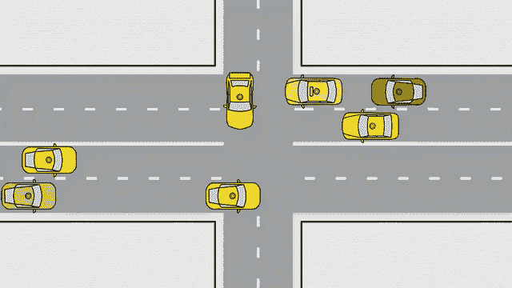
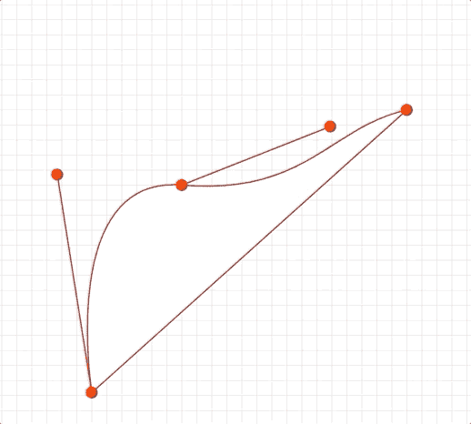
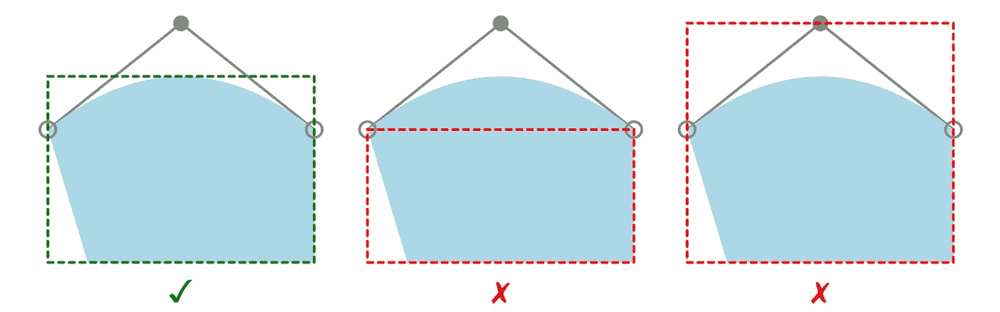
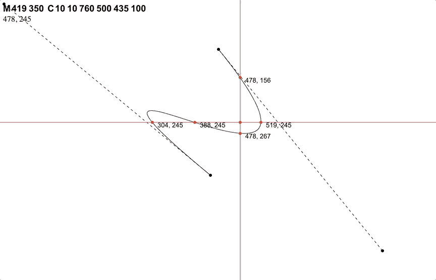

# 6 月 17 日:计算 SVG 贝塞尔曲线交点(不带捕捉！)

> 原文：<https://medium.com/geekculture/june-17-calculating-svg-b%C3%A9zier-curve-intersections-without-snap-adff3fc6aae7?source=collection_archive---------26----------------------->



> H umble 感谢加州科技咨询公司 Cell 中的 [**粒子，以及**](https://www.particleincell.com/)**[他们博客上的这篇精彩文章](https://www.particleincell.com/2013/cubic-line-intersection/)。代码现在有点过时了，所以我冒昧地更新/修改了它。他们的工作对我的个人项目非常有帮助！如果没有它，这篇博文是不可能的！**

今天我将继续[之前的一篇博文](https://javascript.plainenglish.io/june-3-parsing-and-validating-svg-paths-with-regex-7bd0e245115)关于我最喜欢的主题之一:**矢量图形——这是让你的网络应用脱颖而出的最简单的方法。一个天才的矢量艺术家几乎可以满足任何品味:从极简主义到现实主义，以及介于两者之间的几乎一切。SVG 轻便、快速，非常适合操作和动画。**

概括一下:我们再次关注`<path>`(直线和曲线的序列),它们构成了 90%的矢量图形。我上次解释过，路径有带参数的**命令**，用*绝对*(视框坐标)或*相对*(与先前坐标的距离)表示。今天我们将讨论一个非常重要的命令:`**C**` **/** `**c**` **三次贝塞尔曲线命令。**

# **背景:弯道前方**

还记得在我上一篇关于 SVG 路径的文章中，我解释过`<path>`标签可以替换所有其他的形状标签吗？事实证明，**在** `**<path>**` **描述符中，** `**C**` **和** `**c**` **命令可以代替除初始** `**M**` **/** `**m**` **之外的所有其他命令。**(就像一个带有瑞士军刀的工具包，其中一层是 Go-Gadget。)使用我上次的`PathParser`可以看到，下面的两个图形具有相同的绝对点，看起来完全相同:

```
const sameShape = [
   "M 25 25 L 75 25 L 75 75 L 25 75 Z",
   "M 25 25 C 25 25 75 25 75 25 C 75 25 75 75 75 75 C 75 75 25 75 25 75 Z"
];PathParser.parse( sameShape[ 0 ] )
   -> [ [ 25, 25 ], [ 75, 25 ], [ 75, 75 ], [ 25, 75 ], [] ]
PathParser.parse( sameShape[ 1 ] )
   -> [ [ 25, 25 ], [ 75, 25 ], [ 75, 75 ], [ 25, 75 ], [] ]
```

`**C**` **/** `**c**` **命令被称为贝塞尔(bezYAY)曲线，**由两位法国工程师创建/形式化，并以他们的名字命名，他们是计算机辅助设计(CAD)的先驱。贝塞尔曲线使许多曲线操作/计算变得更容易，所以它们非常重要。特别是，`C` / `c`命令更容易转换(或*补间*)，所以它们是矢量动画的核心。

[这篇来自密歇根理工大学的文章](https://pages.mtu.edu/~shene/COURSES/cs3621/NOTES/spline/bezier-construct.html)在解释贝塞尔-德卡斯特尔焦曲线方面做得比我好得多，但简而言之，它们是由*控制点定义的。*在 Illustrator 和 Inkscape 等矢量图形编辑器中，编辑这些控制点已经成为一种自然的用户功能——如果您有一个这样的编辑器，您可以亲眼看到改变曲线的控制点是如何改变其形状的:



贝塞尔曲线和其他曲线的一个怪癖是**它们的边界不一定与它们的点直接对应:**



Photo credit: SVG Working Group

如果你正在使用他们的高级模拟软件产品中的[进行粒子模拟，用 SVG 将工程计划渲染成 3D 对象，那就有问题了。你将如何准确计算一条线与一条曲线的交点来说明，比如说，透视？](https://www.particleincell.com/projects/)

# **解魔方**

现在拿出你的镇定剂，确保你的遗嘱被归档——这是一个真正的奇迹，多亏了一些真正痛苦的高中代数。这是针对 React 演示进行了简化和改编的旧代码，您可以在这里看到。当鼠标按钮按下时，出现十字准线，点指示`mouseDown`事件的`x`和`y`水平/垂直与屏幕上的曲线相交的位置。

这里的大部分动作发生在`utilities/bezierIntersections.js`。记得高中代数中，一个线性方程采用`**ax + b**`、**、**的形式，一个三次方程采用`**a * Math.pow( x, 3 ) + b * Math.pow( x, 2 ) + c * x + d**`的形式。我们不知道*根*(可能的值为`x` ) 或者*系数* ( `a`、`b`、`c`和`d`)，但是我们可以从曲线的命令中计算出来。让我们用一个代表路径`M ${ zero } ${ one } C ${ two } ${ three } ${ four } ${ five } ${ six } ${ seven }`的`curveDefinition`—`[ zero, one, two, three, four, five, six, seven ]`——和一条由其`lineStart`和`lineEnd`坐标定义的线来做这件事。然后，让我们用曲线/直线的定义求解，以代数方式找到它们的交点:

```
const bezierCoefficients = ( p0, p1, p2, p3 ) => {
  return [
     -p0 + 3 * p1 + -3 * p2 + p3,
     3 * p0 - 6 * p1 + 3 * p2,
     -3 * p0 + 3 * p1,
     p0
  ];
}const computeIntersections = ( curveDefinition, lineStart, lineEnd ) => { const A = lineEnd[ 1 ] - lineStart[ 1 ];
  const B = lineStart[ 0 ] - lineEnd[ 0 ];
  const C = lineStart[ 0 ] * ( lineStart[ 1 ] - lineEnd[ 1 ] ) + lineStart[ 1 ] * ( lineEnd[ 0 ] - lineStart[ 0 ] ); const xBezierCoefficients = bezierCoefficients( curveDefinition[ 0 ], curveDefinition[ 2 ], curveDefinition[ 4 ], curveDefinition[ 6 ] );
  const yBezierCoefficients = bezierCoefficients( curveDefinition[ 1 ], curveDefinition[ 3 ], curveDefinition[ 5 ], curveDefinition[ 7 ] ); const P = [
    A * xBezierCoefficients[ 0 ] + B * yBezierCoefficients[ 0 ],
    A * xBezierCoefficients[ 1 ] + B * yBezierCoefficients[ 1 ],
    A * xBezierCoefficients[ 2 ] + B * yBezierCoefficients[ 2 ],
    A * xBezierCoefficients[ 3 ] + B * yBezierCoefficients[ 3 ] + C
  ]; return solveCubicRoots( P ).reduce( ( result, root ) => {
    return [ ...result, [ 
      xBezierCoefficients[ 0 ] * root * root * root + xBezierCoefficients[ 1 ] * root * root + xBezierCoefficients[ 2 ] * root + xBezierCoefficients[ 3 ],
      yBezierCoefficients[ 0 ] * root * root * root + yBezierCoefficients[ 1 ] * root * root + yBezierCoefficients[ 2 ] * root + yBezierCoefficients[ 3 ]
    ] ];
  }, [] );}
```

我们计算`xBezierCoordinates`和`yBezierCoordinates`，用我们的相交线的点对它们进行运算，然后使用函数`solveCubicRoots`求解我们的交点:

```
const solveCubicRoots = P => { let [ a, b, c, d ] = P; var A = b / a,
    B = c / a,
    C = d / a,
    Q = ( 3 * B - Math.pow( A, 2 ) ) / 9,
    R = ( 9 * A * B - 27 * C - 2 * Math.pow( A, 3 ) ) / 54,
    D = Math.pow( Q, 3 ) + Math.pow( R, 2 ),
    Im; let t = []; if ( D >= 0 ) {         // complex or duplicate roots
    const S = Math.sign( R + Math.sqrt( D ) ) * Math.pow( Math.abs( R + Math.sqrt( D ) ), ( 1 / 3 ) );
    const T = Math.sign( R - Math.sqrt( D ) ) * Math.pow( Math.abs( R - Math.sqrt( D ) ), ( 1 / 3 ) );
    t = [
      -A / 3 + ( S + T ),     // real root
      -A / 3 - ( S + T ) / 2, // real part of complex root
      -A / 3 - ( S + T ) / 2  // real part of complex root
    ];
    // complex part of root pair
    Im = Math.abs( Math.sqrt( 3 ) * ( S - T ) / 2 );
    // discard complex roots
    if ( Im !== 0 ) {
      t[ 1 ] = -1;
      t[ 2 ] = -1;
    }
  } else { // distinct real roots
    let th = Math.acos( R / Math.sqrt( -Math.pow( Q, 3 ) ) );
    t = [
      2 * Math.sqrt( -Q ) * Math.cos( th / 3 ) - A / 3,
      2 * Math.sqrt( -Q ) * Math.cos( ( th + 2 * Math.PI ) / 3 ) - A / 3,
      2 * Math.sqrt( -Q ) * Math.cos( ( th + 4 * Math.PI ) / 3 ) - A / 3
    ];
    Im = 0.0;
  }
  // discard out of spec roots
  for ( let i = 0; i < 3; i ++ ) if ( t[ i ] < 0 || t[ i ] > 1.0 ) t[ i ] = -1;
  return t;
}
```

需要注意的一点是，一个立方最多可以有三个根:



## 限制

**该代码总是生成三个根，并且经常有一些是垃圾坐标**用于较平曲线段上的不合格根。这些坐标通常位于视图框之外…但并不总是如此，所以需要进行一些清理；Cell 原始代码中的 Particle 做了一些花哨的排序，但是`filter()` ing 也可能做到这一点。这只是一个演示，所以我没有清理垃圾坐标——我想专注于代数。

# 结论:死人曲线

我坦率地承认，由于有大量的 SVG 库可供选择，这些可怕的数学都不是非常必要的。 [Snap](http://snapsvg.io/) 有`path.intersection` , [Paper.js](http://paperjs.org/) 有`intersections`还有很多。

我改编这段代码主要是作为一种学习经验，但也因为有些情况下加载一个依赖项的项目并不理想；例如，我正在将这段代码合并到一个 web API 中，它需要快速和轻量级。如果您选择是否使用 SVG 库，请考虑您的用例并查阅文档；并非所有的都是生而平等的，有些没有被很好的记录，而且有很多错误/很慢。