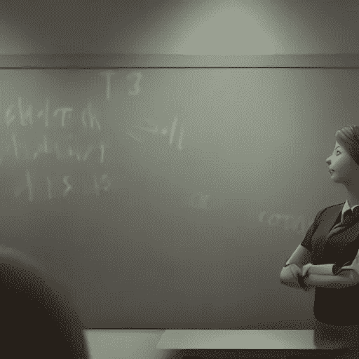

# Jupyter 现在是最好的教育工具

> 原文：<https://medium.com/geekculture/jupyter-is-now-the-best-tool-for-education-8dc57b228d32?source=collection_archive---------5----------------------->

## 关于机器学习的顶级课程，以及如何使用 Jupyter 笔记本创建自己的课程。

Teacher in the classroom — Image created by [Stable Diffusion](https://stability.ai/blog/stable-diffusion-public-release)

Jupyter 笔记本电脑非常适合尝试新想法，将原型带入生活，以及理解交互工作的概念。此外，JupyterLab 的目标是以自己的风格成为一个成熟的 IDE，与众不同…