# Python 上从头开始的神经网络，带有数学证明和代码解释

> 原文：<https://medium.com/geekculture/just-another-neural-network-from-scratch-on-python-simpler-cleaner-1083e3ce3b41?source=collection_archive---------25----------------------->

如果你害怕看到这篇文章的长度或底部的方程，你可能想先看看一个更简单的只有一个神经元的神经网络。

**让我们先运行代码，然后分析每一部分**

让我们克隆这个 Github [项目](https://github.com/arf-themascoteers/c2f.git)，或者简单地在您最喜欢的 IDE 中运行下面的代码。

如果您需要帮助来设置运行代码的环境，请参阅这篇文章来开始使用 PyCharm。如果一切顺利，你会看到这样的图表。

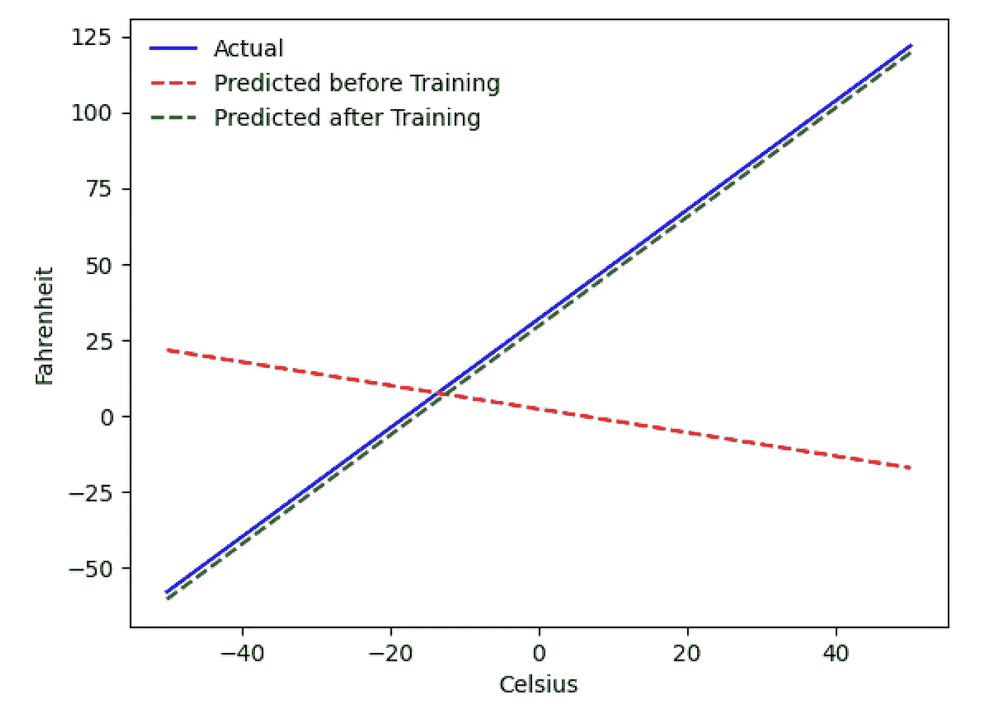

**问题——华氏温度从摄氏温度上升**

我们将训练机器从摄氏温度预测华氏温度。正如您从代码(或图表)中可以理解的，蓝线是实际的摄氏-华氏关系。红线是我们的宝贝机器在没有任何训练的情况下预测的关系。最后我们对机器进行训练，绿线是训练后的预测。

魔法在第 69 行，我们在那里训练机器。可以看到训练前后，都是用同一个函数进行预测(***get _ predicted _ Fahrenheit _ values()***)。那么神奇的火车()在做什么呢？让我们找出答案。

**网络结构**

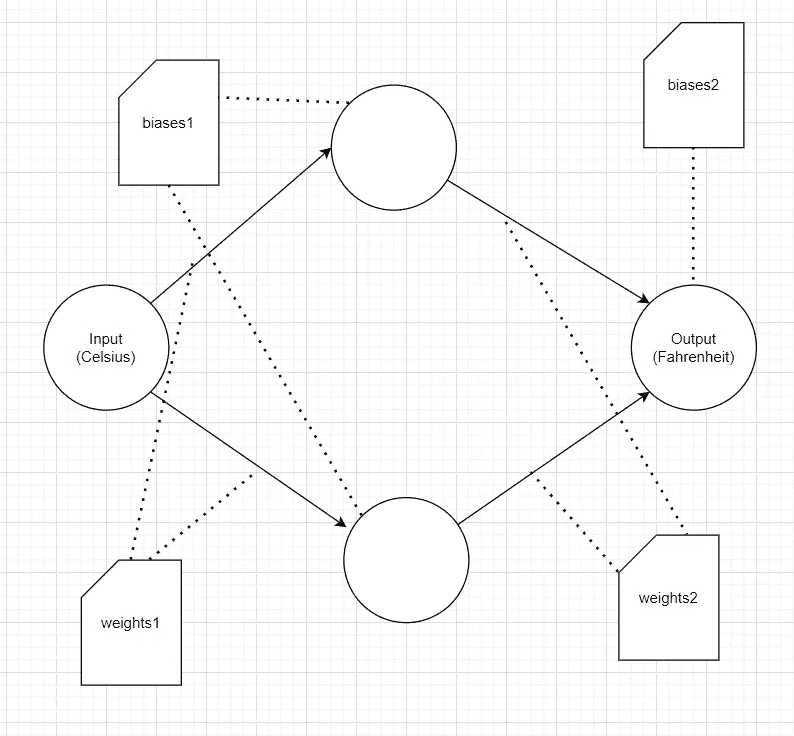

**输入**:表示摄氏度的浮点数

**权重 1** : 1 X 2 矩阵，代表从输入到层 1 的 2 个权重

**biases1** : 1 X 2 矩阵，代表从输入到层 1 的 2 个偏差

**权重 2**:2×1 矩阵，表示从层 1 到输出的 2 个权重

**偏置 2**:1×1 矩阵，表示从层 1 到输出的 1 个偏置

**输出**:表示预测华氏温度的浮点数

因此，我们总共有 7 个参数(第一层 2 个权重，第一层 2 个偏差，第二层 2 个权重，第二层 1 个偏差)。

**代码的取证分析**

现在让我们一部分一部分地解释代码:

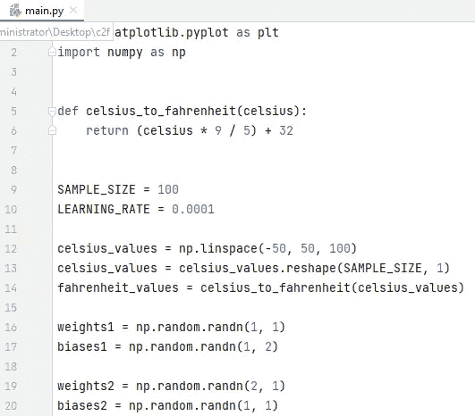

在第 12 行，我们生成了一个由-50 到+50 之间的 100 个数字组成的数组。

在第 13 行中，我们将一维数组转换为 100 X 1 的矩阵，这将有助于向机器提供数据，您很快就会看到这一点。

> 为了理解 ***reshape()*** 如何工作，如果 **x** 是一个[10，20，30]的数组，x.reshape(3，1)将产生一个 2D 矩阵，每行只包含一列。换句话说，每一行将成为一个元素的数组—在这种情况下，第一行将是一个包含[10]、第二行[20]和第三行[30]的数组。

在第 14 行，我们为每个摄氏温度值生成华氏温度。

从第 16–20 行开始，我们用随机值初始化我们的网络参数。

**训练()**

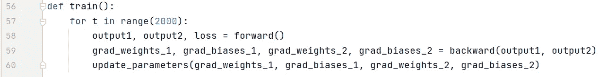

我们在这里进行了 2000 次反复的训练。每次迭代由以下部分组成:

1.  向前(58 号线)传递
2.  向后(59 号线)传递
3.  更新参数(第 60 行)

> 如果您是 python 的新手，可能会觉得有点奇怪——python 函数可以返回多个值作为**元组**

注意，update_parameters 是我们唯一感兴趣的东西。我们在这里做的其他事情是评估这个函数的参数，这些参数是我们的权重和偏差的 ***梯度*** (我们将在下面解释梯度是什么)。这里每个梯度变量都是对应参数变量的同维矩阵。例如，由于 **weights_1** 是 1×2 矩阵，所以 **grad_weights_1** 也是 1×2 矩阵。

1.  **grad_weights_1** : 1 X 2 矩阵。从输入到图层 1 的 2 个权重的渐变
2.  grad _ bias _ 1:1 x2 矩阵。从输入到层 1 的 2 个偏差的梯度
3.  **grad_weights_2** : 2 X 1 矩阵。从层 1 到输出的 2 个权重的渐变
4.  **grad _ bias _ 2**:1 X 1 矩阵。从层 1 到输出的 1 偏差梯度

我们通过向后调用来获取这些值，但这需要:

1.  **输出 1** :层 1 的输出
2.  **输出 2** :层 2 的输出。最终预测的华氏温度值。

为了得到这些值，我们需要用摄氏温度值和相应的实际华氏温度值向前运行。

**前进()**

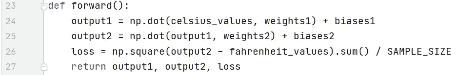

注意，这里的 ***摄氏度值*** 和 ***华氏度值*** 是 100 行的矩阵:

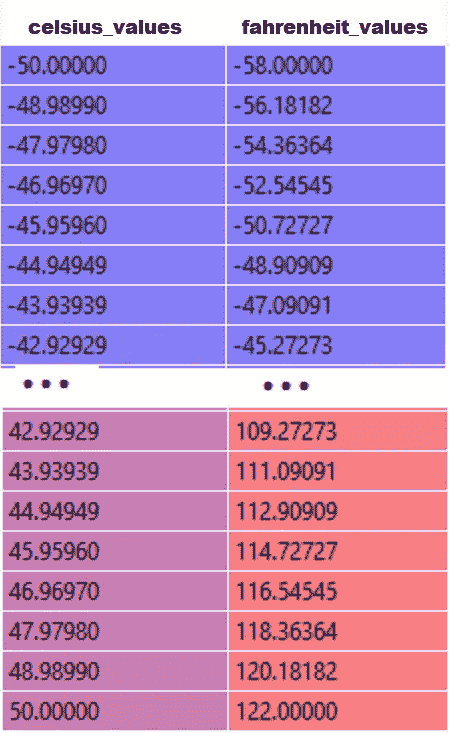

执行第 24 行后，对于*中的一个元素，比如说 **42.92929** ，output1 将包含 2 个数字:*

*output 1[0]=**42.92929*** weight 1[0]+biases 1[0]*

*output 1[1]=**42.92929*** weight 1[1]+biases 1[1]*

*所以对于***celsius _ values***中的 100 个元素，output1 基本上会是一个 100 X 2 的矩阵，我们可以用代码中所示的点积和矩阵加法来计算。*

*第 25 行也在做同样的操作，但是这里的输入是前一层的输出(output1)。*

*第 26 行是使用均方误差(MSE)损失函数计算损失，这只是所有差异的平方除以样本数(本例中为 100)的一个花哨名称。*

> *小损失意味着更好的预测。如果您在每次迭代中保持打印损失，您将看到它随着训练的进展而减少。*

*最后，在第 27 行，我们返回这些值。*

***向后***

*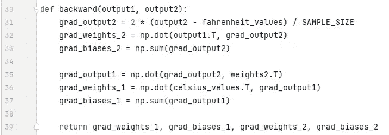*

*现在事情会变得很混乱。如果你需要的话，喝杯咖啡，给我你的全部注意力。*

*记住，我们只对更新我们的权重和偏好感兴趣。为了更新这些值，我们必须知道它们的梯度，这就是我们在这里计算的——这是这个 ***向后*** 函数的唯一原因，也可能是写整篇文章的唯一原因。*

*请注意，梯度是以相反的顺序计算的(首先计算最后一层)，因此得名“反向传播”。原因是，为了计算一个层中的渐变，我们需要来自下一层的一些信息——以便我们可以在 ***链规则*** 公式中使用它们。*

*现在我们来看看什么是梯度和链式法则。*

****渐变****

*为了简单起见，考虑我们只有一个值 ***摄氏度 _ 数值*** 和 ***华氏度 _ 数值*** 、 **42.92929** 和 **109.27273** 。*

*现在，如果你拿一张纸，把计算结果分解到第 26 行，你会发现:*

*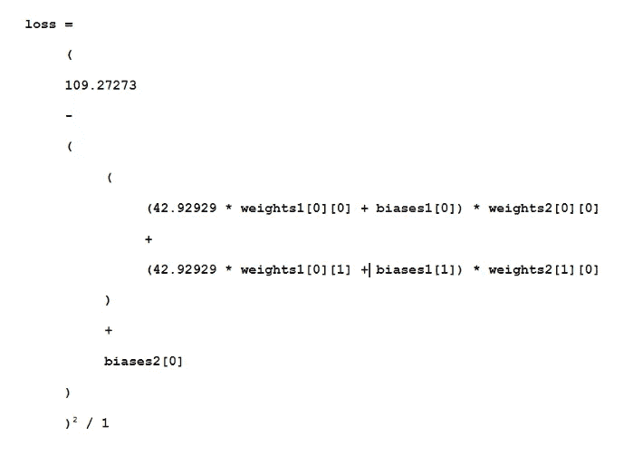*

*如您所见，损耗取决于 7 个参数。现在只考虑一个参数—第一层的第一个权重。在代码中是***weights 1【0】【0】***。想象一下，我们用一个随机值初始化它，比如说 0.8，对上面的等式求值后得到 123.45 作为 ***损失*** 的值。根据这个损失值，您必须决定如何更新权重 1[0][0]。你应该把它设为 0.9，还是 0.7？*

*您必须以某种方式更新 weights1[0][0]，以便在下一次迭代中获得更低的损失值(记住，最小化损失是最终目标)。因此，如果增加权重 1[0][0]会增加损失，我们会减少损失。如果增加重量 1[0][0]减少损失，我们将增加它。*

*现在的问题是，我们如何知道增加重量 1[0][0]会增加还是减少损失。**这就是**中渐变的来源。广义上讲，梯度是用导数来定义的。还记得你高中的微积分吗，∂y/∂x(它是 y 相对于 x 的偏导数/梯度)指出了 y 将如何随着 x 的微小变化而变化*

*如果∂y/∂x 是正的，这意味着 x 的小增量将增加 y*

*如果∂y/∂x 是负的，这意味着 x 的一个小增量将减少 y*

*如果∂y/∂x 很大，x 的小变化会引起 y 的大变化*

*如果∂y/∂x 很小，x 的微小变化会引起 y 的微小变化*

*所以，从梯度中，我们得到两个信息。参数必须向哪个方向更新(增加或减少)以及更新多少(大或小)。*

****链式法则****

*非正式地说，链式法则说:*

*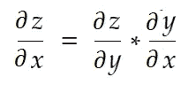*

*或者让我们更进一步，*

*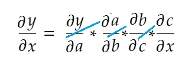*

*看——为什么叫链式法则？*

*考虑上面的 ***权重 1[0][0]*** 的例子。我们需要计算***grad _ weights _ 1[0][0]***来更新该权重，其计算方法如下:*

*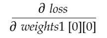*

*用链式法则公式，我们可以推导出:*

**

*让我们分解所有 7 个参数的所有梯度，并绘制一个依赖关系图。*

*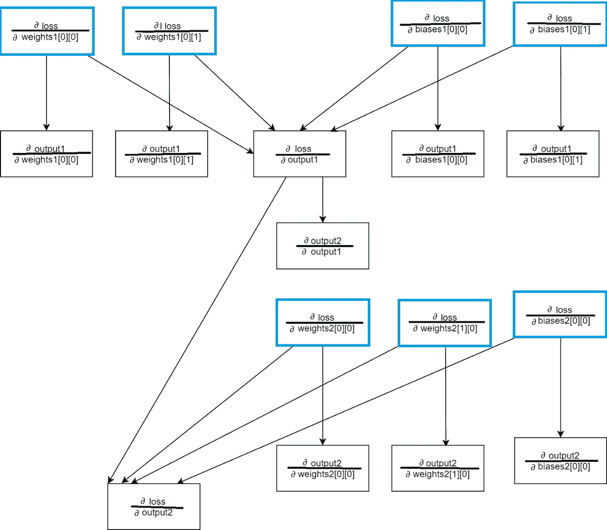*

***你不需要遵循这里的所有方框。***

*我们只对蓝框感兴趣，它是参数的梯度。我们只需要计算其他盒子来评估这 7 个盒子。请注意几个有趣的方面:*

1.  *为了计算一个层中一个参数的梯度(例如**∂loss/∂weights[0][0】**，我们只需要两个信息:
    (a)该层的产量相对于该参数的导数(**【∂output1/∂weights[0][0】**)
    )(b)损耗相对于该层产量的导数( **∂loss / ∂output1** )*
2.  *为了计算一个层的输出梯度( **∂loss / ∂output1** )，我们需要所有后续层的输出梯度(本例中为 **∂loss/∂output2** )。这意味着这里所有的梯度计算都依赖于最后一层输出的梯度。这就是为什么我们在 backpass(第 31 行)中首先计算∂loss/∂output2。*
3.  *参数的渐变不依赖于前一层的任何东西。例如 **∂ loss/∂权重 2[0][0]** 不依赖于 **∂loss/∂output1.***
4.  *参数的渐变不依赖于任何图层上的任何其他参数(或任何其他参数的渐变)。例如， **∂损失/∂权重[0][0]** 不依赖于**权重 2[0][0]，或者∂loss /∂weights2[0][0]).***
5.  *因此，从这些观察中，我们理解，在回传期间，在每一层，我们计算输出梯度(对于这个例子， **∂loss / ∂output2** )有两个可能的原因:
    (a)计算这个层上参数的梯度，对于这个例子意味着:
    **∂损耗/ ∂权重 2[0][0]，
    ∂损耗/∂权重 2[1][0]，** 和 **∂损失/ ∂偏置 2[0][0]** (b)将此梯度( **∂loss /∂output2** )传递到前一层，以用于链规则来计算该层上参数的梯度(在此情况下为权重 1[0][0]、权重 1[0][1]、偏置 1[0][0]和偏置 1[0][1])。*

> *在高级 ML 框架中，例如在 PyTorch 中，您不必为 backpass 编写代码！在前进过程中，它创建计算图形，在后退过程中，它在图形中沿相反方向前进，并使用链规则计算梯度。*

***∂损失/ ∂产出 2***

*我们在代码中通过 **grad_output2** 定义这个变量，正如你在第 31 行看到的，它是这样计算的:*

*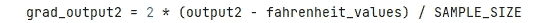*

*让我们找出公式背后的原因。*

*请记住，我们将所有 100 个**摄氏温度值**一起输入到机器中。因此，grad_output2 将是一个 100 X 1 的矩阵，每个元素包含对应于 **celsius_values** 中元素的 output2 的梯度。为了简单起见，让我们考虑一下，在**摄氏 _ 值中只有 2 项。***

*所以，分解第 26 行，*

*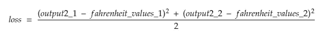*

*在哪里，*

*output2_1 =第一摄氏度值的 output2 值*

*output2_2 =第二摄氏度值的 output2 值*

*fahreinheit_values_1 =第一摄氏度值的实际 fahreinheit 值*

*fahreinheit_values_1 =第二摄氏度值的实际 fahreinheit 值*

*现在，结果变量 ***grad_output2*** 将包含 2 个值 output2 _ 1 和 output2_2 的梯度，意思是:*

**

*让我们只计算 output_2_1 的梯度，然后我们可以对其他的应用相同的规则。*

*微积分时间！*

**

*这与第 31 行相同*

***第二层权重的梯度***

*让我们计算第二层第一个重量的梯度*

*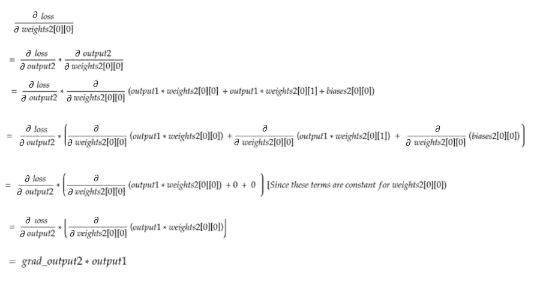*

*这与第 32 行相同。请注意，在点积之后，对于每个权重，100 个输入值中的每一个的梯度值被相加，这是可以的，因为我们在更新参数之前将所有梯度乘以一个小因子(参见最后一节更新参数)。*

***第二层偏压梯度***

*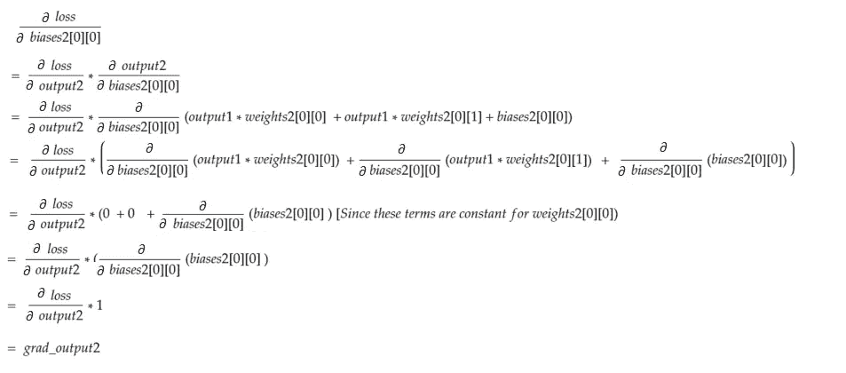*

*这与第 33 行相同。像重量梯度一样，对 100 个输入中的每一个的这些值进行求和。同样，这很好，因为梯度在更新参数前乘以一个小系数(见最后一节**更新参数)**。*

***第一层权重的梯度***

*让我们计算第一层中第一个权重的梯度*

*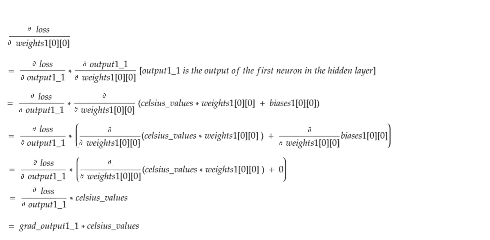*

*它看起来不像 36 号线吗？在代码 ***中，grad_output1*** 是一个表示隐含层 2 个输出的梯度的矩阵，上式中的 ***grad_output1_1*** 是它的第一个元素——意味着隐含层中第一个神经元的梯度。我们来评价一下:*

*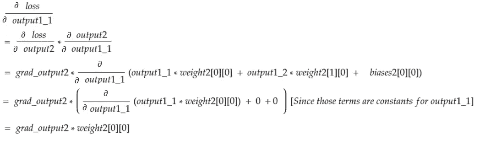*

*这与第 35 行相同。在那一行中，在矩阵点积的帮助下，在一个操作中计算隐藏层中所有 2 个神经元的输出的所有梯度。*

***第一层偏压梯度***

*我们来计算第一层第一偏置的梯度。*

*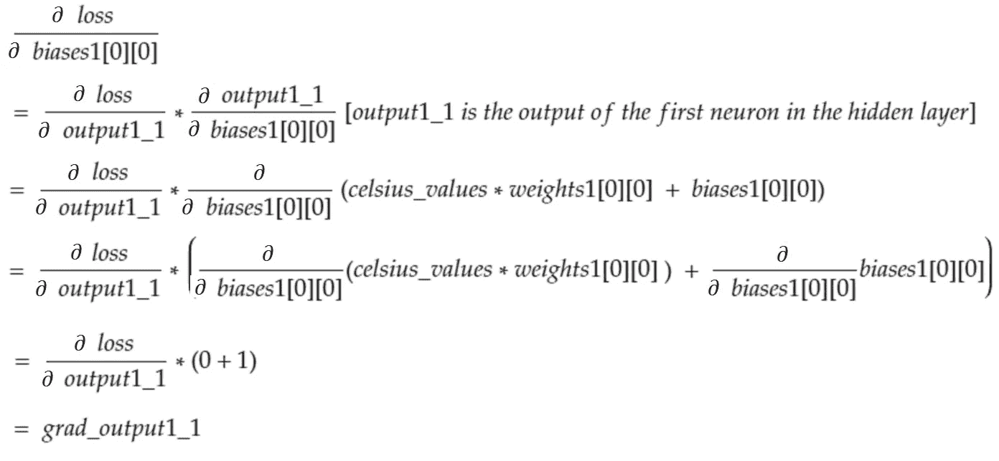*

*等式中的 grad_output_1_1 是隐含层(第一层)中第一个神经元输出的梯度。因此，对于每个偏置，梯度等于相应神经元输出的梯度——写在代码的第 37 行。看上面——同样的事情也适用于输出层的偏差！*

***更新参数***

*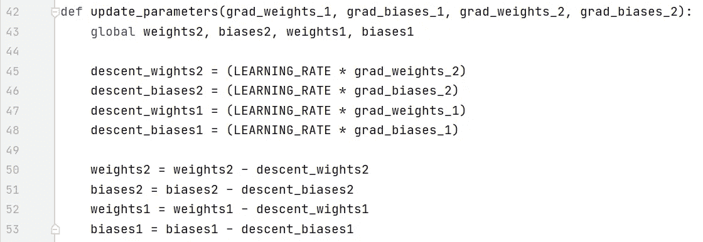*

*最后，我们正在更新参数。请注意，梯度在减去之前会乘以一个小因子(LEARNING_RATE ),以使训练稳定。LEARNING_RATE 的大值将导致 ***过冲*** 问题，而极小的值将使训练变慢，这可能需要更多的迭代。我们应该通过反复试验找到它的最佳值。这里有很多在线资源，包括这个[和一个](https://noobest.medium.com/but-why-is-this-learning-rate-in-gradient-descent-279fd991a1ae)来了解更多关于学习率的信息。*

*请注意，我们调整的确切数量并不重要。例如，如果您稍微调整 LEARNING_RATE，*变量(第 45–48 行)将会改变，但机器可能仍然工作。重要的是确保这些数量是通过用相同的因子(在这种情况下是 LEARNING_RATE)缩小梯度而得到的。换句话说，“保持 ***下降*** 的渐变比例”比“它们 ***下降*** 多少”更重要。**

**还要注意，这些梯度值实际上是为 100 个输入中的每一个评估的梯度的总和。但是因为这些是用相同的值缩放的，所以如上所述是好的。**

> **为了更新参数，我们必须用 global 关键字声明它们(在第 43 行)。**

****何去何从****

**如果你在看这篇文章之前对反向传播没有一个清晰的认识，看完之后如果你觉得你什么都懂了，那你肯定错了。要实现反向传播是不可能的，直到你自己运行代码，跟踪变量，你现在应该在做的事情。**

**任何问题-请留下评论。我一定会解决这个问题。**