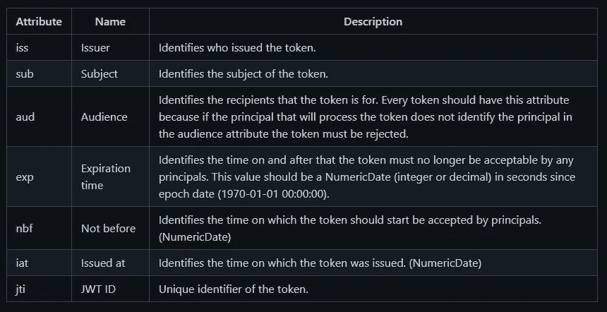
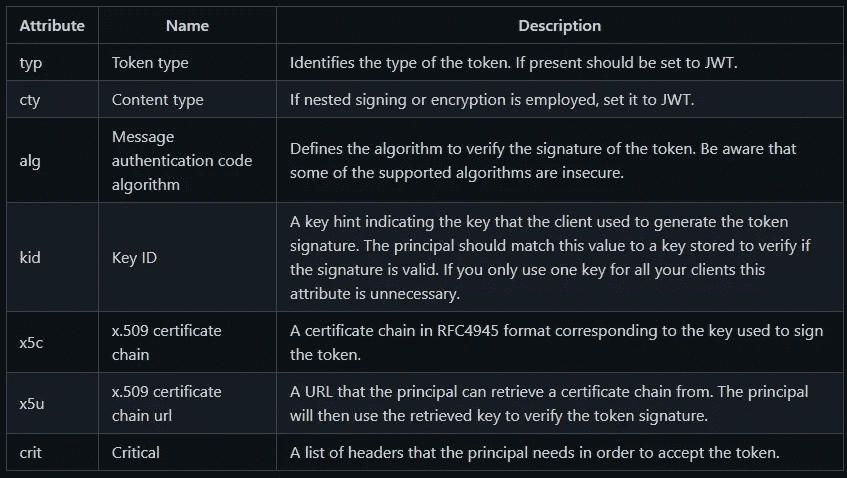

# JWT 认证—第 1 部分

> 原文：<https://medium.com/geekculture/jwt-authentication-part-1-45af02b29fce?source=collection_archive---------18----------------------->


# **简介**

我写这篇文章的目的是总结我在当前工作中研究 JWT 实现时收集的所有信息。我们将简要介绍我认为使用 JWT 时最需要注意的几点，在文章的最后，我将给出一个使用 nodejs 实现 JWT 的例子。

编辑:第二部分现在出来了，如果你是来看代码的，请在这里看[第二部分](https://andre-benevides.medium.com/jwt-authentication-part-2-3eb727805ad8)。

# **什么是 JWT？**

根据 jwt.io 的定义:

JSON Web Token (JWT)是一个开放标准(RFC 7519 ),它定义了一种紧凑且独立的方式，以 JSON 对象的形式在各方之间安全地传输信息。该信息可以被验证和信任，因为它是数字签名的。jwt 可以使用秘密(使用 HMAC 算法)或使用 RSA 或 ECDSA 的公钥/私钥对进行签名。

既然我们已经解决了这个问题，让我们更深入地了解 JWT 世界。

# **令牌到底是什么？**

前段时间我在网上看到了这个解释，这是我能想到的向不了解技术或之前不了解身份验证、会话和/或令牌的人解释令牌是什么的最佳示例:

如果我给你 10 €，你给我一张你签名的欠条，说你欠我 10 €，在以后的生活中，我可以回到你身边，给你看这张纸条，你会知道这张纸条是你签名的，并把钱还给我，但如果有人试图伪造这张纸条，从你那里得到一些钱，你会知道这张纸条是假的，从未由你签名，所以你拒绝交易。用相当基本的术语来说，这就是认证服务器和它的客户端之间发生的事情。

JSON Web 令牌是一种特殊类型的令牌，由 3 个 base64 编码的字符串组成:头、有效负载和签名(

)。<payload>。<signature>)。令牌结构的设计方式方便了它在 web 上的使用，例如，甚至可以在 URL 参数中传递。</signature></payload>

在头中，有一个 JSON 编码的对象，它定义了所使用的算法。

```
{ "alg" : "HS256", "typ" : "JWT" }
```

有效负载部分由认证服务器定义的一组声明组成。因为这些数据是 JSON 编码的，所以您可以存储任何您想要/需要的数据。有效负载的示例如下:

```
{"user":{"id":1,"username":"myDemoUser1","accesses":["CREATE","UPDATE","READ","DELETE"]},"iat":1605058642,"exp":1605067642,"aud":" YOUR-AUD-HERE","iss":"YOUR-ISSUER-NAME"}
```

最后一部分是签名，该签名由报头中指定的算法的加密签名的结果字符串组成。签名过程举例如下:

```
HMAC-SHA256(secret, base64urlEncoding(header) + '.' + base64urlEncoding(payload)
```

“秘密”应该是认证服务器及其用户之间的预共享密钥。

# **可用于 JWT 令牌声明的标准字段**

接下来，我将向您展示标准字段和推荐字段，但重要的是要理解，您不必强制使用这些字段中的任何一个，您可以使用自己的字段和/或混合使用标准字段和自己的字段。



注意:您应该使用的最低限度是“typ”和“alg”字段。



# JWT 安全吗？

TLDR:如果配置正确，它是安全的，否则它是不安全的。在任何情况下，JWT 不一定比 cookie 更安全，因为会话 cookie 的正确实现也使用非对称签名。继续阅读，获取更深入的答案。

JWT 中的内容本质上并不安全，因为它们是以 base64 编码的，base64 绝不是加密算法，但是如前所述，JWT 由 3 部分组成，令牌的最后一部分是由认证服务器用密钥生成的签名。这个签名确保服务器知道他签署了这个令牌，并且这个令牌是有效的。任何篡改签名的企图都将使令牌被认证服务器视为无效。也就是说，JWT 是安全的，但如果您没有正确配置令牌，它可能不如基于会话的身份验证安全。例如，一个永不过期的令牌很容易被任何人劫持和使用，而认证服务器对此一无所知。我通常每 5 分钟让令牌过期一次，但是您应该考虑哪个过期时间更适合您的范围。让您的令牌在短时间内过期会使任何被劫持的令牌在短短几分钟内无法使用，从而最大限度地降低损坏的风险。

# **JWT 是否用于认证或授权？**

这些术语听起来非常相似，但它们是非常不同的过程。身份认证是识别用户对系统的访问的过程。授权是确定您是否被授权访问特定资源的过程。幸运的是(或者不幸的是，这取决于你对 JWT 的看法), JWT 的工作方式使得两种情况都可以使用:令牌本身可以用于身份验证，而令牌有效负载的内容可以包含关于你被授权查看和/或操作的资源的信息。

还记得我之前在解释有效载荷时使用的有效载荷吗？

```
{"user":{"id":1,"username":"myDemoUser1","accesses":["CREATE","UPDATE","READ","DELETE"]},"iat":1605058642,"exp":1605067642,"aud":"YOUR-AUD-HERE","iss":"YOUR-ISSUER-NAME"}
```

这个 JSON 有一个访问声明，在这种情况下，让任何正在读取这个令牌的服务知道这个用户可以“创建”、“更新”、“读取”和“删除”资源。

# **优点&缺点**

# **优点**

因为令牌可以在“任何地方”生成，所以将认证服务器从您的资源服务器(例如:后端 API)中分离/分散是非常容易的。

# **百感交集**

令牌是“可移植的”,单个令牌可以由多个客户端使用。有些人认为这是一个优点，但在我看来，这是一个缺点，因为这使它不那么独特和安全。

另一个优点是，由于 JWT 是一个自包含的令牌，包含认证服务器所需的所有认证信息，它是无状态的，因此您不需要管理会话。我见过这样的情况，开发人员使用令牌作为成功登录的证明，现在令牌必须存储在客户端的某个地方。因此，您有效地将会话管理从服务器更改到了客户端。

# **缺点**

根据令牌的工作方式，如果您需要停用用户，您需要等到生成的最后一个令牌过期后，才能将用户真正锁定在您的系统之外。

如果用户需要更改其密码，并且在密码更改之前生成了令牌，则该令牌在过期之前仍然有效。

不存在“真正的注销”,因为令牌在到期之前一直有效，并且您无法在不破坏 JWT 标准的“无状态性”的情况下销毁令牌。

安全顾问 Tim McLean 报告了一些 JWT 库中的漏洞，这些漏洞使用 alg 属性来错误地验证令牌。被报告为不安全的库已被修补，但这是一个例子，说明您在使用第三方库时需要小心，因为尽管 JWT 标准实际上是安全的，但您的库可能会错误地验证令牌。

# **最佳实践**

由于其 JSON 编码的数据，JWT 允许您在应用程序之间共享信息，但请注意，这可能是一个滑坡，因为如果您开始在令牌中共享太多的信息，您将向您的系统和用户开放泄漏，从而暴露敏感的数据。永远记住，虽然你不能只用眼睛阅读令牌，但你传递的信息是用 base64 编码的，我提醒你，这不是一种加密措施，可以非常容易地还原成纯文本。

验证令牌时，始终检查令牌中的算法声明。如果令牌被盗，恶意参与者可以将声明更改为一些不太安全的算法，并试图篡改您的令牌。由于这个漏洞，你应该保留一个你的系统可以接受的算法的白名单。例如，算法声明“无”是一个有效选项，如果您的身份验证服务器未正确配置，它会将令牌作为未签名的令牌接受。

即使您使用的是安全的内部网络，也要始终验证您在每个请求中收到的每个令牌。如果您将身份认证服务器设置为总是检查令牌，那么当您的内部网络出现漏洞时，以及当您的服务转移到公共域时，您就可以保护您的系统，您已经正确设置了所有内容，现在您不必记住需要进行验证。

始终检查发行人索赔。JWT 的标准领域之一是 iss 声明。这有助于您的服务了解令牌的颁发者以及该颁发者是否合法。另外，在验证 issue 声明时，要确保发布者被准确地解析为您所知道的那样。例如，颁发者“testtest”与“testTest”和/或“testtest/a”不同。

总是检查观众的要求。如果您已经检查了发行者声明，那么您还必须检查受众声明。该字段告诉您令牌的接收者。您的服务应该检查这一声明，并将其与白名单进行比较。如果受众声明被列入白名单，服务器可以接受资源请求，否则服务器应该立即拒绝令牌。如果您使用 JWT 作为访问令牌，那么受众声明的一个良好实践应该是令牌所针对的 API 的 URL。

始终生成具有小有效性窗口的令牌。JWT 在发给客户后几乎不可能被撤销。服务器应该总是寻找 exp 声明，并检查令牌是否还没有过期。请注意，恶意用户可能会更改“时钟”以在过去发出请求，并使其看起来好像令牌尚未过期。为了解决这个问题，您可以使用“nbf”声明，即“不在之前”时间，该声明告诉服务器在特定日期和时间之前不能使用令牌。您还可以添加 iat 声明“issued at”来告诉服务器令牌是何时发出的。这有助于服务器拒绝被认为太旧而不能使用的令牌。

请注意，对令牌的有效负载或报头的任何更改都会生成不同的签名。因此，在验证令牌时记住签名是很重要的(这可能是最重要的一步！).这些变化可能小到在报头或有效载荷中添加一个空格。如果两个客户端在完全相同的时间请求令牌，理论上可能会出现“重复”令牌的情况，我认为这很难发生，但您可以使用“jti”声明，这是由您的身份验证服务器生成的 ID，有助于区分令牌。尽管所有其他声明都是相同的，但是每个令牌的 ID 总是不同的，因此使它们是唯一的。

不要使用对称签名。尽可能避免使用对称签名，而是使用非对称签名。使用对称签名，您永远无法确定谁签署了令牌，而使用非对称签名，唯一能够签署令牌的实体是拥有私钥的实体，这让我想起了下一个好的实践。

不要把你的认证服务器的私钥给任何人。这只应由服务器单独使用，并应保存在安全的地方。

不要使用 JWT 作为会话 cookies。

# **最终想法**

我真的希望我的总结能帮助您更好地理解 JSON Web Token。我认为重要的是，JWT 并没有神奇地比其他经过测试的方法(如会话 cookies)更安全，JWT 的每一项安全措施本质上都和其他工具一样。虽然我没有将 JWT 与其他工具进行比较，但我试图避免一些网站给你的 JWT 的美化视图，因为重要的是要明白，如果你决定在你的应用程序中使用 JWT，你不会自动更安全，你需要做你的尽职调查，以确保你的应用程序尽可能安全。

请继续关注第 2 部分，在那里我将指导您使用 nodejs 和 express 完成一个代码示例。

我希望你喜欢这篇文章，我会在我的下一篇文章中看到你。在那之前，注意安全！