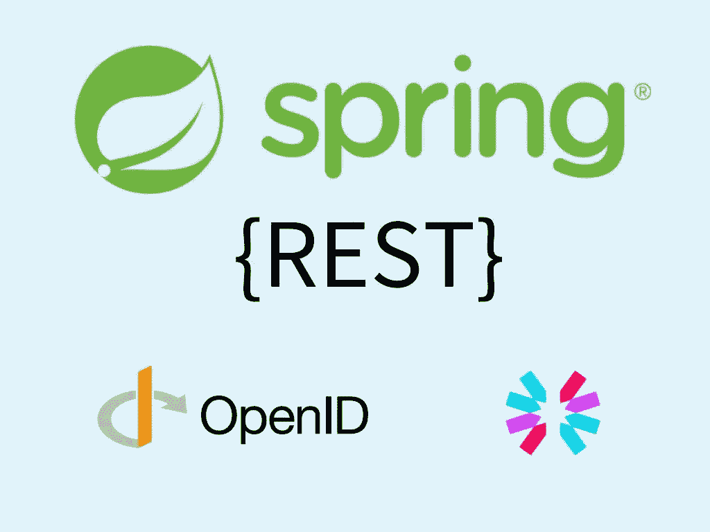

# 使用 OAuth2 资源服务器和外部授权服务器进行 JWT 身份验证

> 原文：<https://medium.com/geekculture/jwt-authentication-with-oauth2-resource-server-and-an-external-authorization-server-2b8fd1524fc8?source=collection_archive---------0----------------------->

## 使用 Spring Boot 内置的 OAuth2 资源服务器，通过外部授权服务器发布的 jwt 来认证 REST API

之前我写过，

*   [如何用 Spring 实现 JWT 认证](/swlh/stateless-jwt-authentication-with-spring-boot-a-better-approach-1f5dbae6c30f) …