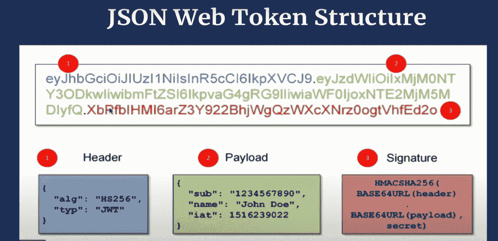
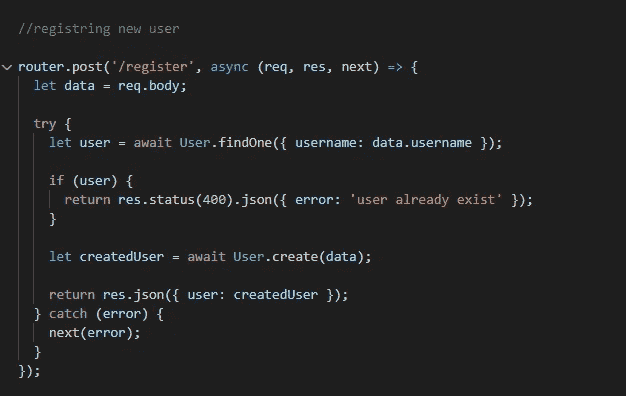
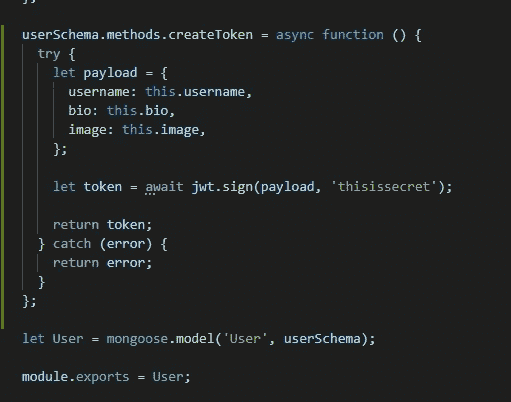
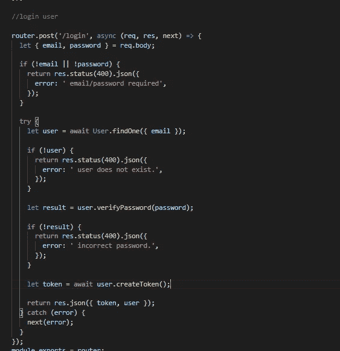
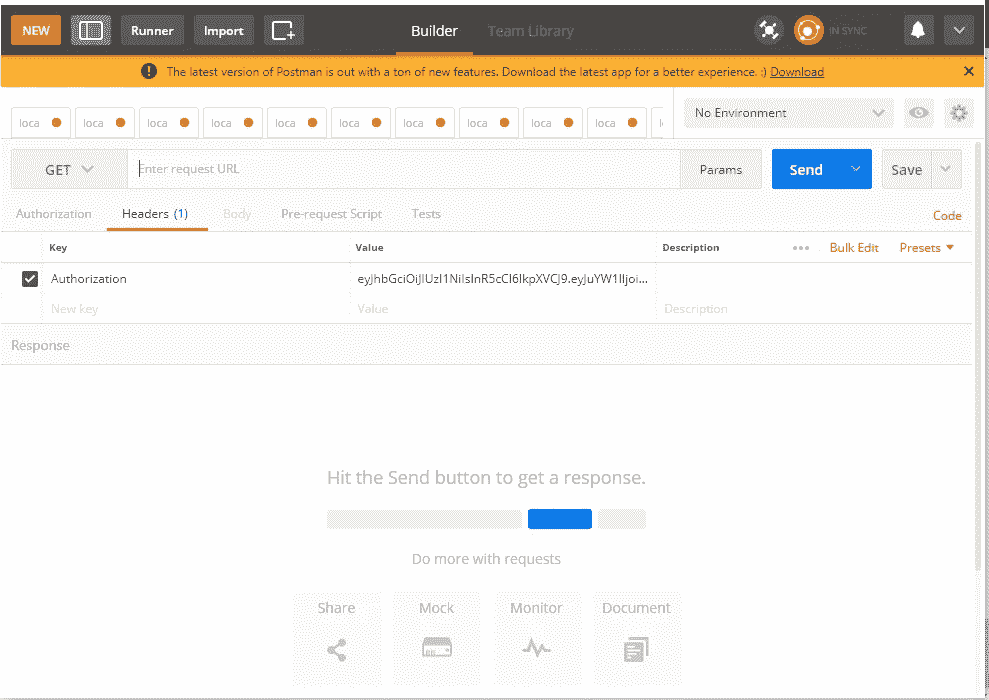
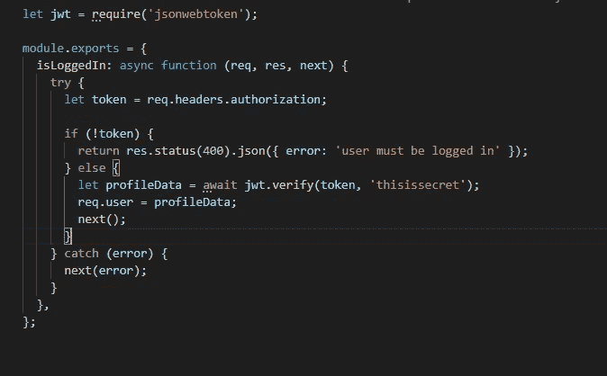

# 使用 nodeJS 的基于 JWT(jsonwebtoken)令牌的身份验证。

> 原文：<https://medium.com/geekculture/jwt-jsonwebtoken-token-based-authentication-using-nodejs-6af661d5a64?source=collection_archive---------8----------------------->

首先，我们必须知道什么是 JWT？JWT(jsonwebtoken)是 npm 包，用于在用户**登录到我们的应用程序**时创建**令牌**。

*   令牌的基本结构如下



JWT token structure

*   **头**:-JWT 令牌中的头包含一些关于令牌的元数据。我们作为用户不需要在里面写任何东西。
*   **Payload** :- Payload 是我们必须添加到令牌中以备将来使用的信息。
*   **Signature** :- Signature 是使用服务器中可用的头、有效载荷和秘密制作的 URLencoded 文本。将来，同样的秘密将被用于从令牌中提取信息。使用这个秘密是为了只有授权的服务器才能解码令牌。

现在让我们看看如何在服务器中使用令牌。

# 步骤 1:-安装 JWT 并设置定位部件。

*   首先，我们必须使用以下代码将 jsonwebtoken 包安装到我们的 express 应用程序中。

```
**npm i jsonwetoken --save**
```

*   现在，我们必须处理应用程序的注册部分。这部分在我之前的博客里有解释。如需进一步参考，请参见下图。
*   现在我们必须处理“**/用户/注册**”路线。



handling registration part

# 步骤 2:-处理登录路由

*   在这一步中，我们必须验证用户提供的凭证并返回正确的结果。
*   对此，可以参考我的另一篇博客《 [***注册/登录使用 MongoDB 在 expressJS 中存储数据***](/nerd-for-tech/registration-login-using-the-mongodb-to-store-data-in-expressjs-dba79c8886f2) 》链接:-“[https://medium . com/nerd-for-tech/Registration-log in-using-the-MongoDB-to-store-data-in-express js-DBA 79 c 8886 f 2](/nerd-for-tech/registration-login-using-the-mongodb-to-store-data-in-expressjs-dba79c8886f2)。
*   一旦用户凭据得到验证，我们现在必须创建令牌。

# 步骤 3:-创建令牌

*   为了创建令牌，我们必须将 **createToken()** 方法添加到我们的**用户**模型中。

> 提示:-在创建 **createToken** ()时，不要使用**箭头功能**。因为我们不得不使用**这个**关键字，它对箭头功能不起作用。

*   首先，我们必须创建有效负载对象，并添加我们需要添加到令牌内部的数据，以供将来使用。
*   现在，我们必须将 jsonwebtoken 导入到用户模型的顶部变量 jwt 中。

```
**let jwt = require('jsonwebtoken');**
```

*   现在，我们可以使用 jwt.sign()方法创建一个令牌，它将接受 payload 作为第一个参数，Secret 作为第二个参数。

> 提示:-记住添加秘密到。env 文件并使用 dotenv 包来保守你的秘密。

*   创建令牌后，返回令牌。



createToken()

# 步骤 4:-在我们调用 createtoken()的地方返回令牌。

*   还记得我们在哪里调用了 createToken()。这是在处理“/用户/登录”路由时发生的。
*   现在我们已经在名为 **token 的变量中创建了 token。**
*   现在，我们可以随心所欲地用这个作为信物。现在我们正在返回令牌和用户数据。



handling /users/login route

# 步骤 5:-使用令牌进行身份验证。

*   现在，我们有了一个令牌，我们必须使用它来保护路由，只允许登录的用户访问它们。
*   这可以通过使用令牌来实现。令牌可用于查找登录用户的信息。
*   在 React 中，我们可以在访问路由时直接传递令牌，但现在，我们将使用 POSTMAN 应用程序在请求路由时将令牌发送到标头中。
*   在 POSTMAN 应用程序中，我们必须在头中创建一个名为“Authorization”的新字段，并且作为一个值，我们必须粘贴一个令牌。



using postman to send tokens.

# 步骤 6:-在中间件文件夹中创建 auth.js 文件

*   现在，我们必须在名为**中间件**的文件夹中创建一个 **auth.js** 文件。
*   现在，我们必须在 **auth.js** 文件的内部编写一个名为 **isLoggedIn()** 的方法。
*   首先，在文件顶部导入 jsonwebtoken。
*   现在，在 isLoggedIn()中，我们可以通过访问 **req.headers.** 来访问由 POSTMAN 应用程序发送的令牌
*   如果没有令牌，那么我们可以向用户发送一条错误消息。
*   如果有令牌，我们可以使用 **jwt.verify()** 方法，该方法接受**令牌**作为第一个参数，接受**秘密**作为第二个参数。
*   jwt.verify() 方法返回令牌内的有效负载作为结果。
*   一旦我们有了有效负载，我们就可以将它放入 req.user 并调用 next()方法。由于这个信息，有效载荷内的信息可用于下一个中间件。



isLoggedIn() inside auth.js file

# 步骤 7:-当我们需要授权时，在 auth.js 文件中使用“isLoggedIn()”方法。

*   对于任何路由，如果我们需要保护它不被未登录的用户访问，我们可以使用 isLoggedIn()方法。
*   假设我们必须保护 route "/profiles/:profileName "不被未登录的用户访问。
*   我们可以在处理路由时添加 auth.isLoggedIn 中间件，如下所示。


using **auth.isLoggedIn** middleware

*   一旦我们添加了这个中间件，只有已登录的用户才能看到正确的响应，而未登录的用户将会收到一条错误消息“您需要登录”。
*   还有一个特性是我们可以访问存在于 **req.user** 对象中的登录用户信息。