# k 表示主题投资的聚类

> 原文：<https://medium.com/geekculture/k-means-clustering-on-thematic-investing-bd75bfb5eeb6?source=collection_archive---------28----------------------->

## 通过分析主题交易所交易基金来识别大趋势群

Photo by [WrongTog](https://unsplash.com/@wrongtog) on [Unsplash](https://unsplash.com/)

主题投资是一种投资形式，旨在捕捉长期增长速度超过平均水平的大趋势。例如，如果我们想抓住人口老龄化的大趋势，那么我们的主题投资可以是购买与老年住房、医疗保健等相关的股票。

虽然主题投资越来越受欢迎，但是股票的大趋势分类却很模糊。例如，一些 ETF 提供商提供能源转型等广泛的大趋势产品，而一些提供商将这一趋势进一步分为智能移动和清洁能源大趋势两个独立的产品。

大趋势有这么多不同的定义，理解主题投资前景可能具有挑战性。本文展示了我对 K 均值聚类的应用，根据一些相似性将这些大趋势分组到更小数量的分类中。这个项目的 Python 实现可以在 [GitHub](https://github.com/jingwun/K-Means-Clustering-on-Thematic-Investing) 上获得。

**数据收集**

为了收集大趋势的各种定义，我使用了 etf.com 数据库来编制主题 ETF 的列表。在撰写本文时，共有 143 只 ETF，以下是前五只:

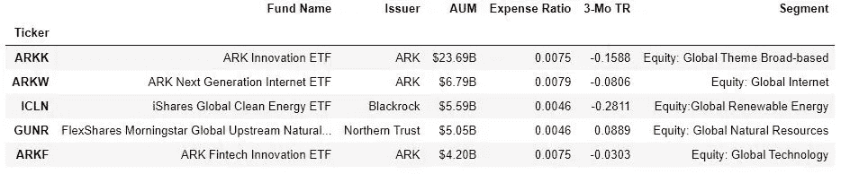

Image by author

这些交易所交易基金由各种各样的发行人提供，总共有 41 家。这是理想的，因为我们可以捕捉各种各样的大趋势定义。

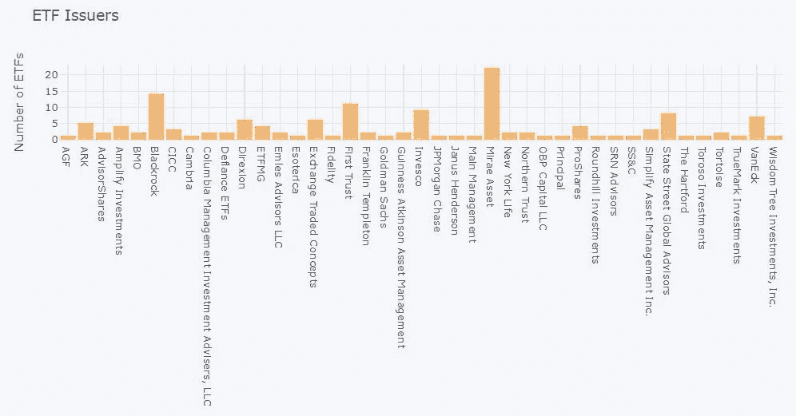

Image by author

与 ETF 相关的特征可以是其价格数据以及持有数据。对于价格数据，我从雅虎下载了每日价格。融资，并计算了 2 年的跟踪年化回报率和波动率。两年的历史看起来很短，但对于衡量价格模式来说，这可能是一个合理的时间长度，尤其是考虑到自新冠肺炎危机爆发以来，我们已经经历了一个市场周期。对于历史短于 2 年的 ETF，我对年化回报和波动性都标为“不适用”。

就持股数据而言，我注意到，基于基金捕捉的大趋势，主题基金通常会强烈倾向于选定的行业。因此，一个好的起点可能是从雅虎收集每个 ETF 的部门分配。金融和 Finnhub。

**探索性数据分析**

完整的数据集有这 19 个变量。

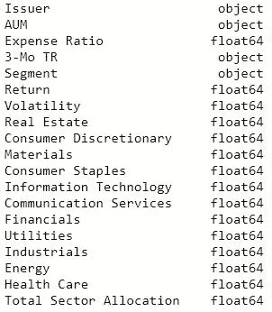

The datatype of variables (image by author)

以下是数据集中每个变量的定义:

*   发行人:交易所交易基金的发行人
*   AUM:以美元管理的资产
*   费用率:投资交易所交易基金的成本
*   3 个月追踪回报:3 个月追踪回报
*   分部:按 etf.com 分类
*   回报:过去 2 年的年化回报。对于历史不足 2 年的 ETF，回报为 N/A。
*   波动率:过去两年的年化波动率。对于历史不到 2 年的 ETF，波动率为 N/A。
*   房地产，非必需消费品，材料，消费品，信息技术，通信服务，金融，公用事业，工业，能源，医疗保健:分配到各自的部门
*   部门分配总额:单个部门分配总额

在这 143 只 ETF 中，54 只缺少价格数据(回报率= 54)，5 只缺少行业数据(总行业分配= 5)。缺少价格数据或行业数据的 ETF 将被删除。

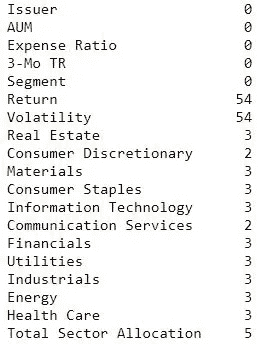

Number of N/A values by variable (image by author)

发行人、AUM、费用比率、3 月 TR 和细分市场不相关，将被删除。请注意，etf.com 通过“细分”变量对主题 ETF 进行了自己的分类。总共有 46 段。如果应用自然语言处理，这个变量可能是相关的，但是现在，我将只关注价格和持有量数据。

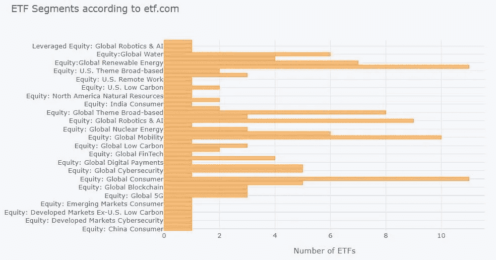

image by author

不出所料，在主题投资领域，一些行业(科技、工业和非必需消费品)比其他行业更受欢迎。

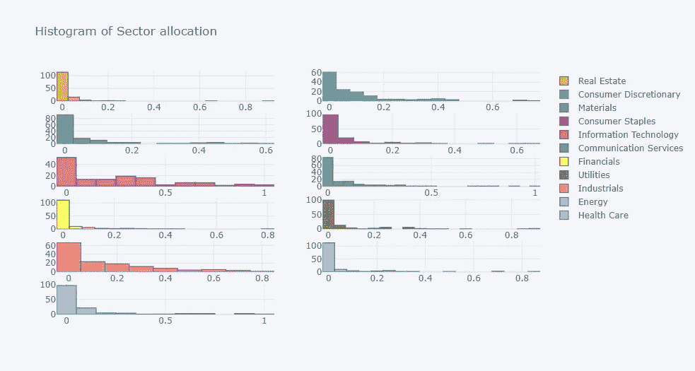

image by author

**数据角力**

除去不相关的变量和缺失的数据点后，我们剩下 89 个 ETF 和 13 个变量。下表显示了选定的变量，我们可以看到它们有不同的标度。

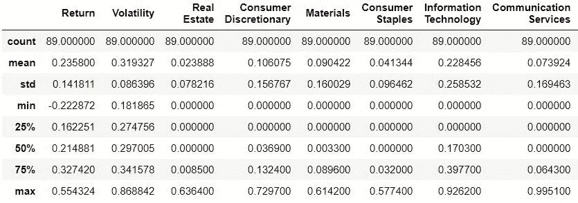

image by author

**数据转换**

k 表示聚类旨在将数据点(ETF)分组为簇。每个聚类都有一个中心，每个数据点都与离它最近的中心相关联。数学上，我们希望最小化单个数据点到其最近中心的距离。使用欧几里德距离，距离可以计算为:

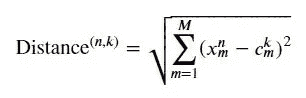

image by author

，其中:

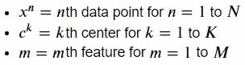

image by author

然后，每个数据点𝑛与最近的中心相关联:

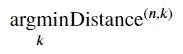

image by author

由于 K 均值聚类使用距离来确定相似的聚类点，因此当要素之间的比例相差很大或具有更高维度的数据时，K 均值聚类并不适用。因此，应该探索特征缩放和降维。

**(1)特征缩放:**

要素缩放的目的是确保要素的比例相似。在这里，我使用 StandardScaler，其计算方法如下:

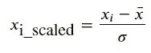

image by author

，其中:

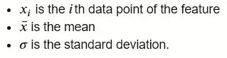

image by author

它将要素重新缩放为近似标准正态分布。数据被转换为平均值为 0，标准差为 1。

重新调整后，我们可以看到每个特征的均值和标准差分别接近 0 和 1。(为了便于阅读下图，省略了其余部分。)

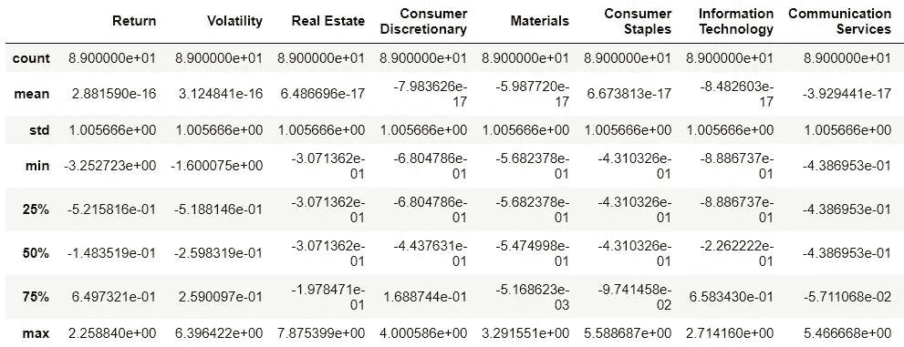

image by author

**(2)降维:**

主成分分析(PCA)是一种降维方法，它将一个大的变量集转换为一个较小的变量集，该变量集仍然包含大集中的大部分信息。从数学上讲，对于具有𝑀要素的数据集𝑋，我们希望找到一个𝑃正交单位向量序列，它可以尽可能多地解释数据中的方差。

作为一个例子，假设我们要进行一个有两个成分的主成分分析，即𝑃=2.我们首先关注具有最大方差的第一个线性组合。这是一个约束优化问题，我们的目标是:

image by author

拉格朗日量是:

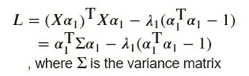

image by author

取一阶导数并设为零:

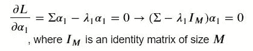

image by author

回想一下，我们的目标是最大化𝕍(𝑋𝛼1).这等于最大化𝜆1，因为:

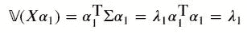

image by author

因此，𝜆1 =最大特征值，𝛼1 =对应的特征向量。

为了找到第二个线性组合，我们需要考虑进一步的约束:

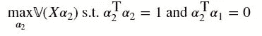

image by author

拉格朗日量是:

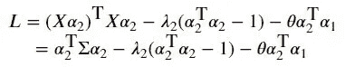

image by author

取一阶导数并设为零:

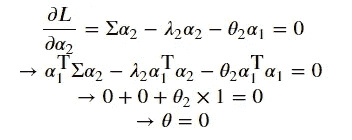

image by author

因此，

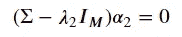

image by author

𝜆2 =第二大特征值，𝛼2 =相应的特征向量。

从下面对专题 ETF 数据集进行的主成分分析中，我们可以看到，随着成分数量的增加，可以更好地解释方差。

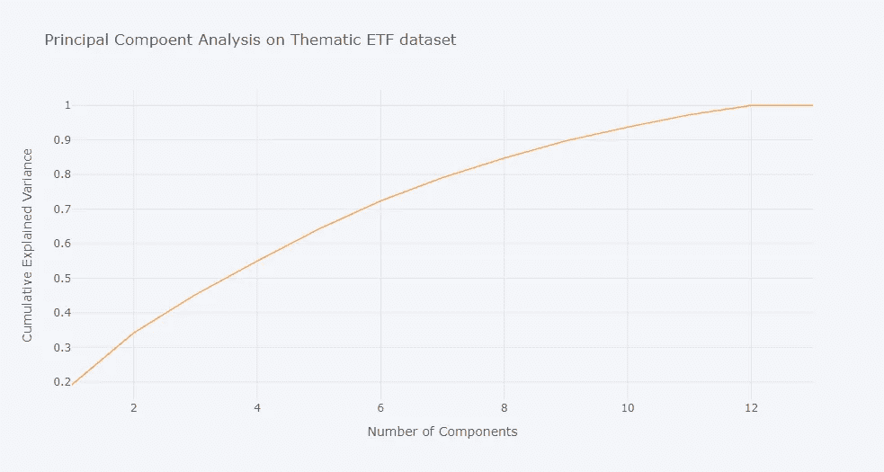

image by author

通常，我们会为所解释的方差设置一个最小阈值，然后选择能够满足该阈值的最小数量的成分。但是，在这个项目中，我将探索组件数量对 K 均值聚类的影响。

在 K 均值聚类中，将所有到最近中心的平方距离相加，得到总距离的度量，称为“误差”。如果我们将这个误差与簇的数量 K 相对照，我们得到一个 scree 图。我们可以看到，在超过 4 个 PCA 成分的 scree 图中没有“弯头”。“肘部”是误差急剧下降然后趋于平稳的地方。肘部的 x 轴是我们正在寻找的最佳聚类数。如果误差只是逐渐下降(没有拐点)，那么使用这种方法就没有明显的最佳 K。

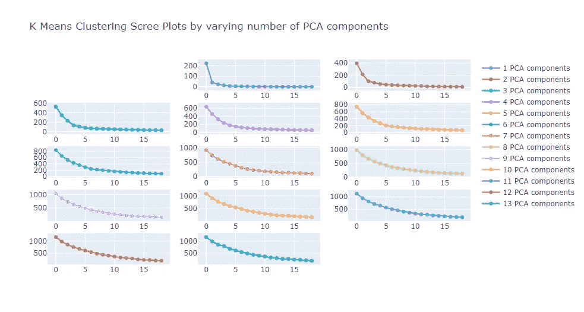

image by author

PCA 成分的数量越多，我从原始特征中保留的信息就越多。因此，我受到激励，最大限度地利用弯头在碎石地块中增加 PCA 成分的数量。在这种情况下，4 个 PCA 组件和 4 个集群看起来是最佳选择。我不能绘制一个四维图，所以我使用第一和第二主成分来可视化。每种颜色代表一个集群。

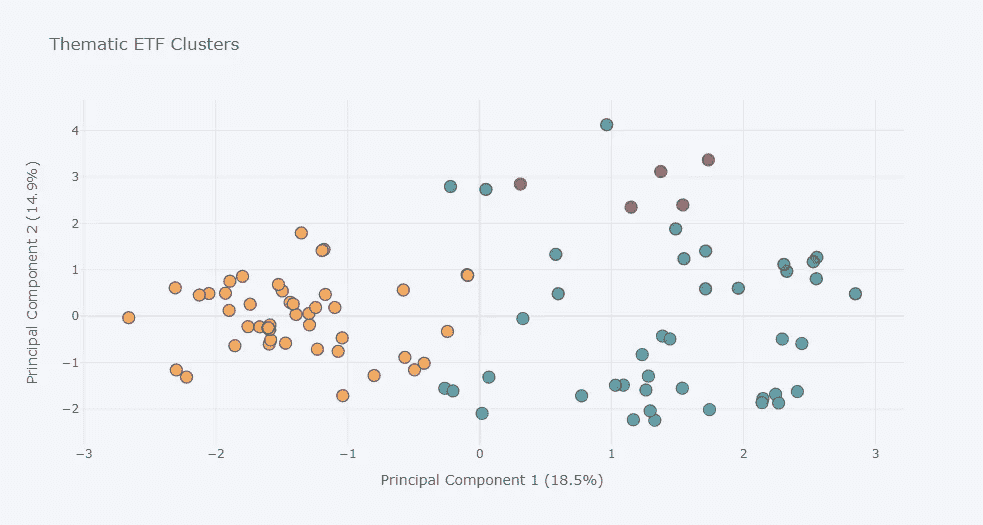

Image by author

虽然这个二维图不能完全说明相似性，但我们可以看到，这些 ETF 似乎在某种程度上根据 PCA1 和 PCA2 聚类。下表更清楚地列出了 4 个集群中的 ETF。

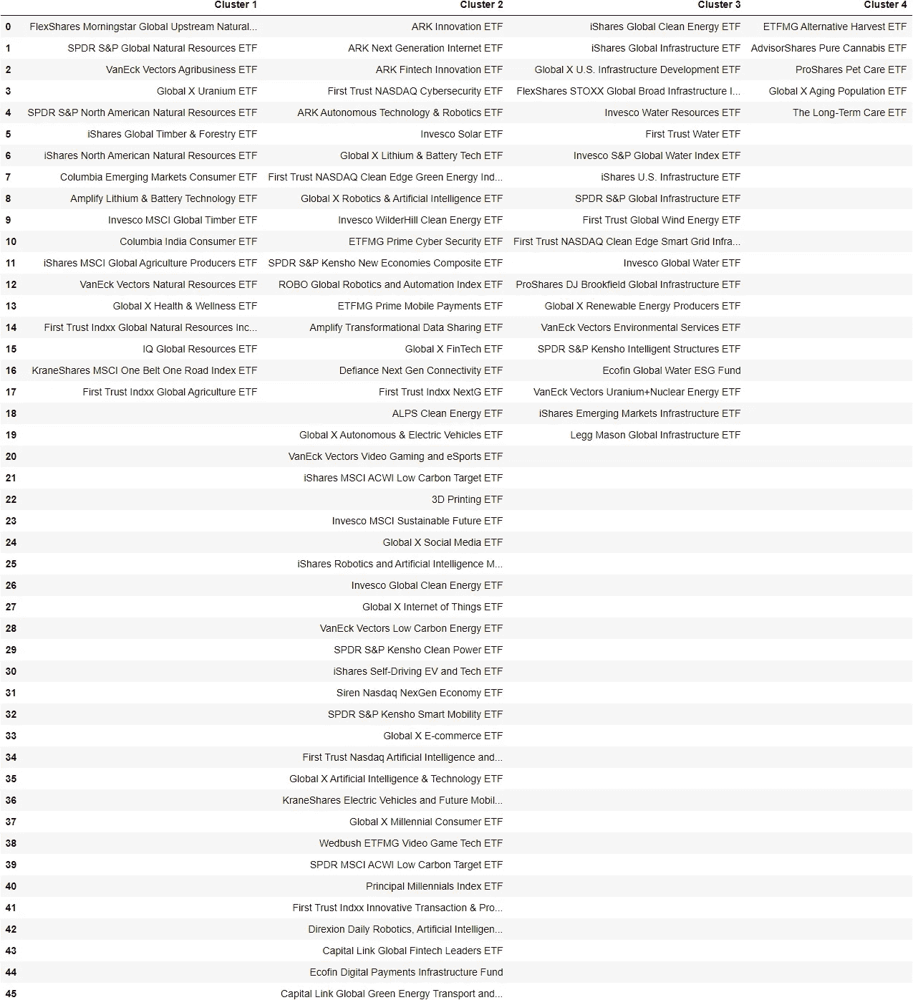

image by author

单个 ETF 的浏览揭示了每个集群内的大趋势:

*   第一组:自然资源和农业
*   群组 2:数字化和自动化
*   第 3 组:清洁能源和基础设施
*   群组 4:老龄化人口

第二组是一个大组。另一个 K 意味着如果我们想要进一步将该簇分解成更小的簇，可以对该簇执行聚类。

**结束语**

通过简单地提供主题 ETF 的价格和部门数据，K 均值聚类似乎可以有效地识别 4 个不同的聚类。流行的大趋势是自然资源和农业，能源转换和自动化，清洁能源和基础设施，以及人口老龄化。“能源转换和自动化”集群明显大于其他 3 个集群，另一个 K 意味着如果需要进一步拆分，可以进行集群。通过纳入更多的主题基金和个人持股，这项研究有可能得到改进。将自然语言处理应用于 ETF 的名称也可能会有所启发。