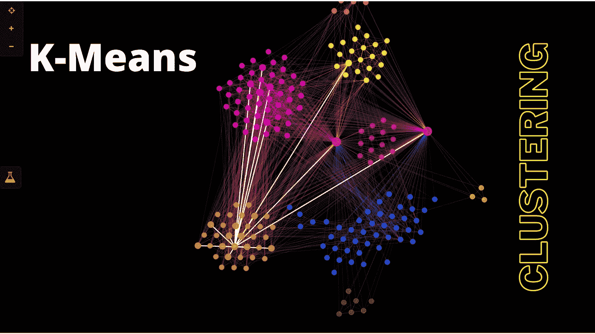
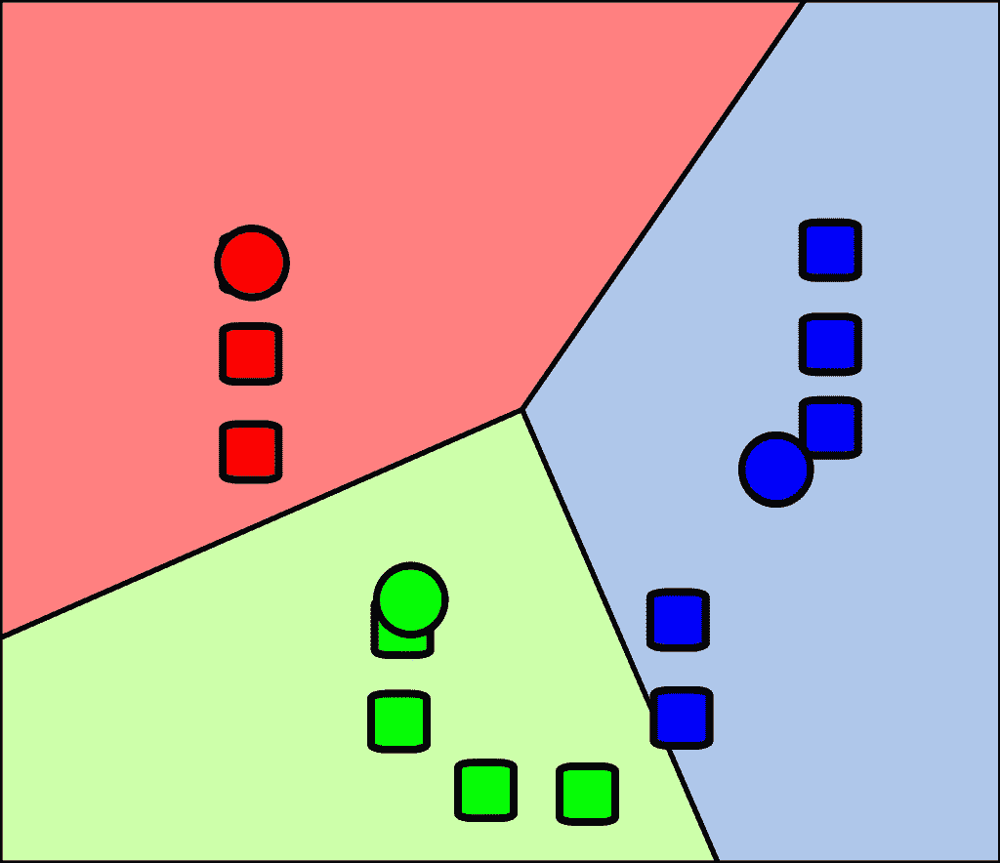
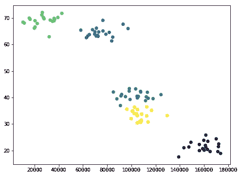

# 简化的 k-均值聚类

> 原文：<https://medium.com/geekculture/k-means-clustering-simplified-f49cfb34388f?source=collection_archive---------43----------------------->



这是机器学习中非常常见的技术，你只需尝试获取一堆数据，并根据数据本身的属性找到有趣的聚类。

听起来很奇特，但实际上很简单。我们在 K 均值聚类中所做的就是试图**将我们的数据分成 K 个组**，这就是 K 的来源:它是你试图将你的数据分成多少个不同的组。

## 定义

一种无人监督的学习技术，你有*一堆东西，你想把它们*组合成不同的**簇**。也许是电影类型或者人口统计学；仅仅基于数据本身的属性。

## 说明

K-mean 算法通过寻找 K 个质心来创建聚类。所以基本上，一个给定的数据点属于哪一组是由散点图中它最接近的质心点来定义的。



您可以看到，这里显示的是一个 K 均值聚类的示例，其中的 **K 为*三(3)*** ，正方形代表散点图中的数据点。

***圆圈*** *代表 K-means 聚类算法得出的质心*，每个点根据其最接近的质心被分配一个聚类。

所以基本上，一个给定的数据点属于哪一组是由散点图中它最接近的质心点来定义的。

## k 均值算法步骤

1.  选择聚类数 k。
2.  从数据中随机选择 k 个点作为质心。
3.  将所有点分配给最近的聚类质心。
4.  重新计算了新形成的星团的质心。
5.  如果质心位置改变，重复步骤 3 和 4。

## 何时使用 K 均值聚类

*   当数据集是不同的或者以线性方式彼此分离时。
*   当聚类中心的数量由于数据中明确定义的类型列表而被指定时。

# k 均值优势:

1.  **简单**:很容易实现 k-means，从复杂的数据集中识别未知的数据组。
2.  **灵活**:如果有任何问题，调整集群段将允许在算法上容易地发生变化。
3.  **准确性** : K-means 分析提高了聚类的准确性，并确保关于特定问题域的信息是可用的。
4.  **适用于大型数据集** : K-means 适用于大量数据集，其计算速度比小型数据集快得多。
5.  **时间复杂度** : K-means 分段在数据对象数量上是线性的，因此增加了执行时间。
6.  **更少的计算成本**:与使用其他聚类方法相比，k-means 聚类技术是快速有效的。

# k-均值缺点:

1.  **用户定义的聚类** : K-means 不允许开发一组最优的聚类，为了获得有效的结果，您应该先决定聚类。
2.  **值的顺序影响结果**:构建算法时数据的排序方式影响数据集的最终结果。
3.  **处理大数据集时崩溃**:创建树状图技术会因为大量的计算负载而导致计算机崩溃。
4.  **限于数值型数据** : K-means 算法只能在数值型数据中执行。
5.  **假设球形聚类** : K-means 聚类技术假设我们处理的是球形聚类，每个聚类都有相同数量的观测值。
6.  **预测问题**:很难预测 k 值或聚类数。也很难比较产生的簇的质量。

# Python 中 K 均值的示例

让我们创建一些随机数据来尝试和集群。我们在 python 中输入这个小的创建集群数据函数，它从一个一致的随机种子开始，所以你每次都会得到相同的结果。

```
from numpy import random, array#Create fake income/age clusters for N people in k clustersdef createClusteredData(N, k):
    random.seed(10)
    pointsPerCluster = float(N)/k X = [] for i in range (k):
        incomeCentroid = random.uniform(20000.0, 200000.0)
        ageCentroid = random.uniform(20.0, 70.0) for j in range(int(pointsPerCluster)):
            X.append([random.normal(incomeCentroid, 10000.0),random.normal(ageCentroid, 2.0)]) X = array(X) return X
```

它需要 N，我想在 K 个集群中创建 N 个人的集群，所以它先计算出每个集群有多少个点，然后建立这个列表 X，从空开始。

> 我们将使用 k-means 在无监督学习中重新发现这些聚类:

```
%matplotlib inlinefrom sklearn.cluster import KMeans
import matplotlib.pyplot as plt
from sklearn.preprocessing import scale
from numpy import random, float data = createClusteredData(100, 5)
model = KMeans(n_clusters=5) # Note I'm scaling the data to normalize it! Important for good results.model = model.fit(scale(data)) # We can look at the clusters each data point was assigned toprint(model.labels_) # And we'll visualize it:plt.figure(figsize=(8, 6))
plt.scatter(data[:,0], data[:,1], c=model.labels_.astype(float))
plt.show()
```

*输出:*

```
[0 0 0 0 0 0 0 0 0 0 0 0 0 0 0 0 0 0 0 0 1 1 1 1 1 1 1 1 1 1 1 1 1 1 1 1 1  1 1 1 4 4 4 4 4 4 4 4 4 4 4 4 4 4 4 4 4 4 4 2 3 3 3 3 3 3 3 3 3 3 3 3 3 3  3 3 3 3 3 3 2 2 2 2 2 2 2 2 2 2 2 2 2 2 2 2 2 2 2 2]
```



这就是 K 均值聚类的全部内容，就是这么简单。你可以从集群中学习*sci kit-learn K-Means*。

在此之前，确保您*缩放并标准化数据*。你要确保你使用的 K-Means 的东西是可以互相比较的，尺度函数会帮你做到这一点。这就是 K 均值聚类的主要内容。

因此，如果您有未分类的数据，并且您事先确实没有正确的答案，那么尝试自然地找到您的数据的有趣分组是一个好方法，这可能会让您对这些数据有所了解。

感谢你阅读这篇文章，我希望你喜欢并且今天学到了一些新的东西。如果您有任何问题，请随时通过我的博客联系我，我将非常乐意帮助您。

保持安全和愉快的学习！