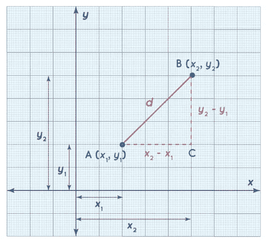
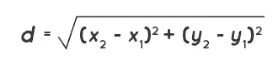
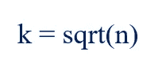
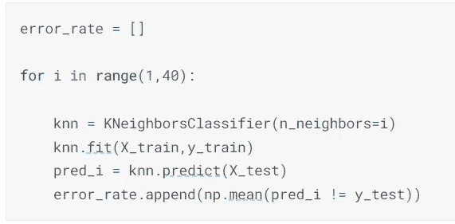
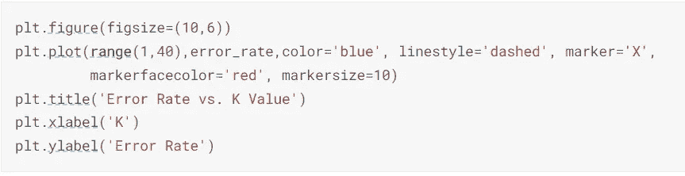
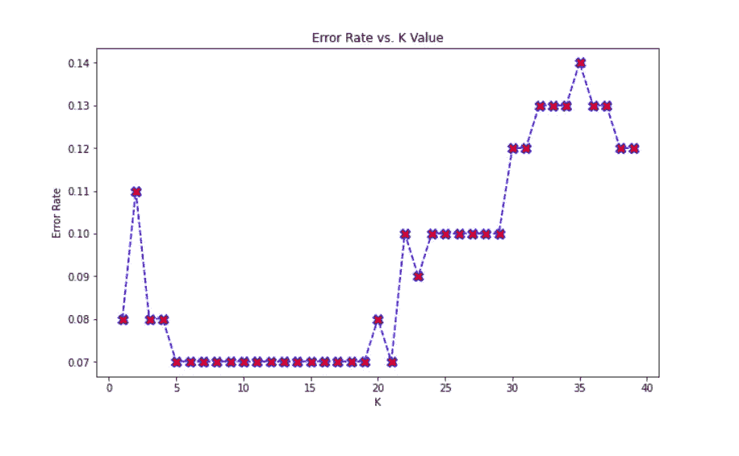
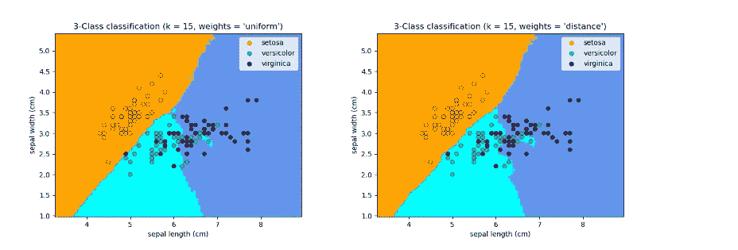
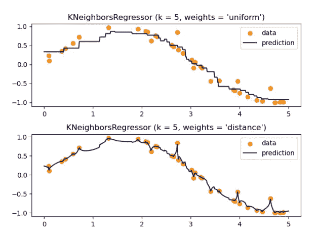

# K-最近邻

> 原文：<https://medium.com/geekculture/k-nearest-neighbour-k-nn-7da34eccf225?source=collection_archive---------9----------------------->

[https://www.pexels.com/photo/smooth-round-colorful-shapes-with-wavy-edges-6664375/](https://www.pexels.com/photo/smooth-round-colorful-shapes-with-wavy-edges-6664375/)

我们经常与 K-NN、K-means 和 K-medoids 混淆，因为这三种方法用于距离方法来对输入进行聚类和分类。K-最近邻(K-NN)是一种监督学习方法，它结合 K 个最近点的分类来确定数据点的分类。它可用于分类和回归问题。它在分类问题中很流行，因为它对分类更有效。

而 K-means 和 K- Mediods 是用于将一组未标记的数据点聚类成小聚类的无监督学习方法。前者考虑最小化总平方误差，而后者关注最小化被标记为在聚类中的点之间的不相似性的总和。

## 惰性和非参数算法

K-NN 算法被称为**懒惰算法**，因为没有**没有训练阶段**，没有建立紧凑模型，没有对训练数据进行计算。该算法只存储它在训练阶段获得的所有数据。它是**非参数的**，因为它没有对数据分布做任何假设，并且它从训练数据集中预测 k 个最相似的模式。相似的模式可以具有相似的输出变量。除非参数算法，例如线性回归，对函数有假设并坚持假设。非参数算法其他例子有决策树、朴素贝叶斯、SVM、神经网络等。

在测试阶段，只使用节点的标签，它调整几个参数。K-NN 灵活而强大，但由于它是非参数的，因此需要大量的数据。与参数模型不同，参数的数量相对于样本大小而言是不固定的，**参数的数量会随着样本大小的增加而增加，这导致了复杂性，并可能使模型过拟合。**在应用 KKN 算法之前，要进行特征缩放，否则模型的精度会大打折扣。要素缩放对所有要素进行缩放，以确保它们都采用相同的比例值。它防止一个特征支配另一个特征。

## 投票机制

KNN 算法使用多数投票或加权投票机制。

**多数表决** 在 k-NN 分类中，输出的是一个类成员。一个对象通过其邻居的多数投票来分类，该对象被分配到其 *k* 个最近邻居中最常见的类别( *k* 是正整数[T8，通常很小)。如果 *k* = 1，那么该对象被简单地分配给该单个最近邻的类。在 k-NN 回归中，输出是对象的属性值。该值是 *k 个*最近邻居值的平均值。](https://en.wikipedia.org/wiki/Integer)

**距离计算** 对于多数投票，通常使用的距离度量是**欧几里德距离**。在欧几里得空间(欧几里得空间是几何学的基本空间，意在表示物理空间。)，两点之间的欧氏距离就是两点之间的一条线段的长度。它可以使用勾股定理从点的笛卡尔坐标中计算出来。

如果我们考虑欧几里得空间中的两个点，它们的笛卡尔坐标分别是(x1，y1)和(x2，y2)，可以表示如下。

[https://www.cuemath.com/euclidean-distance-formula/](https://www.cuemath.com/euclidean-distance-formula/)

那么可以通过使用勾股定理来计算它们之间的距离，

用于距离度量的其他流行方法有**曼哈顿距离**、**切比雪夫距离**和**闵可夫斯基距离**。

关于 scikit 学习距离度量和度量参数的更多信息可从[此处](https://scikit-learn.org/0.24/modules/generated/sklearn.neighbors.DistanceMetric.html)阅读。

用于设置 K-NN 分类器的部分代码

但是当我们使用距离度量作为 Minkowski 距离，并且设置度量**参数值为 1** 时，那么就相当于使用 manhattan_distance，当**参数值为 2** 时那么就相当于使用 euclidean_distance。

**加权投票**
这里用一个核函数给数据点加权。它会给附近的点更多的权重，给远处的点更少的权重。在 scikit learn 中，我们可以使用 metrics 作为“wminkowski ”,并使用 metric_param 来传递权重。

## 过度拟合和欠拟合

K-NN 是通用的，但是随着特征的增加会变慢，即使 k 值不是由要预测的特征和类的数量决定的。k 的选择非常关键，它直接关系到误码率。k 均值的小值将导致过拟合，而大值将导致欠拟合，这将具有高计算费用，并且与 KNN 背后的基本思想相矛盾，即接近的点可能具有相似的密度或类。

## k 值

邻居数量 k 的默认参数是 5，并且奇数总是 k 的首选。k 的值可以通过使用以下等式来设置:

n is the number of data points in the training set.

## 出错率

错误率是验证 K-NN 选择 K 值的最好方法. Python 代码对于数据集，来自 Kaggle 的社交网络广告可以从[这里](https://www.kaggle.com/code/sandhyakrishnan02/knn-svm-svm-with-kernel-hyperparameter?scriptVersionId=99344135&cellId=2)查起。我们使用下面的代码找到不同 k 值的 error_rate。

一旦我们绘制了错误率，我们就可以直观地分析 error_rate。

Code to plot error_rate

从图中可以看出，从 K =5 到 K =18，错误率最低，K= 35 错误率最高。

## K-NN 决策边界

在 K-NN 中，预测边界**不会看起来像一条平滑的曲线**，因为它是基于数据的分布及其相对距离。

基本最近邻分类使用最近邻的简单多数投票，其中权重的**默认值是统一的**。但是当我们必须使用加权投票时，权重参数值被赋值。当权重设置为距离时，它将分配与查询点距离的倒数成比例的权重。我们还可以提供一个用户定义的距离函数来计算权重。

For iris dataset

基本的最近邻回归使用统一的权重，即局部邻域中的每个点对查询点的分类都有统一的贡献。这里，权重的默认值也是统一的，并且对于使用加权算法，权重应被分配为距离或提供用户定义的函数。

## 维度的诅咒

在机器学习中，维数灾难与**峰化现象**互换使用，峰化现象也被称为**休斯现象**。这种现象表明，在训练样本数量固定的情况下，分类器或回归器的平均(预期)预测能力首先随着使用的维度或特征数量的增加而增加，但超过某个维度后，它开始恶化，而不是稳步提高。从抽象意义上来说，随着特征或维度数量的增长，我们需要精确归纳的数据量也呈指数增长。

k-NN 分类器假设相似的点共享相似的标签。但是在高维数据中，最近点可能很远，这与 K-NN 假设相矛盾。因此，这里可以使用特征选择和降维来克服维数灾难。

## 参考

 [## k-最近邻算法-维基百科

### 在统计学中，k-最近邻算法(k-NN)是一种非参数监督学习方法。

en.wikipedia.org](https://en.wikipedia.org/wiki/K-nearest_neighbors_algorithm) 

[https://github . com/SandKrish/Classification/blob/main/KNN-SVM-SVM-with-kernel-hyperparameter . ipynb](https://github.com/SandKrish/Classification/blob/main/knn-svm-svm-with-kernel-hyperparameter.ipynb)