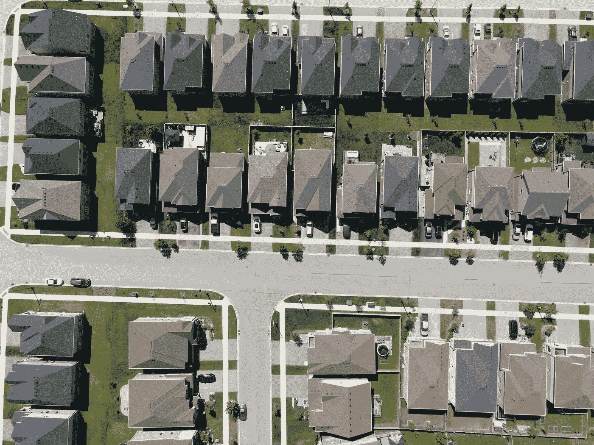

# k-最近邻解释道

> 原文：<https://medium.com/geekculture/k-nearest-neighbours-explained-761afc552918?source=collection_archive---------20----------------------->

## 🏠🏠简单解释一下 KNN，最容易理解的机器学习模型之一🏠🏠

Image from [Unsplash](https://unsplash.com/photos/4s3M-zTxLdw)

在本帖中，我们将解释什么是 K-最近邻(KNN)模型，看看它的优点，它是如何构建的，以及它可以用来做什么。

***我们将通过 KNN*** *的理论和直觉，看到最小量的数学* …