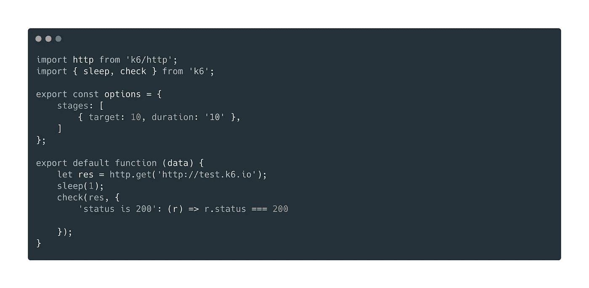
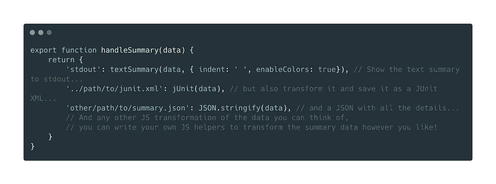
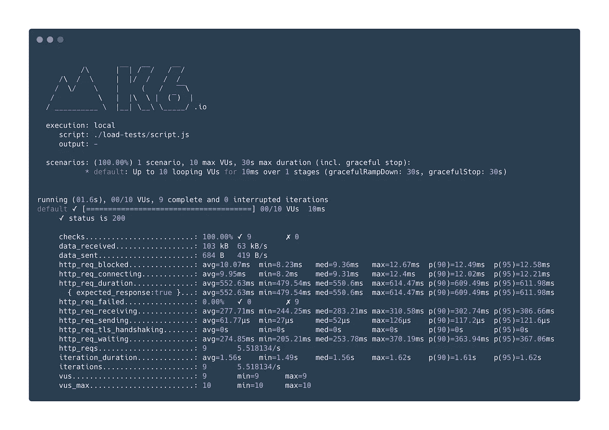
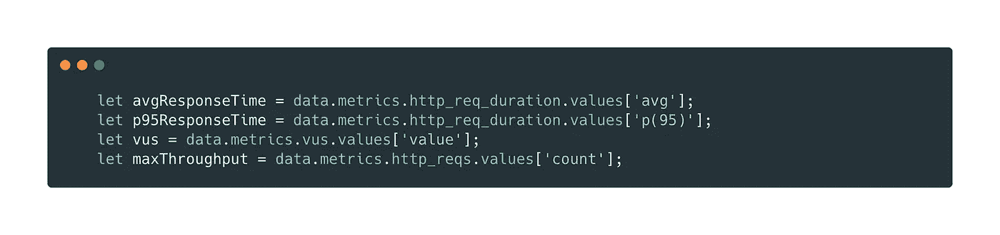
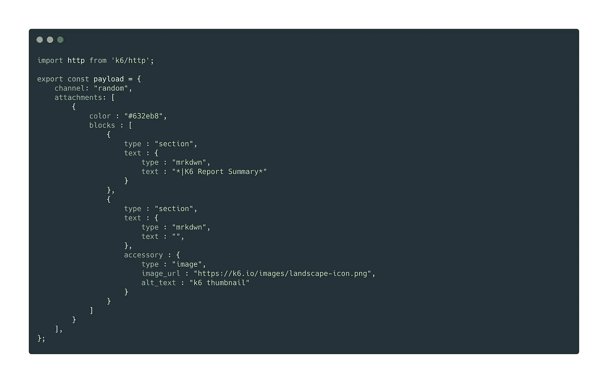
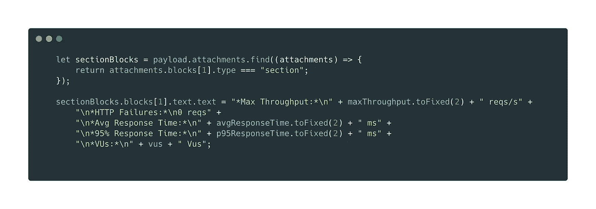
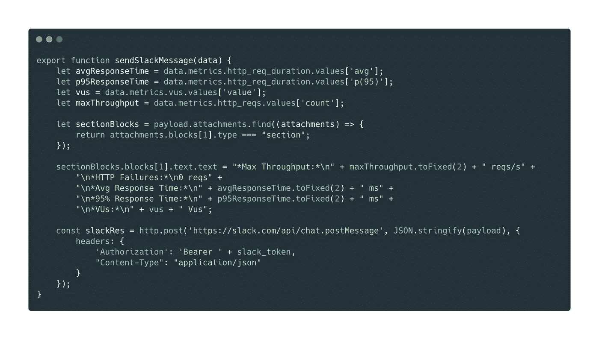
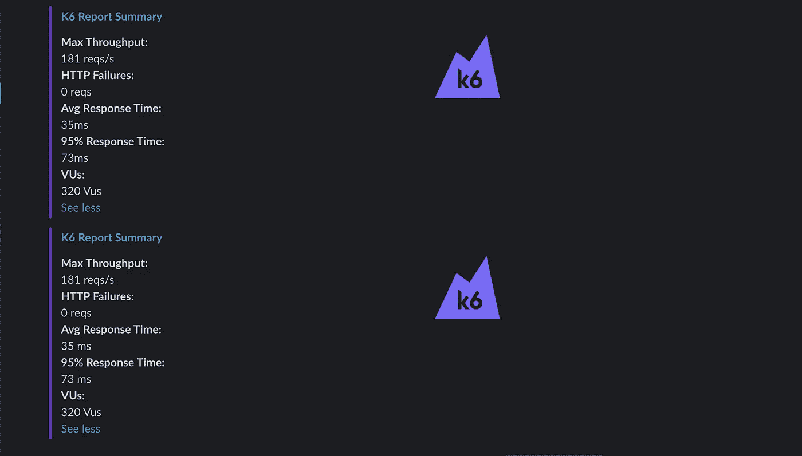

# K6——定制松弛集成:度量是测试的魔力

> 原文：<https://medium.com/geekculture/k6-custom-slack-integration-metrics-are-the-magic-of-tests-527aaf613595?source=collection_archive---------2----------------------->

在我之前的文章中，我谈到了如何用 k6 工具轻松地加载测试。你可以在这里找到[。本文将讨论如何将我们的 k6 测试结果发送给 slack。](/nerd-for-tech/building-more-stable-banking-as-a-service-with-k6-57ba952eab02)

在这些类型的测试中，度量对我们来说是神奇的。因为我们可以用度量来理解一切。这些指标需要随时可用。这有很多方法，你可以用 k6 提供给我们的不同方法来实现。您可以获得 JSON 形式的输出，也可以使用基于时间的数据库追溯查看输出。但是 slack 对我们开发人员来说变得特别重要，我们可以在 slack 上设置警报机制，我们可以根据需要设置 slack-bot 或通知系统。在本文中，我们将为这些系统添加一个新的。

# 基本脚本的示例

这篇文章展示了我们如何将 k6 结果中的指标作为 slack 上的消息发送出去。首先，我们再在 k6 上写一个简单的测试。

如您所见，我们用一个非常简单的脚本完成了测试。现在，当您以这种方式运行 k6 时，它会通过终端向我们提供一个输出。但是我们希望通过这个输出只获得某些数据。为此，k6 为我们提供了一个出色的功能。它允许我们使用 handleSummary()函数以 JS 对象的形式获取测试结果。

# **handle summary()函数的魔力**

让我们用一个例子来验证一下。在下面的示例脚本中，数据参数自动为我们提供函数的输出，您可以按照自己想要的方式使用它。例如，由于这个函数，您可以同时获得 JSON 或 XML 输出。

正如我上面提到的，我们通常可以以 JS 对象的形式获得结果。您可以在下面的输出中看到这样的例子。

我们理解这个输出，并确定我们想要使用的值。在本文中，我们将从这个对象中提取最大吞吐量、HTTP 故障、平均响应时间和 VUs 值作为示例。我们已经定义了我们希望从数据对象中获得的指标，如下所示。

# 自定义松弛集成

现在让我们来看看这项工作最精彩的部分，创建并发送一条带有 slack 的自定义消息。这里我们将受益于 Slack API 和 Slack Block Kit Builder。首先，我们通过 Slack Block Kit Builder 以一种简单的方式创建一个消息模板。然后我们复制这个模板，并把它赋给一个名为 payload 的变量。因为这个变量将是我们通过 Slack API 发送的有效负载。

> 在这里，您可以找到[松弛 API](https://api.slack.com/start) 和[松弛块套件生成器](https://api.slack.com/block-kit)的用法。

定义完成后，我们创建一个简单的函数并发送一个 Slack API 请求。在此之前，创建一个 bot，并且必须在授权 HTTP 头中将您的 bot 令牌作为不记名令牌进行传输。您可以在 slack 文档中找到更详细的过程。

正如您在下面的函数中所看到的，我们首先根据自己的度量标准，更改我们将在定义的有效负载中发送的消息。

最后，我们发送 slack API 请求。现在，我们从 handleSummary()调用这个 slack 函数，并得到我们的 slack 消息。

让我们看看结果……

现在，您可以将想要的结果作为一条松弛消息发送。🥳