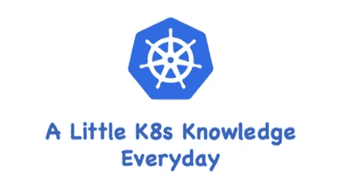

# K8s-身份验证方法

> 原文：<https://medium.com/geekculture/k8s-authentication-methods-66a330223fc1?source=collection_archive---------8----------------------->

## 每天一点 K8s 知识！

当在 K8s 集群中启用 TLS 时，所有请求都需要首先进行身份验证。K8s 支持多种认证机制，支持同时启用多个认证插件。

如果认证成功，用户的`username`将被传递到授权模块进行进一步授权…