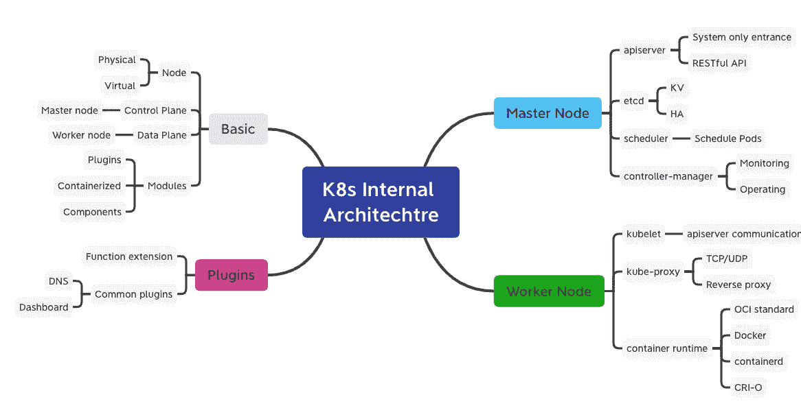

# K8s —集群内部架构

> 原文：<https://medium.com/geekculture/k8s-cluster-internal-architecture-2b1489f8ce28?source=collection_archive---------2----------------------->

## 每天一点 K8s 知识！

以前，我们看到容器技术解决了应用程序的打包和分发问题。然而，当操作和维护容器化应用时，仍然会有许多困难。

因此，我们需要使用容器编排技术来解决这些问题，并…