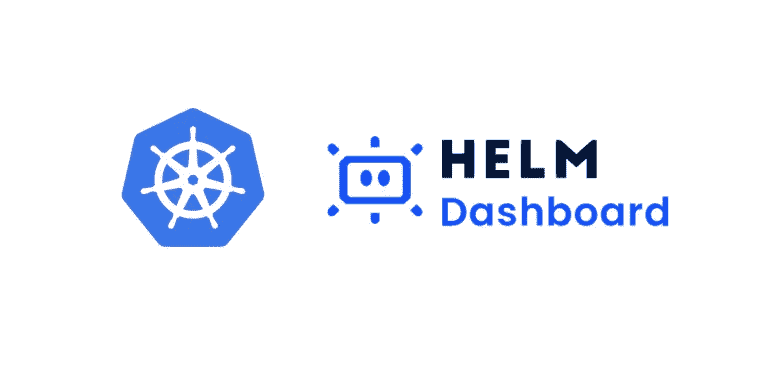

# K8s —舵仪表板

> 原文：<https://medium.com/geekculture/k8s-helm-dashboard-d7509c5fee88?source=collection_archive---------2----------------------->

## 头盔丢失的用户界面

# 什么是舵仪表板

Helm-Dashboard 提供了一种 UI 驱动的方式来查看已安装的`Helm`图表，查看它们的修订历史和相应的 k8s 资源。此外，您可以执行简单的操作，如回滚到某个修订版或升级到较新的版本。Helm dashboard 是 [Komodor](https://komodor.com/) 继`ValidKube`之后的第二个开源项目。