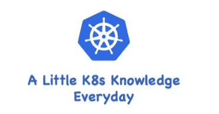

# K8s —入口介绍第二部分

> 原文：<https://medium.com/geekculture/k8s-ingress-introduction-part-two-459d73005a6c?source=collection_archive---------3----------------------->

## 常见的入口示例和入口规则

在我的上一篇文章中，我介绍了“K8s 入口”的概念，并在一个最小的`Ingress` YAML 文件中演示了它的定义，在最小入口定义中，我没有定义任何特定的规则，而是对所有传入的请求使用`defaultBackend`。