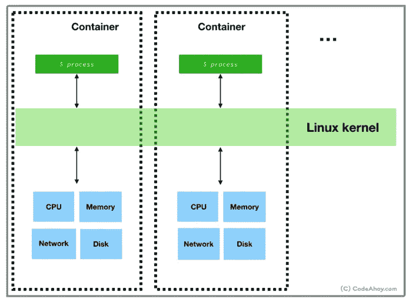

# K8s —容器中的过程

> 原文：<https://medium.com/geekculture/k8s-process-in-container-b4ea4b1f34bf?source=collection_archive---------3----------------------->

## 集装箱工艺简介

# 初始化过程

使用容器的理想状态是在一个容器中只运行一个进程，但是在现实世界中这有时是不可能的。例如，除了容器中的主进程之外，我们还可以启动用于监控或轮换日志的进程。