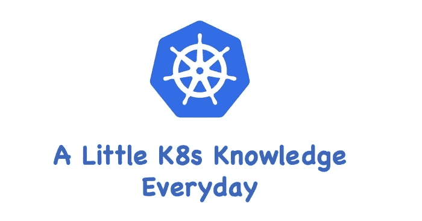

# k8s——秘密

> 原文：<https://medium.com/geekculture/k8s-secret-3de9bb8e2bf1?source=collection_archive---------5----------------------->

## 每天一点 K8s 知识！

应用程序启动期间可能需要一些敏感信息，如用户名、密码或密钥来访问数据库。显然，将此信息直接存储在容器图像中是不合适的。K8s 提供的解决方案为`Secret`。

# K8s 秘密