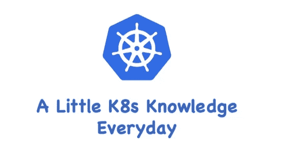

# K8s 存储—临时卷

> 原文：<https://medium.com/geekculture/k8s-storage-ephemeral-volumes-2ea8d22f1b8b?source=collection_archive---------4----------------------->

## K8s 临时存储卷简介

在 K8s 存储系统中，除了“[持久卷](https://blog.devgenius.io/k8s-storage-persistent-volume-a41144da8240)”和“投影卷”之外，还有一种卷类型叫做“临时卷”。

# 什么是短命卷

临时卷是为不需要永久数据的 pod 设计的。例如，有时你的…