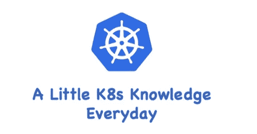

# K8s 存储—NFS 的持久卷演示

> 原文：<https://medium.com/geekculture/k8s-storage-persistent-volume-demo-with-nfs-ff0b57d27ffc?source=collection_archive---------9----------------------->

## 使用 NFS 的 K8s 永久卷演示

在这篇文章中，我将演示如何使用 NFS 文件系统实现 K8s 持久存储。

# 先决条件

*   现有的 NFS 文件系统
*   K8s v1.25 集群