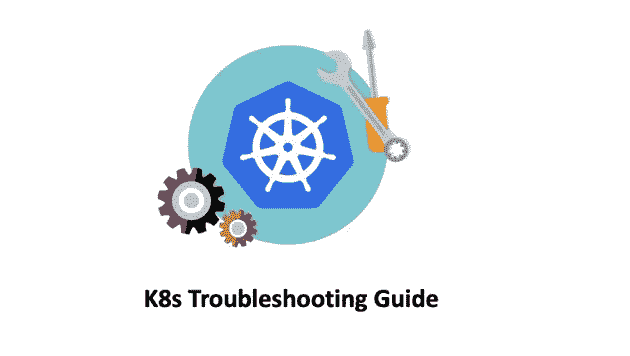

# K8s 故障排除—如何调试核心 DNS 问题

> 原文：<https://medium.com/geekculture/k8s-troubleshooting-how-to-debug-coredns-issues-724e8b973cfc?source=collection_archive---------0----------------------->

## K8s 故障排除手册

> *N*ote，完整“K8s 故障排除”思维导图可在: [**K8s 故障排除思维导图**](https://github.com/metaleapca/metaleap-k8s-troubleshooting/blob/main/metaleap-k8s-troubleshooting.pdf)

**`CoreDNS`是 K8s 集群的必备扩展。它可以用来为集群提供命名服务，并且从 K8s v1.13 开始就是默认的 DNS 服务。**