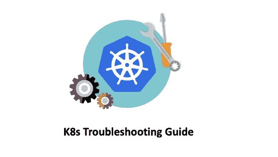

# K8s 故障排除—节点资源不足

> 原文：<https://medium.com/geekculture/k8s-troubleshooting-insufficient-node-resources-d336968a45b0?source=collection_archive---------1----------------------->

## 如何解决 K8s 节点资源不足的问题

> *N* **ote，完整的“K8s 故障排除”思维导图可在:** [**K8s 故障排除思维导图**](https://github.com/metaleapca/metaleap-k8s-troubleshooting/blob/main/metaleap-k8s-troubleshooting.pdf)

**K8S 工作者节点称为节点。节点可以是物理机，也可以是虚拟机。每个节点都包含运行 pod 所需的服务流程。这些服务…**