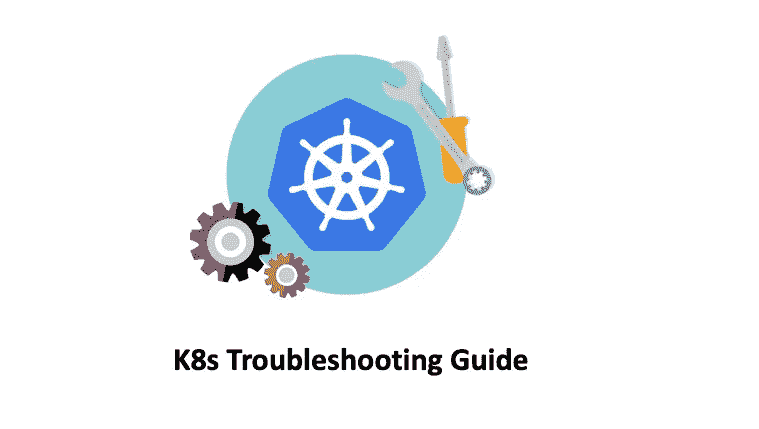

# K8s 故障排除—节点未就绪

> 原文：<https://medium.com/geekculture/k8s-troubleshooting-node-notready-8b39a026696e?source=collection_archive---------1----------------------->

## K8s 故障排除手册

我们都知道，K8s 节点是参与 K8s 集群的物理机或虚拟机，可以用来运行 pod。当一个节点关闭或崩溃或`kubelet`进程有问题时，该节点进入**未就绪**状态，这意味着它不能用于运行 pod。然后，在该节点上运行的所有有状态的 pod 都变得不可用。