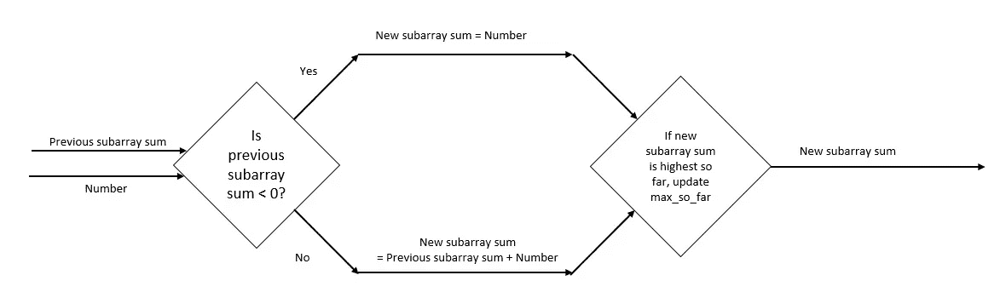
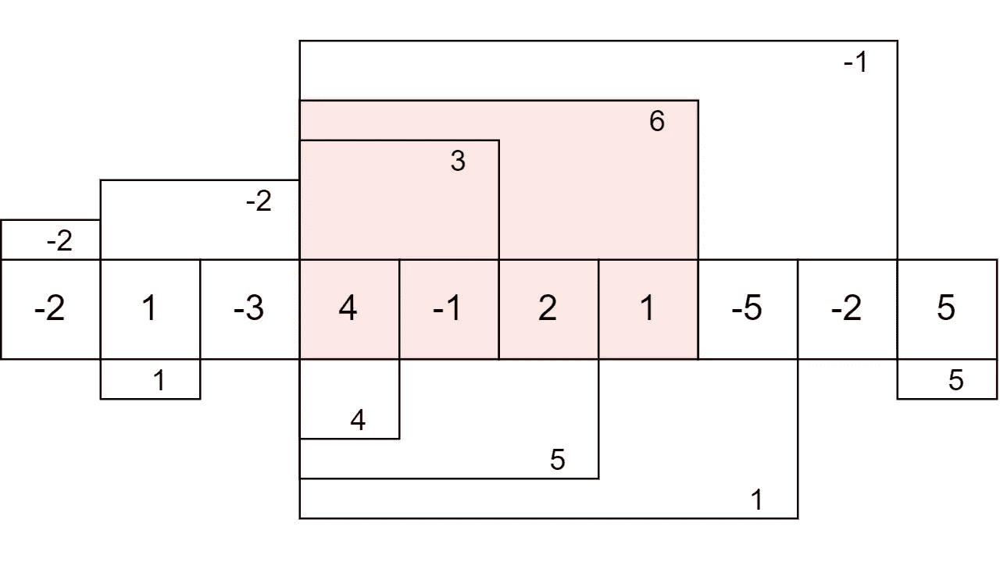
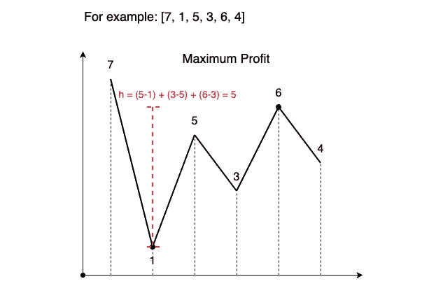

# Kadane 的算法——Python

> 原文：<https://medium.com/geekculture/kadanes-algorithm-python-fccf1527eae6?source=collection_archive---------4----------------------->



tomroth.com.au

单程常数空间中子阵问题的求解方法。

至少有一个元素的数组的子数组个数为 **N*(N + 1)/2** 。因此，如果我们有一个问题，需要检查所有子阵列的最大值、最小值等，我们可以使用 Kadane 的算法，因为它可以在一次通过中实现子阵列的最大值/最小值。

在这个算法中，我们从左到右遍历给定的数组。在第 I 步中，我们在结束于 *i* 的子阵列上应用该函数。基于所选择的更新标准，我们决定用当前子阵列结果来更新整体结果。在最大总和情况下，更新标准变为 **max_sum < curr_sum。**通过简单地改变更新标准，该方法也可以应用于其他问题。

它类似于 1D 阵列上的动态编程方法。这里，我们还基于先前位置的最大/最小计算值来计算当前位置的最大/最小。它也类似于贪婪方法，因为只要达到中断条件，我们就重置运行总和/最大值/最小值。

## 复杂性

> 时间复杂度:O(N)
> 空间复杂度:O(1)

# 问题 1

给定一个整数数组，找出只有非负元素的子数组的最大和。

```
**Input:** nums = [1, 4, -3, 9, 5, -6]
**Output:** 14 
**Explanation:** 
Subarray [9, 5] is the subarray having maximum sum with all non-negative elements.
```

## 代码实现

```
def max_sum_non_negs(nums):
    max_sum = -math.inf
    curr_max = 0

    for num in nums:
        if num < 0:
            curr_max = 0
        else:
            curr_max += num

        if max_sum < curr_max:
            max_sum = curr_max

    return max_sumprint(max_sum_non_negs([1, 4, -3, 9, 5, -6]))
```

# 问题 2

给定一个整数数组`nums`，找出总和最大的子数组(至少包含一个数)。

```
**Input:** nums = [-2, 1, -3, 4, -1, 2, 1, -5, -2, 5]
**Output:** 6
**Explanation:** [4,-1,2,1] has the largest sum = 6.
```



## 代码实现

```
def max_sum_sub_array(nums):
    max_sum = -math.inf
    curr_max = 0

    for num in nums:
        curr_max += num

        if (max_sum < curr_max):
            max_sum = curr_max

        if (curr_max < 0):
            curr_max = 0

    return max_sum

print(max_sum_sub_array([-2, 1, -3, 4, -1, 2, 1, -5, -2, 5]))
```

# 问题 3

给定一个整数数组`nums`，找出总和最小的子数组(至少包含一个数)。

```
**Input:** nums = [-2,1,-3,4,-1,2,1,-5,4]
**Output:** 6
**Explanation:** [-5] has the smallest sum = -5.
```

## 代码实现

```
def min_sum_sub_array(nums):
    min_sum = math.inf
    curr_min = math.inf

    for num in nums:
        if curr_min <= 0:
            curr_min += num
        else:
            curr_min = num

        if min_sum > curr_min:
            min_sum = curr_min

    return min_sumprint(min_sum_sub_array([-2,1,-3,4,-1,2,1,-5,4]))
```

# 问题 4

给定一个二进制串**0**和**1**。任务是找出在**0**的数目和 1 的数目(0 的数目—**1 的数目**)之间具有最大差值的子串的长度。如果所有**1**都打印-1。

```
**Input :** S = "11000010001"
**Output :** 6
From index 2 to index 9, there are 7 0s and 1 1s, so number of 0s - number of 1s is 6.
```

## 代码实现

```
def max_difference(s):
    max_diff = -math.inf
    curr_diff = 0

    for digit in s:
        if digit == '0':
            curr_diff += 1
        else:
            curr_diff -= 1

        if max_diff < curr_diff:
            max_diff = curr_diff

        if curr_diff < 0:
            curr_diff = 0

    return max_diffprint(max_difference("11000010001"))
```

# 问题 5

给定一个由 N 个正整数组成的数组，在所有具有唯一元素的子数组中找出具有最大和的子数组。

```
**Input** nums = [1, 2, 3, 3, 4, 5, 2, 1]
**Output:** 15
**Explanation:**
The subarray having maximum sum with distinct element is [3, 4, 5, 2, 1] and it's sum is = 3 + 4 + 5 + 2 + 1 = 15
```

## 代码实现

```
def max_sum_unique(nums):
    d = {}
    max_sum = -math.inf
    curr_max = 0

    for num in nums:
        if num not in d:
            curr_max += num
            d[num] = 1

            if curr_max > max_sum:
                max_sum = curr_max

            if curr_max < 0:
                curr_max = 0

    return max_sumprint(max_sum_unique( [ 1, 2, 3, 1, 5 ]))
```

# 问题 6

给你一个数组`prices`，其中`prices[i]`是在`ith`日给定股票的价格。你想通过选择一个**单日**买入一只股票，并选择未来的**不同日**卖出该股票来最大化你的利润。返回*你可以从这笔交易*中获得的最大利润。如果你不能获得任何利润，返回`0`。

```
**Input:** prices = [7,1,5,3,6,4]
**Output:** 5
**Explanation:** Buy on day 2 (price = 1) and sell on day 5 (price = 6), profit = 6-1 = 5
```



代码实现

```
def max_profit(prices):
    max_profit = 0
    curr_profit = 0

    for i in range(1, len(prices)):
        curr_profit += prices[i] - prices[i-1]

        if curr_profit < 0:
            curr_profit = 0

        if max_profit < curr_profit:
            max_profit = curr_profit

    return max_profitprint(max_profit([7, 1, 5, 3, 6, 4]))
```

# 问题 7

给定一个整数数组，找出该数组中具有最大乘积的子数组。退回最大的产品

```
**Input:** nums = [2,3,-2,4]
**Output:** 6
**Explanation:** [2,3] has the largest product 6.
```

代码实现

```
def max_product(nums):
    cur_max = 1
    cur_min = 1
    max_prod = -math.inf

    for n in nums:
        cur_max, cur_min = max(cur_max * n, cur_min * n, n), min(cur_min * n, cur_max * n, n)
        max_prod = max(max_prod, cur_max, cur_min) 

    return max_prod

print(max_product([2,3,-2,4]))
print(max_product([2,3,-2,4, -1]))
```

在所有上述问题中，我们也可以找到子阵列的指数。同样，我们也可以将卡丹的算法应用于 2D 矩阵。

编码快乐！！