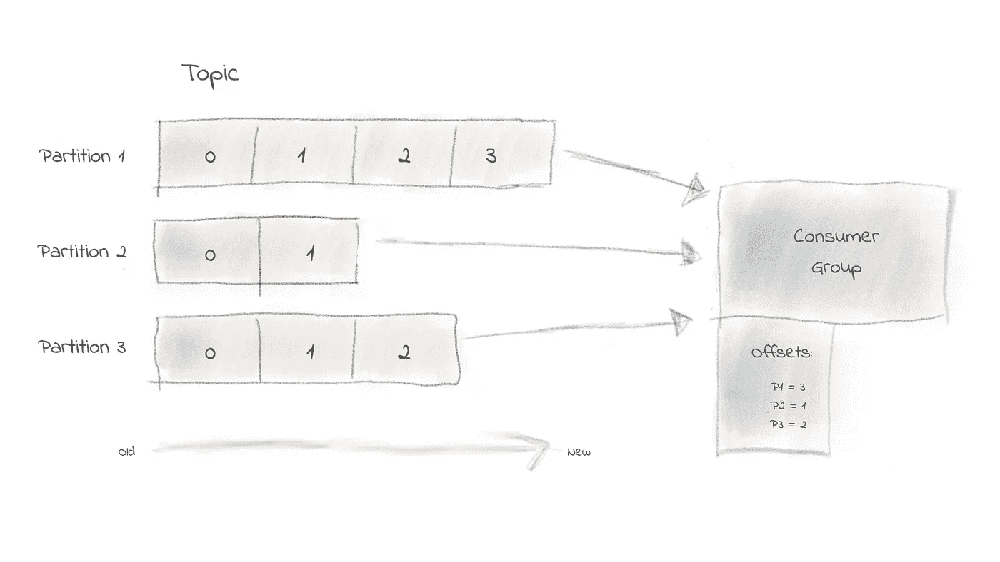
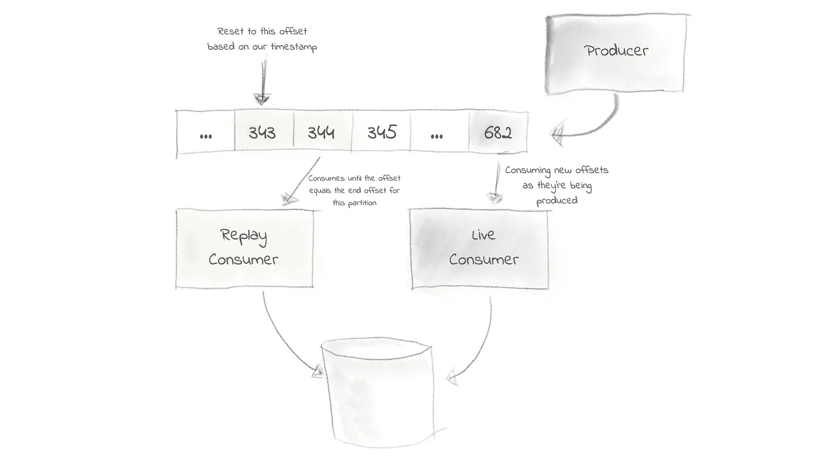

# F1 中的卡夫卡——重放信息

> 原文：<https://medium.com/geekculture/kafka-in-f1-replaying-messages-53b3bd7d3a61?source=collection_archive---------6----------------------->


在过去的几年里，我一直在领导一个大型、高度可扩展、事件驱动的微服务平台的开发，充当一级方程式赛车核心的一个激动人心的应用程序的器官。

为什么是卡夫卡？在一个分秒必争的环境中，遥测数据从时速 372.5 公里的汽车中喷涌而出，您需要每秒处理数千条数据。尽管卡夫卡是一只复杂的野兽，但他能够面对挑战。

# 为什么需要重播消息？

想象一下，今天是星期五，汽车在轨道上行驶，数据以极快的速度传来。一项英勇的微服务跨越了地平线，通过 UDP 接收原始遥测数据，处理并生成消息总线上的主题数据。另一个服务消费所述主题，同时将它输入数据库。一个完美的幸福事件流过集群。

工程师们不知道的是，一位同事被电线绊倒，切断了一大堆固态硬盘的电源(*好吧，为了产生戏剧性的效果，我们可以假设我们所有的存储都在一个机箱中……*)。

警报开始响起…工程师们急忙寻找问题所在。在犯罪现场发现了一根悬空的电缆。很快，它又插了回去。但是已经太晚了。汽车已返回车库…

此时，数百万条消息未能到达数据库中的最终目的地，浪费了练习时间，团队无法对练习时间的数据进行分析。

整个过程中，消费服务愉快地阅读主题，但由于磁盘机箱离线，无法将数据放入目标数据库。

*要是有办法回到过去就好了……*


# **卡夫卡是怎么工作的？！**

我不打算深入研究卡夫卡的内心世界，否则这篇文章的阅读时间大约是 35280 分钟…

尽管为了重播我们的信息，我们需要对事物如何运作有一点了解。好吧，至少主题，分区和偏移量…



卡夫卡给了我们对某些类型的信息进行分类、分组、排序和存储的方法。这是通过使用*主题*实现的。一个主题只是一个有序的事件日志，每当一个新的事件被接收时，它被附加到主题的末尾。

分区是实现并发的卡夫卡斯方式。一个主题将有 n 个分区，每个分区负责自己的事件日志。

每次使用者从事件日志(主题)中读取消息时，使用者都会将消息的偏移量提交到它所读取的特定分区上。

回到故事…我们的消费者现在处于每个分区上的最新偏移，距离会话开始还有几十万个偏移。幸运的是，所有这些事件都保留在我们的主题中，我们可以利用它回到过去吗？

# 回到未来…

现在我们了解了主题、分区和偏移量，我们可以使用这些知识来填充我们现在健康的数据库！

如果我们可以在练习课开始前将消费者的偏移量设置为某个位置，我们的消费服务将能够读取和处理事件，就像事件正在现场发生一样。

谢天谢地，有很多工具可以让我们做到这一点。使用`kafka-consumer-groups` cli，我们可以将每个分区上的用户偏移量重置回给定的时间。万岁。

```
kafka-consumer-groups --bootstrap-server <kafkahost:port> --group <group_id> --topic <topic_name> --reset-offsets --to-datetime 2021-08-04T12:30:00.000 --execute
```

我们甚至可以通过使用`--by-duration PT2H0M0S`将消费者偏移量重置回给定的持续时间(即从现在开始向后移动几个小时)。

> 注意:在重置主题的偏移量之前，必须停止目标使用者组中的所有使用者。

一旦我们回到灾难发生前，我们就可以恢复服务。消费者将开始重新消费我们所有的事件到我们的*now*health 数据库中。从灾难发生前我们指定的确切时间开始。

# 陷阱

在上面的解决方案中，我们被要求停止使用我们的服务，以便重放我们的旧事件，从而完全停止我们可能正在接收的任何实时数据。



Using a replay-consumer to allow continued functionality of live-services

解决这个问题的一种方法是让一个具有不同消费者组 ID 的相同服务充当休眠重放服务，直到需要它为止。然后，这个重放服务将成为重置其偏移量的消费者，让实时服务正常运行。

然而，我们必须小心。重放过去的消息可能会导致更多的复杂情况，例如重复数据。通常，我们可以通过确保消费者以幂等的方式处理消息来解决这个问题。

# 结论

卡夫卡让我们在失去所有希望时从灾难中完全恢复，同时满足了低延迟、高吞吐量的信息需求。

我们可以做很多事情来确保我们不会丢失数据。主题复制、致谢等等，但那是另一篇文章…

[Jordan](https://www.linkedin.com/in/jordanpawlett) 是一名全栈软件工程师，专门领导和设计高度可伸缩的微服务和渐进式 web 应用程序！