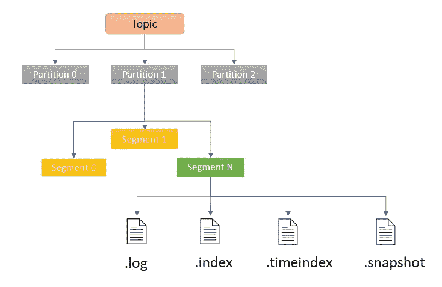
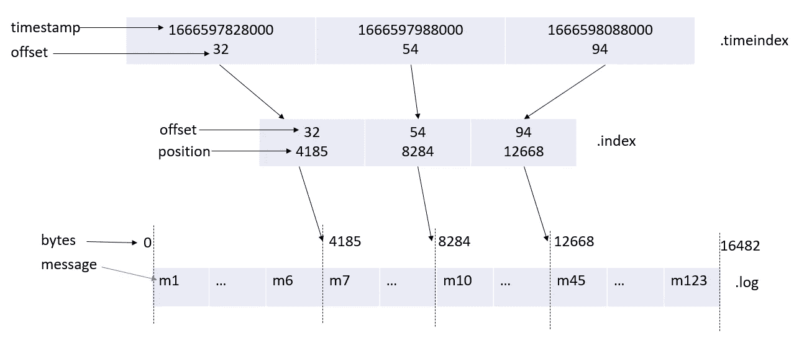
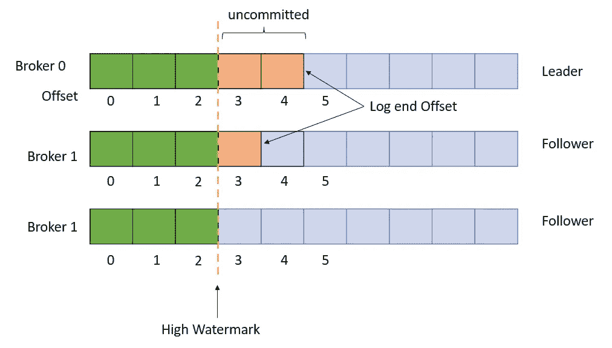
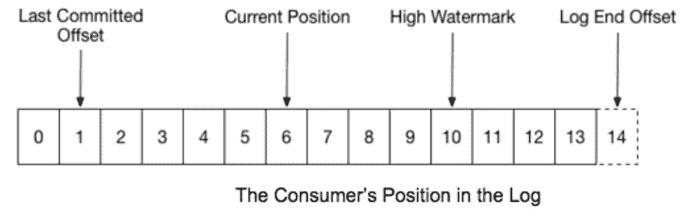

# 卡夫卡内部——第二部分

> 原文：<https://medium.com/geekculture/kafka-internals-part-2-7dad1977f7d1?source=collection_archive---------7----------------------->

kafka 存储、返回、水印和流的内部

在我之前的博客中，我讨论了生产者和消费者。在这个博客中，我会记下其他细节。

## 磁盘上的存储结构

*   `.log`文件是一个包含特定偏移记录的实际段。文件名定义了该日志中记录的起始偏移量。
*   `.index`文件包含一个索引，该索引将逻辑偏移量(实际上是记录的 id)映射到`.log`文件中记录的字节偏移量。它用于访问日志中指定偏移量的记录，而不必扫描整个`.log`文件。这有助于卡夫卡知道要找到一个信息，应该阅读片段的哪一部分。
*   `.timeindex`文件是另一个索引，用于通过日志中的时间戳访问记录。

*   `.snapshot`文件包含关于序列 id 的生产者状态的快照，用于避免重复记录。当一个新的领导人当选后，首选的领导人回来，需要这样的状态，以便再次成为领导人。

> log.segment.bytes(默认 1Gb)
> log.roll.ms(默认 7 天)

活动段是唯一可读写的文件，而其他日志段文件用于读取。当活动段变满(由 **log.segment.bytes** 配置)或经过配置的时间( **log.roll.hours** 或 **log.roll.ms** ，默认为 7 天)时，段开始滚动。这意味着活动段被关闭，并以只读模式**重新打开，一个新的段文件(活动段)将以读写模式**创建。当`.index`和`.timeindex`达到它的默认大小限制 10 Mb 时，该段也可以滚动。****

## 日志保留

一个段及其包含的记录只有在关闭时才能被删除。删除过程的流程是 1。关闭文件 2。标记已删除 3。实际上，从磁盘中删除文件。消息的生命周期由以下配置设置控制:

> log . retention . bytes
> log . retention . ms
> log . retention . check . interval . ms
> log . segment . delete . delay . ms

> *如果不考虑段级保留期，低吞吐量主题保留消息的时间可能会比预期的长。*

Kafka 通过*将*段级保留期添加到该段上最后一条(最近的)消息的时间戳，来确定何时可以开始使消息过期。

## 分布式锁

**租约** — Kafka 的租约到期时间为 18 秒，而客户端每 3 秒发送一次心跳。

**Leader Epoch** —每次从 LMS 获得租约时，它都会将一个世代/epoch 附加到租约上。该领导者纪元用于在当前领导者失败的情况下持续选举新的领导者。

**高水印** —卡夫卡保持高水印，以确保消费者永远不会读取不一致的数据。消费者只能使用高水位线以下的邮件。只有在同步副本分区复制消息时，硬件才是高级的。换句话说，高水位线是该分区所有 ISR 上的最小低端偏移，并且单调增长。

> replica . high . watermark . check point . interval . ms—高水位线保存到磁盘的频率

## 消息完整性

针对消息损坏的 CRC32—CRC32 函数将可变长度字符串转换为 8 个字符的字符串，该字符串是 32 位二进制序列的十六进制值的文本表示。CRC 是剩余消息字节的 CRC32。这用于检查代理和消费者上消息的完整性。如果消息有效负载的 CRC32 与随消息存储的 CRC 相匹配，则认为消息未被破坏。如果检测到损坏，日志将被截断到最后一个有效偏移量。

## 编码

Kafka 使用的是基于 IDL 的编码协议 [Avro](https://avro.apache.org/docs/current/) 和 [Protobuf](https://developers.google.com/protocol-buffers) 。

## 卡夫卡溪流状态

Kafka Streams 使用 [RocksDB](http://rocksdb.org/) 作为默认状态存储。它是一个嵌入式状态存储，意味着写操作不需要网络调用。这消除了延迟，并确保它不会成为流处理中的瓶颈。它是一个键/值存储区，记录以其字节表示形式持久化，从而实现快速读写。它是一种持久的而不是内存中的状态存储，写入被异步刷新到磁盘。默认情况下，状态存储由 Kafka changelog 主题支持，捕获存储中每个键的状态。