# Kaggle: Instacart 市场篮子分析

> 原文：<https://medium.com/geekculture/kaggle-instacart-market-basket-analysis-8bfbbf5f2efb?source=collection_archive---------29----------------------->

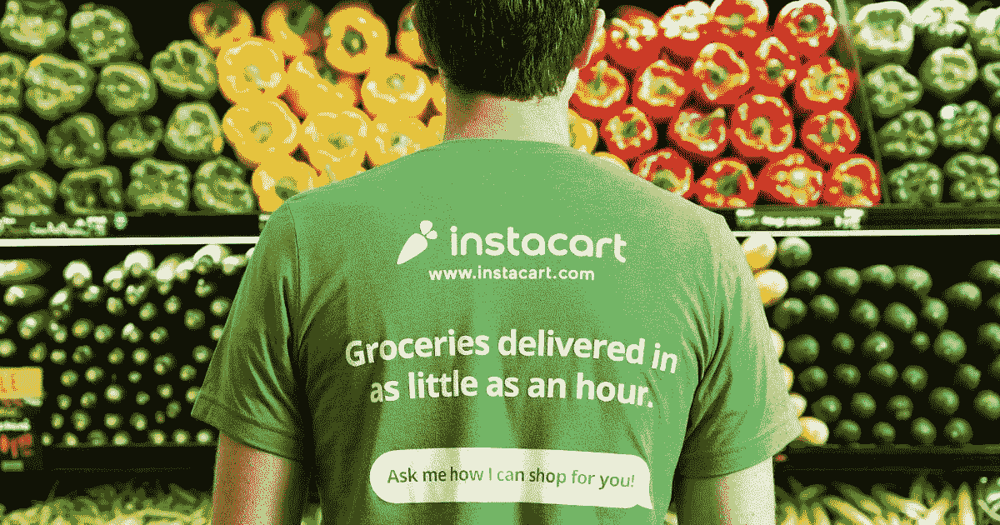

# 目录

*   介绍
*   商业问题
*   机器学习问题
*   数据解释
*   探索性数据分析
*   特征工程
*   将数据分为训练和测试
*   机器学习模型
*   未来的工作
*   参考

# **简介:**

Instacart 是一家美国公司，在美国和加拿大经营杂货交付和提货服务。

Instacart 是一款杂货订购和交付应用程序，旨在方便您在需要时将自己喜欢的食物和主食放入冰箱和储藏室。通过 Instacart 应用程序选择产品后，私人购物者会审核您的订单，并为您进行店内购物和送货。该公司通过网站和手机应用程序提供服务。

# **业务问题:**

对业务问题的正确理解是任何机器学习或深度学习任务最关键的一步。我们先试着了解一下业务问题。

购物篮分析是一种数据挖掘技术，非常有助于增加销售，帮助我们更好地了解客户的购买技巧。利用一段时间内的购买历史，我们尝试向客户建议可以重新订购的商品。

主要的好处是增加销售和客户满意度。使用这些数据，我们试图确定哪些产品被集中在一起，零售商可以优化产品投放，他们可以提供更好的交易，鼓励客户购买他们从未想过购买的商品。这将有助于增加销售。市场购物篮分析还允许公司识别重要产品和经常购买的产品，如果这些产品不可用，可能会对他们的业务造成潜在的损害。例如，假设我们已经预测到某某产品将成为这些用户下一个订单的一部分。这将有助于公司意识到产品的可用性，并确保它是可用的。

# **机器学习问题:**

Instacart 的数据科学团队希望我们使用他们在一段时间内客户订单的外包数据来预测哪些之前购买的产品将出现在用户的下一个订单中。数据集由 6 个文件组成，每个文件包含关于 Instacart 的不同信息。它包含关于产品的信息、产品放置的通道、什么产品被重新订购、多少天后用户来购物等等。

数据集分为 3 部分:先验、训练和测试。先前订单包含有关用户及其先前订单的信息。训练和测试订单将用于模型的训练和测试。这些先前的订单将用于特征工程。差不多有 50K 的产品，300 万左右的订单。此外，用户可能会也可能不会订购以前订单中的产品。因此“无”也可以是对用户下一次购买的回答。因此，我们将不得不把“无”作为一个单独的产品来考虑。

# **数据解释:**

我们有 6 张桌子，即-

*   **订单**:此表包含所有订单，即先验、训练、测试。
*   **order_products_train** :该表包含培训订单，并指示订单中的产品是否为再订购(通过再订购变量)。
*   **订单 _ 产品 _ 前期**:此表包含前期订单。它指示订单中的产品是否是重新订购的(通过重新订购变量)。
*   **产品**:此表包含所有产品及其相关信息。
*   **通道**:该表包含所有通道及其相关信息。
*   **部门**:此表包含所有部门及其相关信息。

这些表格相互之间的关系如下

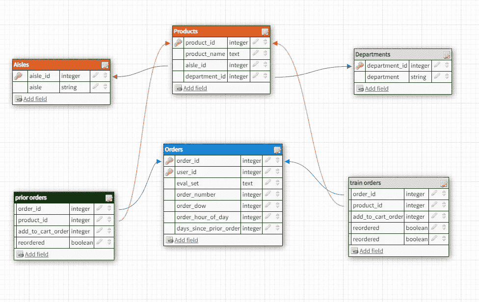

该数据包含大约 50k 个产品和 206209 个用户的购买历史。
如上所述，数据集分为 3 个部分。
先前订单的数量为 3214874，将用于创建特征。训练订单数为 131209，测试订单数为 75000。

用户的订单数量从 4 到 100 不等。

# **探索性数据分析:**

数据可视化是信息和数据的图形化表示。我们的眼睛被颜色和图案所吸引。当我们看到一张图表或一个曲线图时，我们可以很快理解趋势或识别异常值。

最初的笔记本 market _ basket _ analysis _ EDA . ipynb 有大量的情节，把它们都放在这里会让这个博客变得单调。因此，我将只包括几个重要的在这里。

**评估集分布**

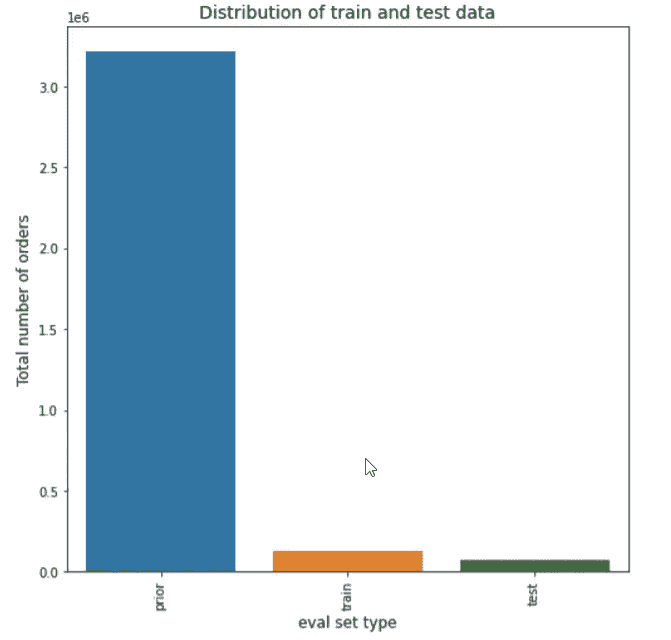

Distribution of train and test and prior data

## 一周中的哪一天订单最多？

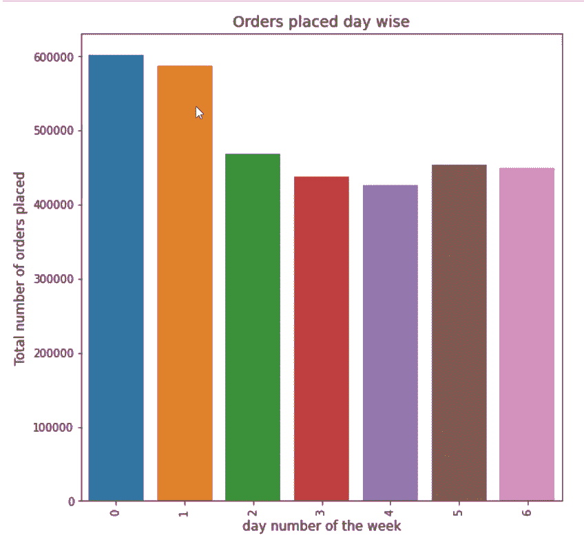

**观察-**

从上面的图中，我们可以看到，最大数量的订单是在周末下的，即周六和周日。这意味着顾客更倾向于在周末购物。

## 一天中的什么时候订单最多？

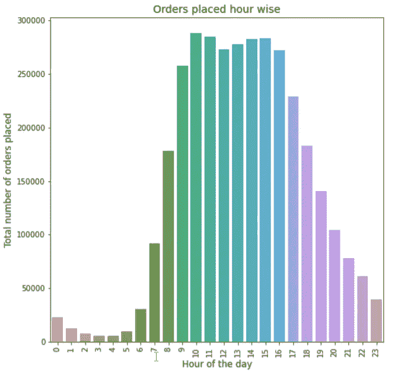

**观察结果-**

大多数订单是在上午 9 点到下午 5 点之间下的。我们可以看到，在这些时间里，平均有近 25000 个订单被下了。

## 当前订单是在前一个订单之后多少天下的？

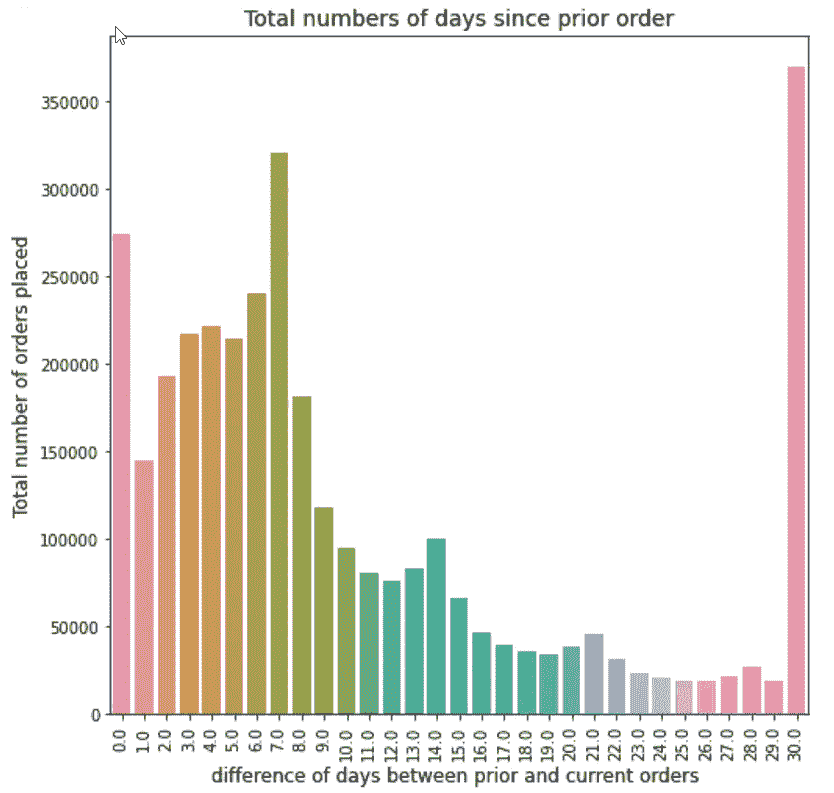

**观察结果-**

*   在 7 天和 30 天的间隔之后，最大数量的订单被发出。这意味着客户每周和每月都会下更多订单或购物。
*   有几个订单是在一天之内下的。
*   我们可以看到，用户倾向于在一周的开始日和结束日订购。
*   在月末下最大数量的订单。

## 最佳销售部门

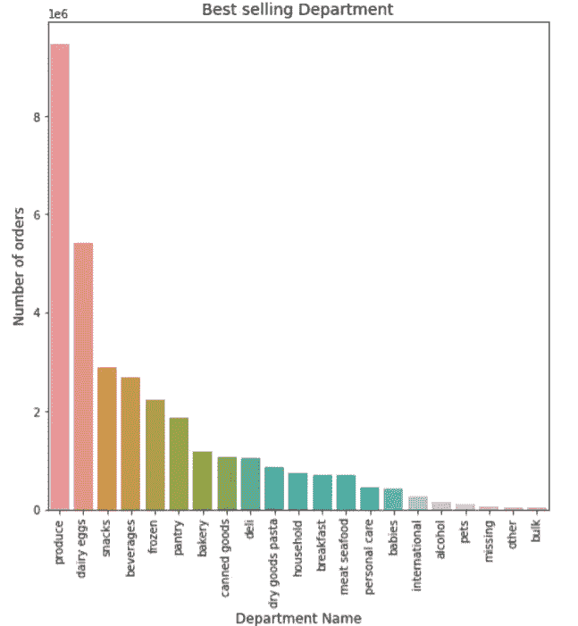

**观察-**

*   最畅销的 5 个部门是农产品、乳制品、鸡蛋、零食、饮料和冷冻食品。
*   我们没有每个部门产生的收入的任何数据，所以我们无法知道哪个部门最有利可图，所以我们只能对最大的销售数量有发言权。

**但是，什么是“生产”部门呢？让我们按通道打破它**

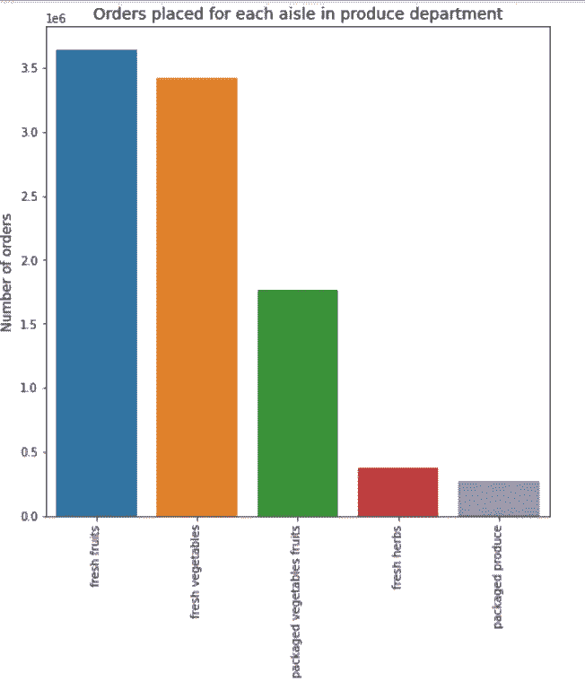

**观察-**

*   农产品部门指的是新鲜水果、新鲜蔬菜、包装水果和蔬菜以及新鲜草药。
*   在农产品部门，新鲜水果订单最多，包装产品订单最少。
*   新鲜蔬菜通道也没那么落后。这也给了我们一个暗示，在这里点餐的大多数顾客似乎饮食谨慎，比起饮料、包装产品、小吃等，他们更喜欢健康的产品。

## 整体最畅销的通道

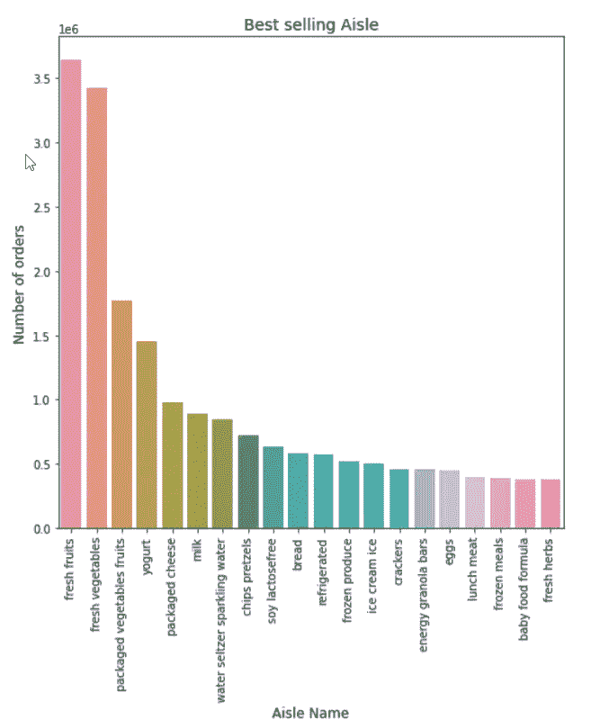

**观察-**

*   最大订单是新鲜水果、新鲜蔬菜和酸奶。
*   这似乎很棒！大部分订单都是新鲜水果和蔬菜。

## 让我们看看重新订购最多的产品

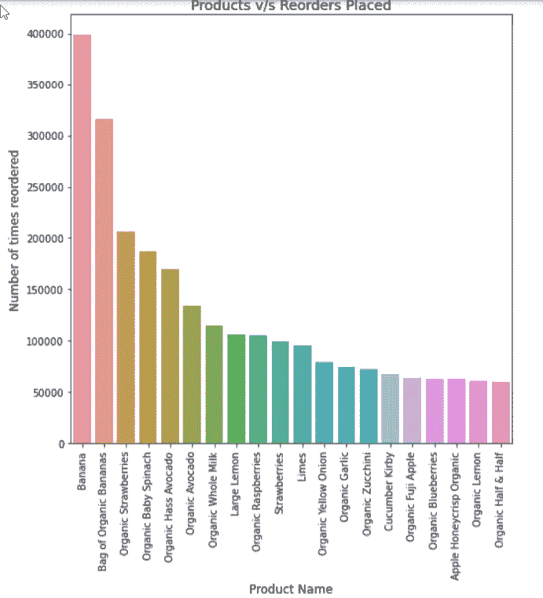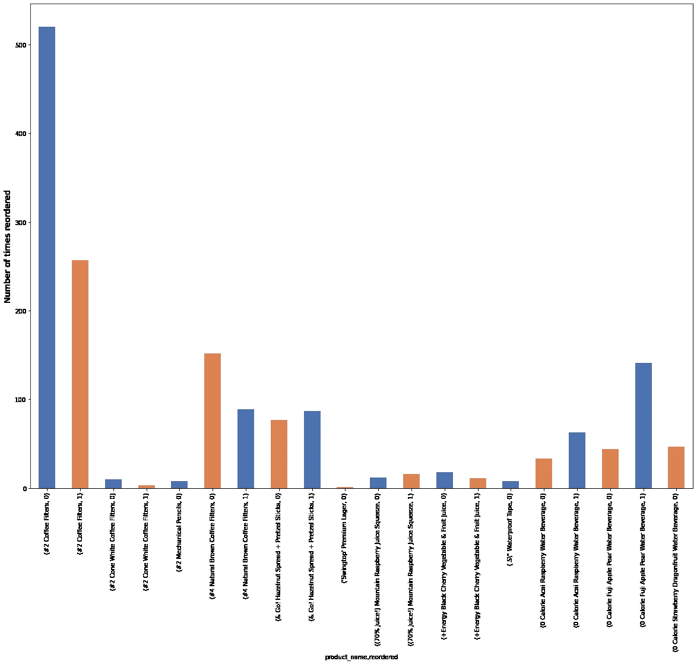

**观察-**

*   这与上面的发现非常相似，但该图显示了前 20 种产品被重新订购的确切次数。香蕉以 400000 份订单位居榜首。

## 重新排序一周中的第几天

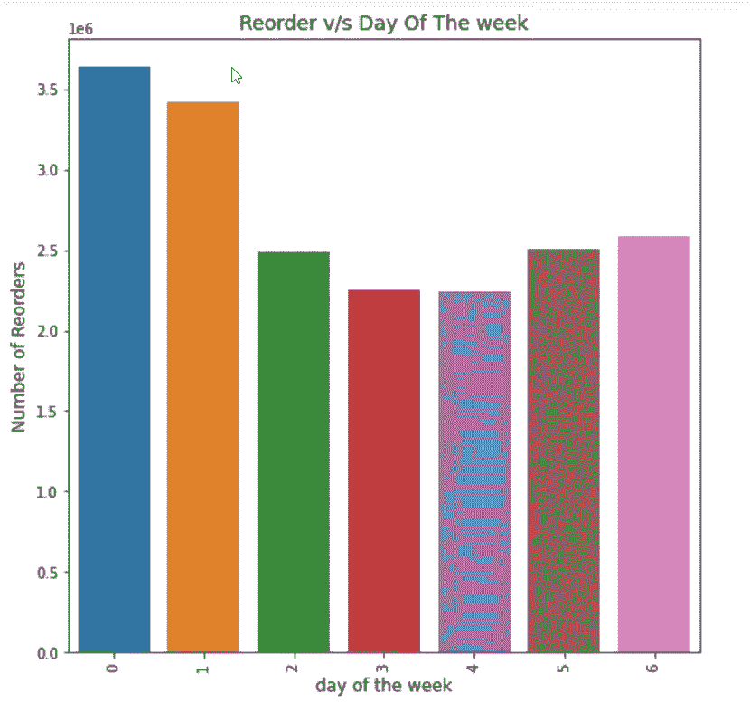

**观察-**

*   周六完成了最大的再订购量。
*   周三完成的再订购最少。

## 自上次订单后重新订购 v/s 天数

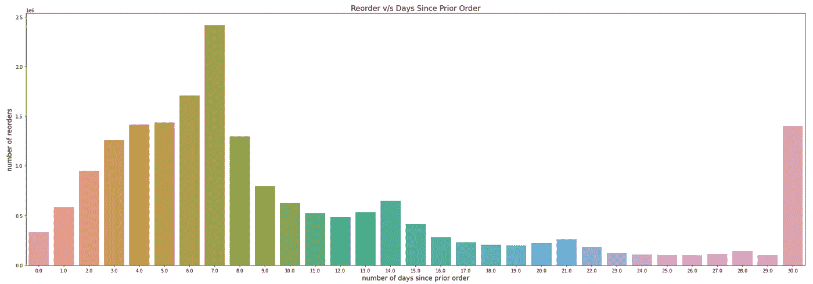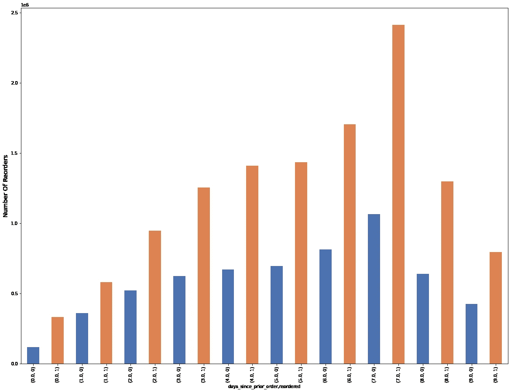

**观察-**

*   我们可以清楚地说，最大数量的再订购是在间隔 7 天之后完成的。
*   大多数记录器是在间隔 5 到 7 天之后和 30 天之后制造的。
*   在 15 到 29 天的间隔期内，最少的再订购发生在周中的某个时候。
*   因此，大部分再订购是在周末或月末进行的。

# 特征工程:

特征工程是利用领域知识从原始数据中提取特征的过程。这些特征可以用来提高机器学习算法的性能。

我能够想出 4 种类型的特征，

1.  **用户相关特征**:用户行为是什么样的？
2.  **产品相关特性**:产品是什么样的？
3.  **用户 x 产品相关特性**:用户对产品的感受如何？
4.  **日期时间相关特征**:用户购买物品的日期和时间。

**用户相关功能-**

*   每个用户下单的最大、最小和平均数量
*   一周中用户订购最多的一天。
*   一天中用户订购最多的时间。
*   用户重新订购比率
*   用户下达的订单总数等。
*   用户平均购物篮
*   用户带来的不同数量的产品

**产品相关功能-**

*   每种产品的购买次数
*   产品被重新订购的总次数——表明产品的受欢迎程度
*   产品再订购率
*   产品的通道和部门再订购率

**用户 x 产品相关功能-**

*   用户 A 购买产品 B 的次数
*   用户“A”重新订购产品“B”的次数
*   发现用户第一次购买产品的时间
*   每个用户的平均购物车位置
*   查找用户最后一次购买产品的时间
*   用户-产品订购率-用户购买产品的频率
*   对商品 B 在用户 A 购物车中所处位置的订单求和。
*   用户产品再订购率
*   订单连续

总的来说，我为每个订购的产品准备了大约 48 个特性。

## 功能重要性(前 30 名)

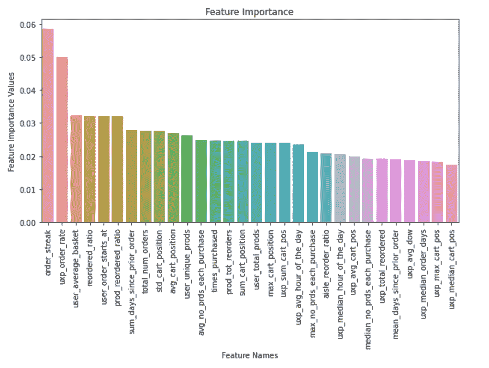

来解释一些最重要的特征-

*   **order _ streak**-该符号表示条纹的类型(有序与非有序)。
*   **uxp _ order _ rate**-用户购买产品的频率
*   **用户平均购物篮**-用户的平均购物篮大小
*   **再订购比率**-产品的再订购比率
*   **user_order_starts_at -** 用户的订单号从几号开始？这告诉我们用户是 instacart 的老客户还是新客户。

# 将数据分为训练和测试:

这里，我们的第一步是将属于“eval_set”的所有订单作为 train 和 test。然后，我们将这些订单与我们使用以前的订单创建的当前数据合并。一旦我们获得了训练和测试订单，我们就将训练订单与 order_products_train 数据集合并。下一步是在重新排序的列中用 0 替换 NaN 值。

# 机器学习模型:

我们将用于评估我们模型的绩效指标是 **F1 分数。**这里我们将训练 6 种不同的模型。这里的第一步是通过使用随机搜索或网格搜索在 cv 集上训练和测试模型来找到最佳超参数。**另外，请注意，我们也应该将阈值视为需要调整的超参数之一**。然后我们用最好的超参数训练这些模型。最后一步是计算测试数据的 F1 分数，比较最佳结果，并选择给出最高 F1 分数的最佳模型。

Sklearn 用于培训的通用模型:

1.  逻辑回归
2.  决策树分类器
3.  随机森林(集合)
4.  轻型 GBM
5.  XGBoost
6.  CatBoost

**不同的车型将有不同的阈值，我们将在该阈值内获得最高 F1 分数**。

下面的代码片段有助于我们确定最佳阈值。

Best Threshold

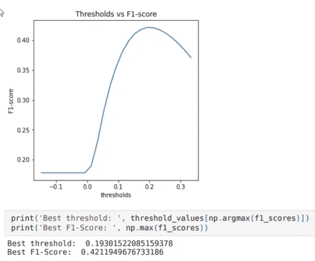

Thresholds vs F1-score

## 自定义集成分类器(堆叠):-

除了通用的 sklearn 模型，让我们继续构建一个定制的集合模型。实现定制信号群的步骤如下

1)首先，我们将所有数据分为训练和测试(80–20)。

2)在 80%的火车集合中，我们再次将火车集合分成 D1 和 D2。(50–50).

3)然后，我们用来自 d1 的替代品进行取样，以创建 D1、d2、d3…dk(k 个样本)。

4)我们创建“k”个模型，并用这 k 个样本中的每一个来训练这些模型中的每一个。

5)一旦“k”个模型的训练完成，我们将 D2 集传递给这 k 个模型中的每一个，因此我们从“k”个模型中的每一个得到 D2 的 k 个预测。

6)使用这些“k”个预测，我们创建一个新的数据集，对于 D2，因为我们已经知道其相应的目标值，我们然后通过将它视为元数据来训练具有这些“k”个预测的元模型。

7)对于模型评估，我们使用了我们保留的 20%的数据作为测试集。将测试集传递给每个基本模型，并获得“k”个预测。之后，我们用这 k 个预测创建一个新的数据集，并将其传递给元模型。

一旦我们得到了最终的预测，使用测试集的目标，我们计算模型的性能得分。

在这里，我们调整了基本模型的数量以及基本模型的组合，因为它们可以检测不同的数据模式。

> *要获得关于这种方法的更多见解，请参考下面的文章:*
> 
> [*https://pdf . semantic scholar . org/449 e/7116d 7 e 2 CFF 37 B4 D3 b 1357 a 23953231 b 4709 . pdf*](https://pdfs.semanticscholar.org/449e/7116d7e2cff37b4d3b1357a23953231b4709.pdf)

比较结果后，我们决定采用以下组合。

*   **基础模型组合** -CatBoostClassifier、LGBMClassifier、XGBClassifier
*   **基本型号数量** -5

在选择了最佳模型之后，我保存了我的模型，并使用测试数据运行它以获得结果。为了在 Kaggle 上提交，我创建了下面的函数来合并所有的产品作为一个列表。

下表总结了所有 sklearn 通用型号和定制套装的得分。

Kaggle score for catboost model

# **部署:**

为了创建一个 web 应用程序，这里使用 Flask 作为后端框架。在创建了一个 web 应用程序之后，它就被部署在云上，供所有人使用。对于云上的部署，使用 AWS EC2 实例。

app.py 中的以下函数用于处理 HTML 请求。

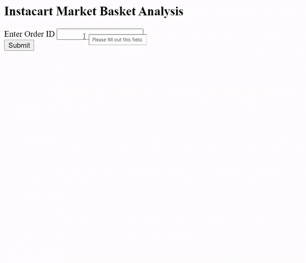

# 未来工作:

作为我的解决方案的进一步扩展，我想尝试一些深度学习模型。还有，期待尝试关联规则和 Apriori 算法。

## 对当前方法的改进:

作为对现有方法的改进，我想尝试使用 Faron 的 **F1 分数期望值最大化实现，这肯定会提高 Kaggle 分数。**

关于**自定义系综**，如果没有计算资源的限制，这个实现肯定会提供更好的分数。

# 参考资料:

1.  [https://www . semantic scholar . org/paper/A-Study-of-Meta-Learning-in-Ensemble-Based-Rani-活女神/449 e 7116d 7 e 2 cf 37 B4 d 3 b 1357 A 23953231 b 4709？p2df](https://www.semanticscholar.org/paper/A-Study-of-Meta-Learning-in-Ensemble-Based-Rani-Kumari/449e7116d7e2cff37b4d3b1357a23953231b4709?p2df)
2.  [https://medium . com/ka ggle-blog/insta cart-market-basket-analysis-feda 2700 cded](/kaggle-blog/instacart-market-basket-analysis-feda2700cded)
3.  [https://www . ka ggle . com/Errol Pereira/light-gradient-boosting # Creating-features using-user _ id](https://www.kaggle.com/errolpereira/light-gradient-boosting#Creating-Featuresusing-user_id)
4.  [https://www . ka ggle . com/c/insta cart-market-basket-analysis/discussion/38109](https://www.kaggle.com/c/instacart-market-basket-analysis/discussion/38109)
5.  [https://www.kaggle.com/mmueller/order-streaks-feature](https://www.kaggle.com/mmueller/order-streaks-feature)
6.  [https://www . ka ggle . com/c/insta cart-market-basket-analysis/discussion/38100](https://www.kaggle.com/c/instacart-market-basket-analysis/discussion/38100)
7.  [https://www.appliedaicourse.com/](https://www.appliedaicourse.com/)

要查看我的全部作品，请访问我的 GitHub 知识库:[**https://GitHub . com/srinidhikarjol/insta kart-Market-Basket-Analysis**](https://github.com/srinidhikarjol/Instakart-Market-Basket-Analysis)

我的领英简介:[**https://www.linkedin.com/in/srinidhi-karjol-aba072103/**](https://www.linkedin.com/in/srinidhi-karjol-aba072103/)