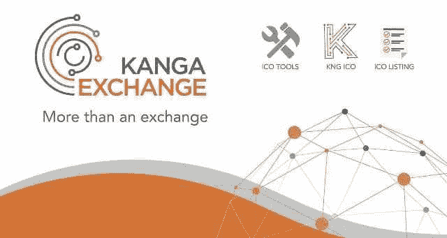

# Kanga 与 Tenset 交换独家公开销售

> 原文：<https://medium.com/geekculture/kanga-exchange-with-tenset-for-an-exclusive-public-sale-987cd147ecd7?source=collection_archive---------10----------------------->

Kanga Exchange 是一个动态发展的金融科技工具和服务系统，旨在鼓励和促进加密货币在日常生活中的广泛使用。Kanga 的主要活动领域是加密货币交易所，该交易所于 2018 年 9 月推出，用户**无需 KYC** 即可使用。