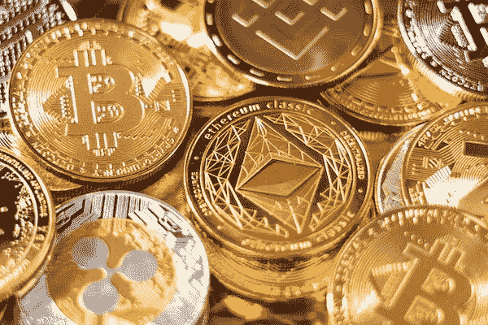
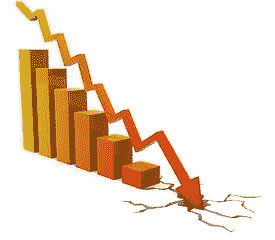

# 卡戴珊和其他名人起诉加密促销

> 原文：<https://medium.com/geekculture/kardashian-and-other-celebrities-sued-over-crypto-promotion-b4d366cbdcdb?source=collection_archive---------12----------------------->

Photo by [Art Rachen](https://unsplash.com/@artrachen?utm_source=unsplash&utm_medium=referral&utm_content=creditCopyText) on [Unsplash](https://unsplash.com/s/photos/cryptocurrencies?utm_source=unsplash&utm_medium=referral&utm_content=creditCopyText)

金·卡戴珊拥有世界上最大的社交媒体追随者，所以她的帖子很有分量。她与数字令牌 EthereumMax 相关的声明导致了一场诉讼。该诉讼称，卡戴珊关于 EthereumMax (EMAX)的陈述是“虚假和误导性的”，并导致投资者进入“抽水和倾倒”计划。

纽约布鲁克林居民瑞安·休格里奇和其他原告提起了诉讼。他们声称金·卡戴珊、弗洛伊德·梅威瑟和另一位名人骗他们购买 EMAX 代币

## **卡戴珊做了什么？**

2021 年 6 月，卡戴珊在她的 Instagram 上发布了一条消息，内容是“你们对加密感兴趣吗？”用免责声明语言“这不是财务建议。”卡戴珊的帖子提到她正在分享她的朋友告诉她的关于以太令牌的事情。她加入了“广告”(付费广告)标签。

在她发布 EMAX 代币帖子的时候，卡戴珊在 Instagram 上有超过 2.5 亿的粉丝。卡戴珊每条赞助的 Instagram 帖子通常能赚 50 万至 100 万美元。尽管她收到的推广 EthereumMax 的确切金额不得而知，但估计她收到的金额在这个范围内。

以太最大诉讼的其他名人包括前职业拳击手弗洛伊德·梅威瑟和前职业篮球运动员保罗·皮尔思。

2021 年，梅威瑟在一场拳击比赛上与 YouTube 名人聊天时，吹捧投资 EthereumMax 的好处。2021 年 5 月，皮尔斯在自己的推特账号上推广了 EthereumMax。该帖子还提到了皮尔斯和 ESPN 之间的冲突，称:“@espn 我不需要你。我得到了@ethereum-max，在过去的一个月里，我用这个密码赚的钱比你们一年赚的还多。”作为前 NBA 球员，皮尔斯担任体育评论员，这条推文引起了广泛关注。

## **继卡戴珊升职之后，以太最大值直线下降**

**Image credit:** [**Piqsels**](https://www.piqsels.com/en/public-domain-photo-jrdxb)

自 6 月初以来，EthereumMax 的市值已经缩水约 97%。原告指控卡戴珊和其他名人通过社交媒体人为抬高加密货币的价格。名人促销之后，EthereumMax 的价值增加了 1300%以上。这种影响并没有持续很久。就在价格飙升一个月后，硬币的价格暴跌至历史最低点。原告声称，卡戴珊和其他人在价格大幅下跌前抛售了他们的股票，并获得了可观的利润。

尽管名称相似，但 EthereumMax 与仅次于比特币的第二大加密货币[以太坊](https://ethereum.org/en/)并无关联。该诉讼还声称，将“以太坊”作为其名称的一部分是故意欺骗投资者。

原告在美国加州中区地方法院提起了集体诉讼。原告要求包括金·卡戴珊、弗洛伊德·梅威瑟和保罗·皮尔思在内的被告归还财产并让[交出利润](https://www.investopedia.com/terms/d/disgorgement.asp)。被告还包括 EthereumMax 项目的联合创始人。

## **谁是以太最大值？**

没有人对 EthereumMax 项目背后的创始团队了解多少。法庭文件确认史蒂夫·真蒂尔是 EthereumMax 的联合创始人和创造者。原告声称，EMAX 令牌是一个“由一群神秘的加密货币开发者创造的投机性数字令牌”

EthereumMax 项目的发言人反驳了卡戴珊诉讼将该项目定性为骗局的说法。“这个项目以自己是加密货币领域最透明和最具沟通性的项目之一而自豪。我们对指控提出异议，并期待真相大白。”

## **来自英国和美国委员会的警告**

卡戴珊发布社交媒体帖子几个月后，英国金融行为监管局的查尔斯·兰德尔发表了一次演讲，警告人们小心社交媒体平台上的加密广告。他特别单挑了卡戴珊对 EthereumMax 的推广。他说，“社交媒体影响者通常会从骗子那里获得报酬，以帮助他们在纯粹的投机行为的基础上抽取和倾倒新的代币。”

这不是梅威瑟第一次在加密货币促销方面遇到法律问题。2018 年，他向美国证券交易委员会(SEC)支付了超过 60 万美元，以解决他非法在社交媒体上推广首次硬币发行的指控。SEC 还指控 DJ Khaled 在首次发行硬币时的促销活动。他与美国证券交易委员会达成了单独和解，支付了超过 15 万美元。

证券交易委员会执法部门的前联合主任史蒂文·佩金强调了投资者在名人广告方面保持谨慎的重要性。“投资者应该对发布在社交媒体平台上的投资建议持怀疑态度，不应该根据名人的支持做出决定，”佩金说。“社交媒体影响者通常是付费的推广者，而不是投资专业人士，他们兜售的证券，无论是使用传统证书还是在区块链发行的，都可能是欺诈。”