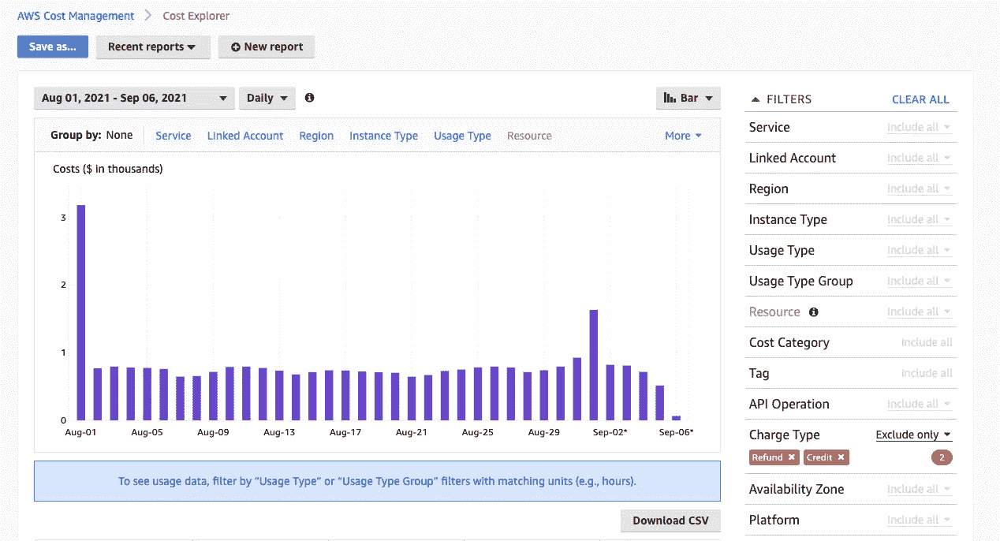
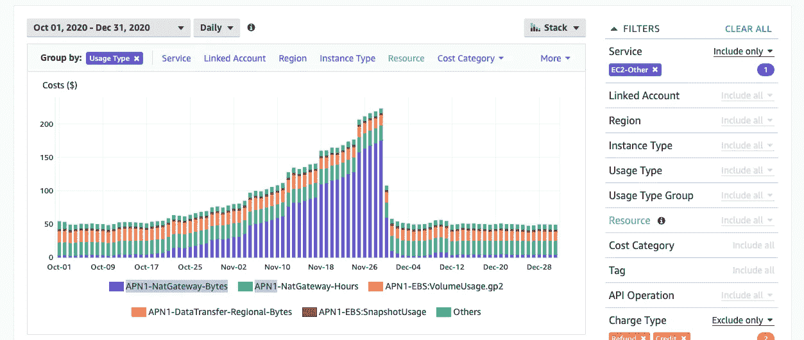

# 控制 AWS 成本

> 原文：<https://medium.com/geekculture/keep-aws-cost-in-check-d31543d1d54e?source=collection_archive---------19----------------------->

AWS 生态系统提供了丰富的服务，促进了云应用程序开发和操作的各个方面。然而，这些服务的成本很容易在一段时间后失控。它可能来自应用程序设计、基础设施设计中的错误，或者仅仅是因为事情发生了变化。控制成本对任何项目都至关重要。以下是我控制 AWS 成本的一些方法

# 监控成本

首先，应该有效地监控成本。可以使用 Cost Explorer 和 AWS Budget 来完成。

## 成本浏览器

成本浏览器是一个很好的开始方式。它显示了客户/组织正在使用的每项 AWS 服务的成本。*过滤器*和*分组*非常有助于浏览每一个成本细节。

比如我一般会去 Group by: Service 查看当月每项服务的费用。如果我发现一项服务产生了不寻常的费用，我将使用过滤器挑选出该服务，然后按关联帐户/地区/使用类型分组…以获得更多信息，并最终找到费用的原因。

Group by and Filters tells me that the sudden surge in EC2 cost is from Nat Gateway data transfer

上图取自我的 EC2 成本调查。它揭示了 Nat 网关数据传输是导致 EC2 成本异常高的罪魁祸首。进一步的调查表明，DMS 实例每天通过 Nat 网关将 RDS 数据推送到 S3 进行分析是根本原因。添加一个 VPC 端点有效地解决了这个问题，避免了它可能被忽视的可怕错误。

## AWS 预算

探索成本是第一步，下一步应该是应用预算，以便在成本超过阈值时发出警报。AWS Budget 允许您按服务、帐户、使用类型…创建预算，并在警报触发时触发 SNS 或 Lambda。设置闹钟向 slack、sms 发送消息，或者用 Lambda 对 AWS 资源做一些事情，只要通知在检查中，您就可以安心地知道成本在检查中。

# 降低成本

成本监控系统到位后，就可以开始优化成本了。对于每个特定的项目，有很多降低成本的方法。以下是我的一些想法:

## 购买保留实例或保存计划

一个伟大而简单的方法来减少每月发生的费用是预先支付，以 RI(保留实例)或储蓄计划的形式。基于您过去支付的金额，AWS 将为您推荐合适的购买计划，如果您信任 AWS 计算。但是，由于算法不了解未来的使用计划，例如从现在起 2 个月后，该功能将被删除，并且不再需要该类型的实例，我发现自己计算并仅使用 AWS 建议作为参考会更好。

## 调整资源

资源是用来实现某种预期目的的。唯一的问题是有时期望与现实不符，这导致资源要么计划不足，要么计划过度。两者都不好，但是人们倾向于安全行事，喜欢过度规划而不是规划不足。一段时间后，那些过度计划的资源会啃掉一大块钱。偶尔调优资源可能会让您免于这种情况。

为了优化任何资源，您必须有一种方法来监控该资源。在 AWS 上，通常是 Cloudwatch 指标，但任何其他工具也可以完成这项工作。调优候选可以是任何东西，从 EC2 实例规范到自动缩放组、lambda 规范、RDS 规范等等。这些步骤是

*   检查所需资源的指标
*   如果未充分利用，调整资源(减少规格、规模或改变类型)
*   监控调整后的资源，以确保其正常有效地工作

这是一个微妙的过程，所以要小心不要引入任何不良影响。迭代地引入小调优而不是大调优是一个好主意。

## 添加 VPC 端点

通常，实例安全地位于私有子网内，并通过 NAT 网关与外界通信。然而，与数据相关的任务，如将 RDS 同步或备份到 S3，或将 AWS 日志推送到 Cloudwatch 日志，可能会在 NAT 网关上产生如此多的流量，以至于数据传输成本失控。

幸运的是，AWS 提出了 VPC 端点，这是一种更有效的与 AWS 服务对话的方式。流量将通过 AWS 网络私下进行，从而提高安全性和数据传输成本。

但是，VPC 端点不能完全删除 NAT 网关，这对于互联网流量是必要的。除此之外，还需要两个或更多的接口端点来保持高可用性。因此，拥有终端的额外成本可能会超出节省的数据传输成本，最终您会支付更多费用。为了避免这种情况，您应该仔细选择使用 VPC 端点的服务。

# 结论

成本监控和一些富有想象力的想法是你控制账单所需要的。