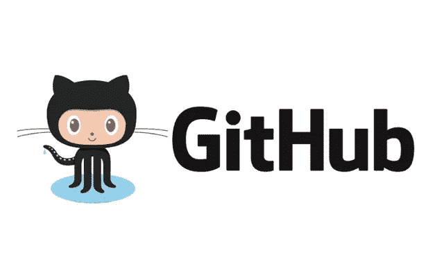
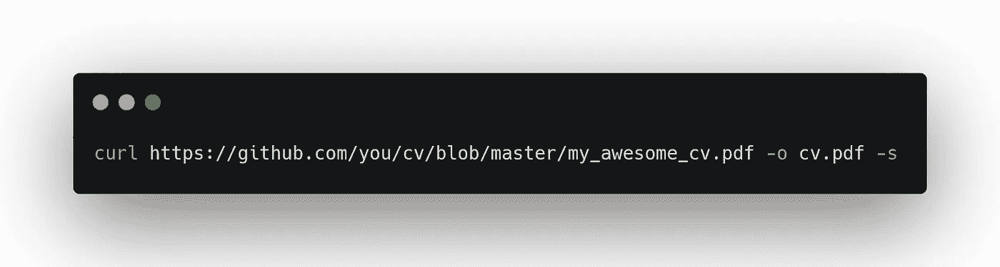

# 像开发者一样使用 GitHub Actions & LaTeX 更新你的简历

> 原文：<https://medium.com/geekculture/keep-your-cv-updated-like-a-developer-using-github-actions-latex-ab9820484147?source=collection_archive---------13----------------------->

Photo by [João Ferrão](https://unsplash.com/@joaoscferrao?utm_source=unsplash&utm_medium=referral&utm_content=creditCopyText) on [Unsplash](https://unsplash.com/?utm_source=unsplash&utm_medium=referral&utm_content=creditCopyText)

你有没有遇到过想发简历却没有更新的 PDF 的情况？

有几个在线解决方案可以防止这种情况发生在你身上:从支付网站输入你所有的专业信息，允许你下载各种格式和模板的简历；其他更标准的叫做 LinkedIn 的网站。在后者中，你可以下载一个稍微可配置的简历版本，只需在社交网络上更新你的信息。

在这篇文章中，我提出了一个变体，我用它来保存我的简历，随时更新，更新版本，并以 PDF 格式轻松下载。

# 1.使用版本控制器

有什么比版本控制工具更好的方法来保持你的简历版本化呢？在 GitHub 上创建一个新的存储库，您将在其中存储您的 CV 源代码。

如果你需要不止一个版本的简历，Git 还可以通过使用不同的分支来帮助你。

# 2.为你的简历找一个好的乳胶模板

建议你用乳胶。LaTeX 是一个文本排版系统，专门面向书籍、科技文档的创作，被确定为高度灵活。一些优点是:

*   它是自由软件。
*   有一整套模板可以提供专业的结果。
*   如果结果从一台计算机到另一台计算机或在不同版本中改变，不必担心。
*   网上有很多参考书目。

你可以看看这些 GitHub 库，在那里你会找到一些很棒的模板。

 [## GitHub-posquit 0/Awesome-CV:Awesome CV 是您出色工作申请的 LaTeX 模板

### 乳胶模板为您出色的工作申请 Awesome 简历是乳胶模板的简历(履历表)，简历或…

github.com](https://github.com/posquit0/Awesome-CV)  [## GitHub - jankapunkt/latexcv:用 LaTeX 编写的 cv 和简历模板集合。留下一个…

### 领带:用 LaTeX 写的 cv 和简历模板的集合。如果您的语言不受支持，请留下问题！…

github.com](https://github.com/jankapunkt/latexcv) 

无论如何，如果您不喜欢这些模板中的任何一个，并且您对 LaTeX 有一些基本的了解，您可以从头开始创建自己的文档。

# 3.以 PDF 格式编译您的文档

把你的文件放进去是没有用的。tex 格式，如果我们不能生成一个可以发送给人类的 PDF 版本。我不认为招聘人员想阅读简历。tex 格式😁。这就是 GitHub Actions 的用武之地。我们可以对上传到我们开发分支的每个变更进行配置，这将触发一个编译我们的文档并将其存储在存储库中的操作。

我分享了一个例子，您可以用它来创建 GitHub 动作。

如果你不太了解 GitHub Actions，可以看看这里:

 [## GitHub 操作

### 使用 GitHub Actions 在您的存储库中自动化、定制和执行您的软件开发工作流。你…

docs.github.com](https://docs.github.com/en/actions) 

# 4.轻松分享

如果我们公开存储库，就有可能使用文件的 URL 以简单的方式下载文档。大概是这样的:

[https://github.com/you/cv/blob/master/my_awesome_cv.pdf](https://github.com/you/cv/blob/master/my_awesome_cv.pdf)

Download your CV using **curl**

仅此而已。通过这简单的四个步骤，你可以拥有一个 CV，更新的，版本化的，可用的，在所有电脑上都好看的格式。希望对你有所帮助。👋