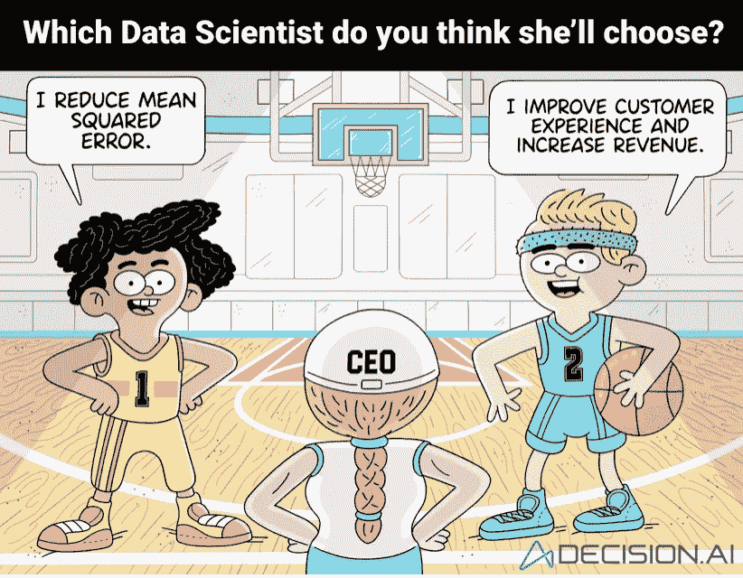

# 跟上数据——第 10 周阅读清单

> 原文：<https://medium.com/geekculture/keeping-up-with-data-week-10-reading-list-3f98fdd4204e?source=collection_archive---------29----------------------->

## 花 5 分钟读 5 个小时的书

Source: [https://decision.ai](https://decision.ai)

O 是输出，不是输出！这是数据科学中的重要问题。但是我们很容易被日常工作分散注意力。所以，提醒是有用的。无论是上面这张有趣的图片，还是比尔·施马尔佐的新书:[《数据、分析和数字转型的经济学》。](https://www.packtpub.com/product/the-economics-of-data-analytics-and-digital-transformation/9781800561410)

星期五快乐！

*   **“大”数据可能比看起来小 99.98%:**直觉告诉我们，样本越大越可靠。但是我们不能忘记如何选择样本的重要性。要评估汤的咸度，哪怕只有一勺也足够了。但前提是要搅拌好！同样，只有在样本是随机的情况下，样本总体的意见才能被概括。如果有哪怕是很小的——0.5%的选择偏差——对 230 万人的看法，那也不比 400 人的真正随机样本好多少。因此，请记住这一点，并注意“大数据悖论”:数据越多，我们就越容易欺骗自己。([彭博](https://www.bloomberg.com/news/articles/2021-03-08/-big-data-can-be-99-98-smaller-than-it-appears))
*   **因果关系介绍|测量和优化原因的科学&效果:**几年前，似乎有一种由“相关性”一词引发的关于因果关系的巴甫洛夫反射。不幸的是，这种条件反射通常不支持何时考虑因果分析，以及使用非因果决策的风险是至关重要的。所以要注意混淆因素。它们在现实生活中并不总是像在[有趣的虚假关联例子](https://www.tylervigen.com/spurious-correlations)中那样明显。([贝叶斯服务器](https://www.bayesserver.com/docs/causality/causality)
*   **测试你的数据，直到它受伤:**数据质量是一个热门话题。但是实际情况如何呢？“好数据”是什么样的？控制什么？如何设置阈值？这不是你可以在桌子上头脑风暴的事情。你需要把你的胳膊——肘深——放在数据里。文章中有两个要点——第一，在数据管道上独立设置质量控制机制，第二，预计测试在前几周会失败。你甚至应该设置他们，这样他们就会失败！不用担心误报。担心假阴性！([米莎·昆泽](https://medium.com/u/99731487ad71?source=post_page-----3f98fdd4204e--------------------------------) @ [走向数据科学](https://towardsdatascience.com/test-your-data-until-it-hurts-306a7d7e4f84))

每周四晚上，当我写阅读清单时，我要求自己不要把它留到下周四晚上。我又回来了。但好的一点是，我现在不用担心下一周了！

## 如果你错过了上周的《跟上数据》

 [## 跟上数据——第 9 周阅读清单

### 花 5 分钟读 5 个小时的书

adamvotava.medium.com](https://adamvotava.medium.com/keeping-up-with-data-week-9-reading-list-4a1f14be45da) 

***感谢阅读！***

***欢迎在评论中分享你的想法或阅读技巧。***

***跟我上*** [***中***](https://adamvotava.medium.com/)*[***领英***](https://www.linkedin.com/in/adamvotava/) ***和*** [***推特***](https://twitter.com/_adam_votava) ***。****