# Kerberos v5:使用 Apache directory studio 在 Windows 10 Home 中进行 SSO 认证

> 原文：<https://medium.com/geekculture/kerberos-v5-sso-authentication-in-windows-10-home-using-apache-directory-studio-fb0151899185?source=collection_archive---------4----------------------->

## 学习带有 Spring Security 的 Kerberos V5:IAM

## 无缝 SPNEGO HTTP 身份验证

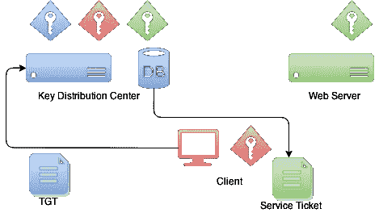

3 components in Kerberos network authentication protocol

Kerberos v5 Single Sign-On Security

# 范围

这篇文章解释了如何在 Windows 10 Home 中使用 Kerberos 网络协议单点登录身份验证来实现安全性。它在 Apache directory studio 中启用 Kerberos，Apache directory studio 是一个 LDAP 服务器和密钥分发中心(KDC)。
Kerberos v5 单点登录(SSO)使用运行在不同端口的两个 Spring boot 应用程序进行解释。

# **先决条件**

如果您希望在您的本地环境中执行此操作，那么 ***软件安装和应用的最低要求是:
**a .**Windows 10 Home
**b .**Apache Directory studio v 2 . 0 . 0
**c .**MIT Kerberos client-kfw-4 . 0 . 1
**d .**在 Java SE 平台 v1.8 开发两个 Spring boot 应用，测试 Kerberos v5 SSO
**e.** 浏览器配置。Firefox/Edge/Chrome【如下图】
***f .****Spring Boot 应用代码可以在* [GitHub](https://github.com/ganesh-nag/Kerberos-V5-SSO-Authentication) 看到。您需要使用链接中给出的两个项目来测试 Kerberos v5 SSO。***

# **安全配置**

## **Windows 10 首页**

DNS 主机名设置:C:\ Windows \ System32 \ drivers \ etc \ hosts
127 . 0 . 0 . 1**example.net**

> 系统环境变量设置
> krb 5c name = C:\ Users \**{ username }**\ AppData \ Local \ Temp \ krb 5b cache

## **Apache 目录工作室**

**答:** Apache DS 连接配置

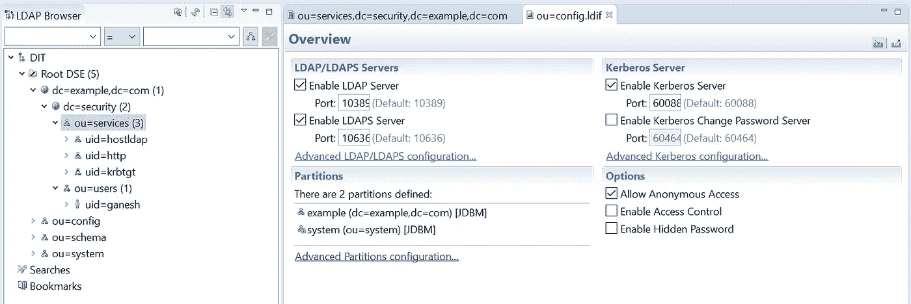

Overview tab

SASL settings

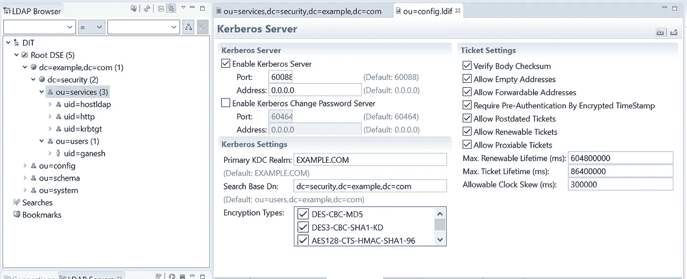

Kerberos server settings

**b.** 将以下 LDIF 文件导入 Apache DS，以创建**层级、服务**和**用户**

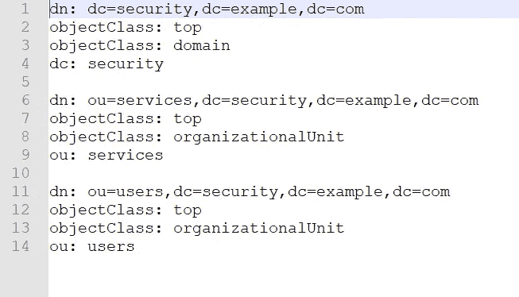

hierarchy.ldif

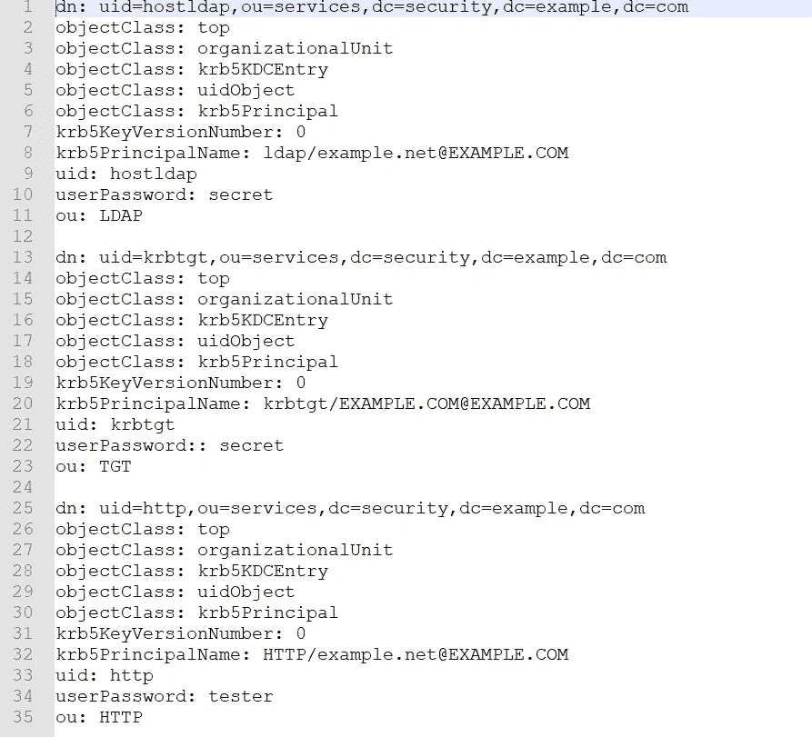

services.ldif

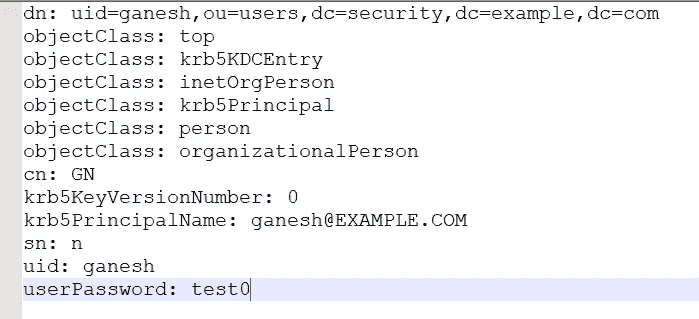

users.ldif

## MIT Kerberos 客户端

使用记事本创建包含以下内容的 krb5.ini 文件，该文件应存储在 C:\ program data \ MIT \ Kerberos 5 \ krb5 . ini 下

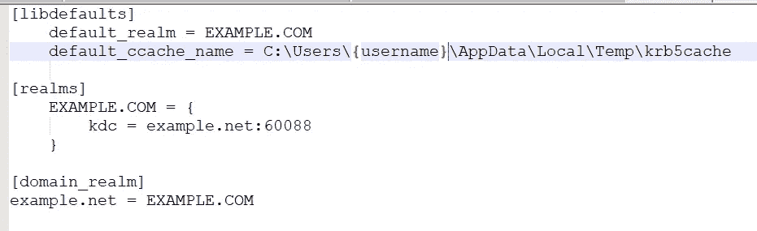

krb5.ini

> 上面的屏幕截图显示了 **krb5cache** 位置存储票据，这些票据是使用服务主体名称创建的，并使用服务主体密码加密。这样，密码就不会通过网络发送，而这正是 Kerberos 的症结所在。
> 
> 当用户试图通过浏览器访问一个***/受保护的*** 端点时，如果 **krb5cache** 为空，MIT Kerberos 票证管理器将弹出，您提供服务主体凭证以创建票证授予票证(TGT)。KDC 的票据授予服务器(TGS)创建 TGT。MIT Kerberos 票证管理器将在 krb5.ini 文件中查找域名和 KDC 位置来获取 TGT。
> 
> 用于 web 应用程序的服务主体名称以 **HTTP/HOSTNAME@REALM** 开头，即 **HTTP/example.net/EXAMPLE。本例中的 COM** 。您可以在上面我们在 Apache DS 中创建的 **services.ldif** 文件中找到服务主体名称条目。

# **什么是 SPNEGO 和 GSS-API？我们为什么需要？**

Kerberos 是一种主要在传输层(TCP/UDP)运行的安全网络身份验证协议。这就是我们需要 SPNEGO 的地方。 **SPNEGO** ( *简单且受保护的 GSS_API 协商机制*)为 web 应用扩展了 Kerberos SSO。

Web 应用程序通信主要发生在 web 浏览器和通过 HTTP 托管 web 应用程序的 web 服务器之间。允许应用程序通过 SPNEGO 将 Kerberos 作为安全机制进行协商，并通过 HTTP 将票证作为 SPNEGO 令牌进行交换。

## **GSS-API** 是**通用安全服务 API**

它为访问不同的安全服务提供了一个公共接口。SPNEGO 是 GSS API 的一部分，用于客户端和服务器协商安全机制的选择，例如 Kerberos 或 NTLM。

SPNEGO 是一种与认证者协商以决定使用何种协议的机制，即 **GSS/SPNEGO - >摘要- > NTLM - >基本**。注意，Kerberos 没有出现在这个列表中，因为每当支持协商时，总是选择 **GSS/SPNEGO** 。“ **SPNEGO** ”表示您更喜欢使用 **GSS/SPNEGO** 机制来响应协商方案。

# 事件的经过，一瞥

1.  如果 **krb5cache** *为空，将弹出* MIT Kerberos 票证管理器，用户需要提供服务主体凭证来创建票证授予票证(TGT)。服务主体凭据用于创建支持单点登录的 TGT。
2.  身份验证成功后，票据授予票据(TGT)存储在主体的私有凭证集中，Kerberos 主体存储在主体的主体集中。与 TGT 一起，一个**服务器的长期** *密钥*也存储在该主题中。这个密钥被目标服务器用来解密**服务票**。
3.  Kerberos 服务身份验证提供程序使用客户端的 TGT 获取目标服务器的服务票。这个服务票是使用**服务器长期** *密钥加密的。*
4.  目标服务器*使用**服务器长期** *密钥* **解密***服务票。

# **发送 SPNEGO 令牌的用户代理配置**

Firefox 设置

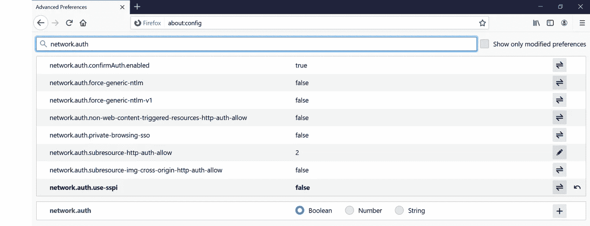

Firefox settings

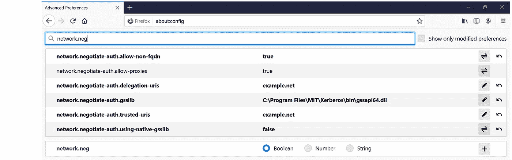

Firefox settings

# **Kerberos V5 SSO 认证如何工作？**

让我们启动两个运行 REST 服务的 spring boot 应用程序，看看票证是如何生成的，以及 Kerberos SSO 认证是如何工作的。

让我们首先为服务主体创建密钥表文件，并将它们放在**C:\ key tabs**
Java**ktab**实用程序可用于创建密钥表文件，对于本例，它们存储在名为 **webapp.keytab** 的文件中。

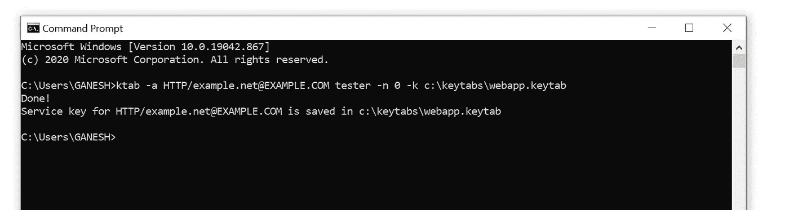

keytab files creation

必须在 Spring boot 应用程序的以下配置中提供 key-tab 的位置和服务主体名称，以验证身份验证。

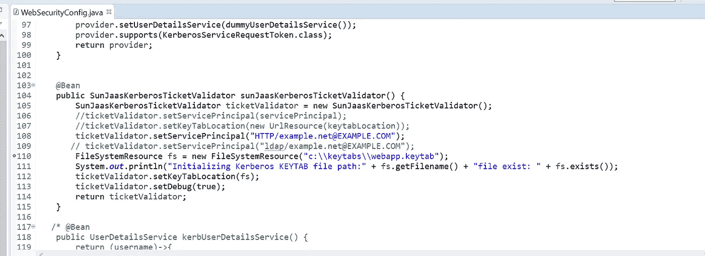

keytab and service principal in spring boot

a.运行**Kerberos authapplication**Spring boot 应用在**端口 8080**
添加 VM 参数**-DJ ava . security . krb5 . conf**= " C:/Program Files/Java/JDK 1 . 8 . 0 _ 281/JRE/lib/security/krb5 . conf "

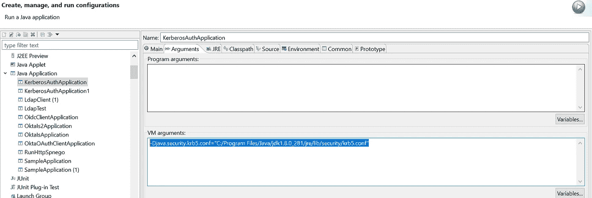

Run configuration using Java

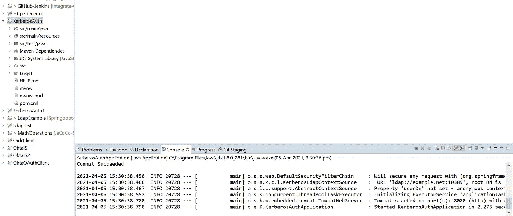

Spring boot application started in port 8080

b.运行**kerberosauthapplication 1**Spring boot 应用在**端口 8081**
添加 VM 参数**-DJ ava . security . krb5 . conf**= " C:/Program Files/Java/JDK 1 . 8 . 0 _ 281/JRE/lib/security/krb5 . conf "

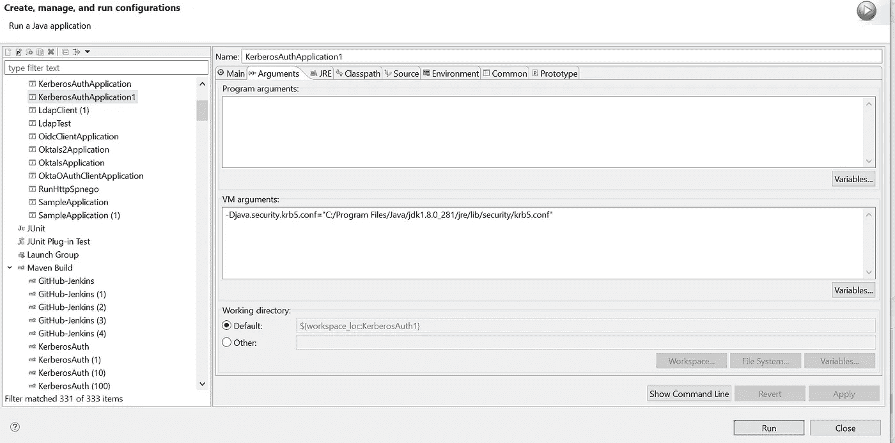

Run configuration using Java

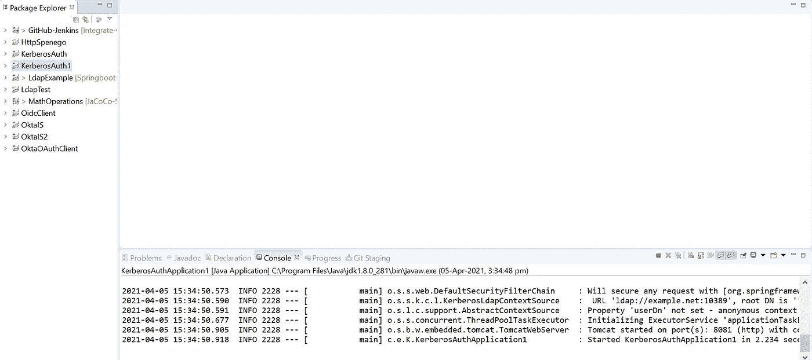

Spring boot application started in port 8081

当 2 个 Spring boot 应用程序运行时，我们点击 **/protected** 端点，看看会发生什么。

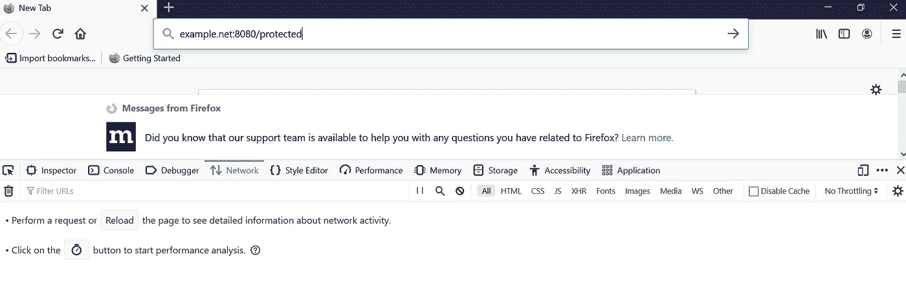

user hits /protected endpoint

从下面的屏幕截图可以看出，我们弹出了 MIT Kerberos 票证管理器。这是因为，krb5 缓存是空的，我们必须生成一个 TGT。要生成 TGT，我们必须提供服务主体名称和密码。

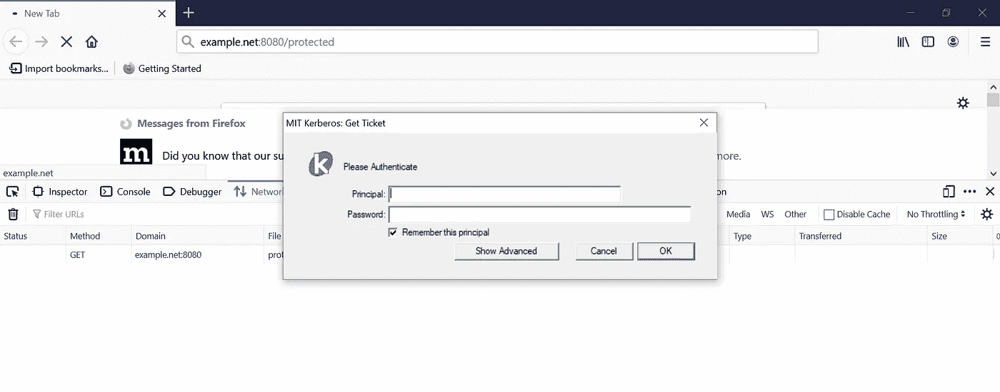

MIT Kerberos UI login

如果输入的服务主体名称不正确，那么服务器会在响应中提示使用**WWW-Authenticate:Negotiate**。

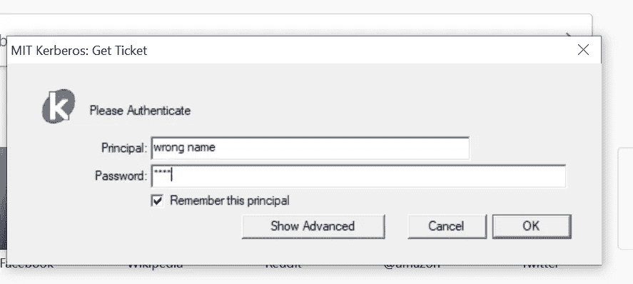

invalid service principal credentials

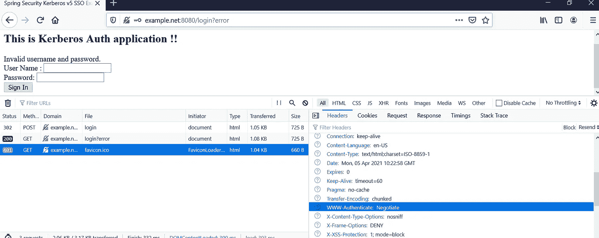

WWW-Authenticate: Negotiate in the response

现在，我们使用正确的服务主体凭证进行身份验证，以获得 TGT 和无缝 Kerberos 身份验证。如果成功，它将返回 HTTP 200 状态。

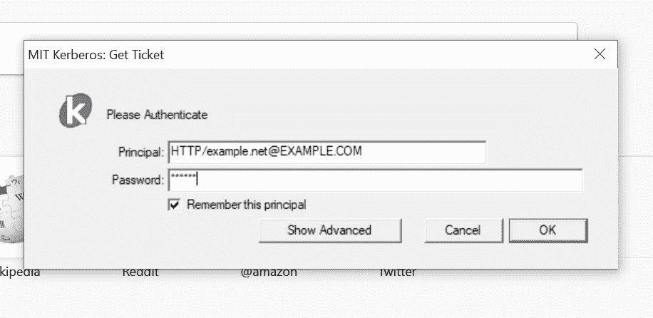

service principal credentials to get TGT

下面的屏幕截图显示已经为服务主体生成了 TGT。还有一种方法可以通过命令行生成 TGT。导航到
C:\ Program Files \ MIT \ Kerberos \ bin>*kinit-k-t C:\ key tabs \ web app . keytab*[*HTTP/example.net@EXAMPLE.COM*](mailto:HTTP/example.net@EXAMPLE.COM)
这个命令将生成 key-tab 文件，就像上面的 MIT Kerberos 票证管理器生成的一样。

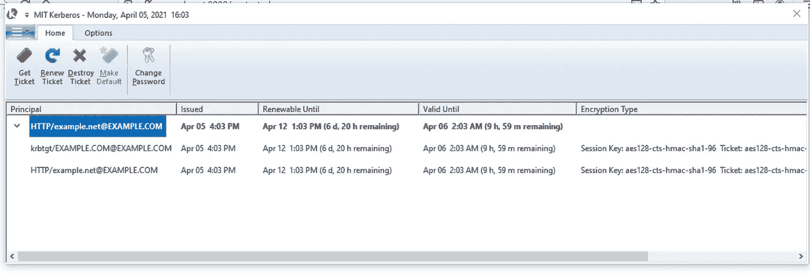

TGT generated

你可以在下面的屏幕截图中看到最后一个条目，用 TGT 创建的 **krb5cache** 。这是 **krb5.ini** 和 **krb5.conf** 中给出的路径。

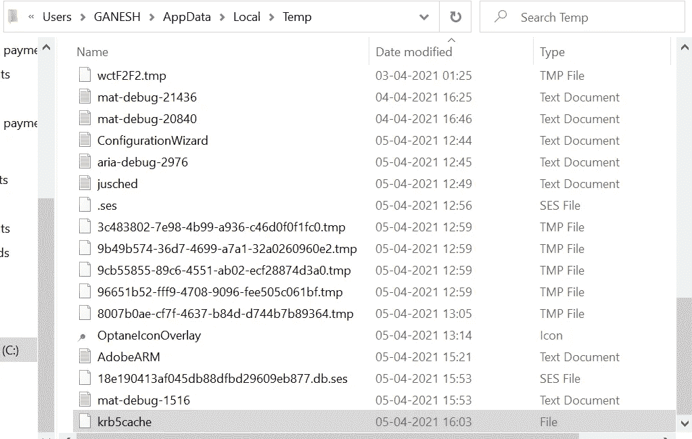

krb5cache

使用正确的服务主体凭证生成 TGT 后，点击 **/protected** 端点，您将看到 **KerberosAuthApplication** 在**端口 8080** 中运行，并收到来自服务器的响应。

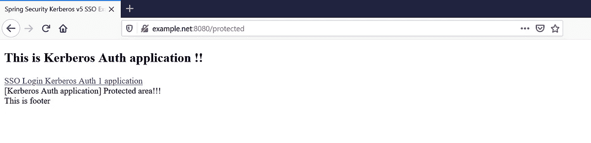

KerberosAuthApplication

点击 **SSO 登录**链接，您将可以访问运行在**端口 8081** 的**Kerberos authapplication 1**，如下图所示。

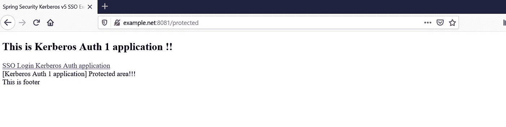

KerberosAuthApplication1

# **结论**

于是我们通过使用 **Apache Directory Studio** 与 **REST API** 集成，最终在 **Windows 10 Home** 中完成了 **Kerberos v5 SSO** 。上面给出的 GitHub 链接有经过测试的源代码，您可以利用它来进一步理解 Kerberos 的细微差别和症结。

## 发布于*2021 年 4 月 5 日*

> ***其他中等文章，*由 *Ganesh Nagalingam***
> 
> [使用 JAPA 访问者模式探索语法树和补救代码气味](/geekculture/quest-syntax-tree-and-remedy-code-smell-using-japa-visitor-patterns-f023a89842cf)
> 
> [异步 WebSocket 消息中间件和微服务](/nerd-for-tech/asynchronous-websocket-messaging-middleware-and-microservices-1a50a8f14e4b)
> 
> [通过 CORS 融合 Angular 和 Spring Cloud 架构](/geekculture/amalgamate-angular-with-spring-cloud-architecture-through-cors-7f13b5fdb98f)
> 
> [*多代理洞察 Apache Kafka 集群架构*](/geekculture/multi-broker-insights-into-apache-kafka-cluster-architecture-617b0abfc53e)
> 
> [远程队列定义:IBM MQ v9.2](https://ganeshblog.medium.com/remote-queue-definition-ibm-mq-v9-2-c3ec4f568dab?source=user_profile---------5----------------------------)
> 
> [Kubernetes Pods&Docker Containers:在 Windows 10 Home 中使用虚拟盒子旋转虚拟机](https://ganeshblog.medium.com/kubernetes-pods-docker-containers-spin-vm-using-virtual-box-in-windows-10-home-d3be783ff087?source=user_profile---------0----------------------------)
> 
> [联合 OKTA IdP + WSO2 API 管理器作为 Spring boot 微服务集成的网关](https://ganeshblog.medium.com/federate-okta-idp-wso2-api-manager-as-gateway-to-spring-boot-microservices-integration-ba567567e81?source=user_profile---------1----------------------------)
> 
> [将 IBM WebSphere Service Registry and Repository 与 IBM Process Server 集成](https://ganeshblog.medium.com/integrate-ibm-websphere-service-registry-and-repository-with-ibm-process-server-f97eeb0e2ea?source=user_profile---------6----------------------------)
> 
> [整合服务提供商(sp)和 OKTA 身份提供商(IdP)](https://ganesh-nagalingam.medium.com/integrate-service-providers-sps-with-okta-identity-provider-idp-ce64a4e262ae)
> 
> [将 IBM 业务流程管理器与混合 MobileFirst 应用程序集成](https://ganesh-nagalingam.medium.com/integrate-ibm-business-process-manager-with-hybrid-mobilefirst-application-5aed20841bf3?source=your_stories_page-------------------------------------)