# 支持向量机中的核技巧

> 原文：<https://medium.com/geekculture/kernel-methods-in-support-vector-machines-bb9409342c49?source=collection_archive---------0----------------------->

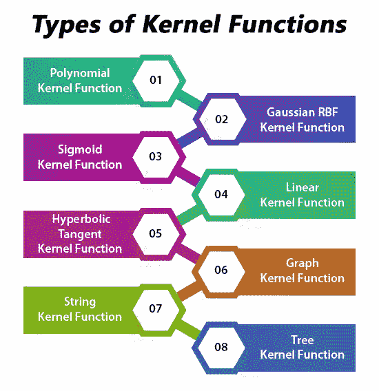

> 内核或内核方法(也称为内核函数)是用于模式分析的不同类型算法的集合。它们通过使用线性分类器来解决非线性问题。在分类和回归问题中使用的 SVM(支持向量机)中采用了核方法。SVM 使用所谓的“核心技巧”，即转换数据并为可能的输出找到最佳边界。

# 对内核方法的需求

SVM 算法使用一组被定义为内核的数学函数。内核的作用是把数据作为输入，转换成需要的形式。不同的 SVM 算法使用不同类型的核函数。这些函数可以是不同的类型。例如线性、非线性、多项式、径向基函数(RBF)和 sigmoid。
核是一个相似度函数。它是作为领域专家的你提供给机器学习算法的一个功能。它接受两个输入，并指出它们有多相似。

假设你的任务是学习图像分类。你有(图像，标签)对作为训练数据。考虑典型的机器学习管道:你获取图像，计算特征，将每幅图像的特征串成向量，并将这些“特征向量”和标签输入学习算法。
果仁提供了一种选择。您不用定义一系列特征，而是定义一个核函数来计算图像之间的相似性。你把这个内核，连同图像和标签一起提供给学习算法，就产生了一个分类器。
当然，标准的 SVM/逻辑回归/感知器公式不适用于内核:它适用于特征向量。那么我们究竟如何使用内核呢？两个美丽的数学事实拯救了我们:

*   在某些条件下，每个核函数都可以表示为一个(可能是无限维)特征空间中的点积([梅塞定理](https://en.wikipedia.org/wiki/Mercer%27s_theorem))。
*   很多机器学习算法完全可以用点积来表示。

这两个事实意味着我可以拿我喜欢的机器学习算法，用点积来表示，然后既然我的核在某个空间也是点积，就用我喜欢的核来代替点积。

## 为什么是核而不是特征向量？

一个很大的原因是，在很多情况下，计算核很容易，但是计算核对应的特征向量真的真的很难。甚至简单核的特征向量在大小上也可能爆炸，对于像 RBF 核(k(x，y) = exp( -||x-y||，参见[径向基函数核](https://en.wikipedia.org/wiki/Radial_basis_function_kernel))这样的核，相应的特征向量是无限维的。然而，计算内核几乎是微不足道的。
很多机器学习算法可以写成只使用点积，然后我们可以用核来代替点积。通过这样做，我们根本不需要使用特征向量。这意味着我们可以使用高度复杂、计算效率高、性能高的内核，而不必写下巨大且可能无限维的特征向量。因此，如果没有直接使用核函数的能力，我们将被困在相对低维度、低性能的特征向量中。这个“技巧”被称为内核技巧。

## 净化空气

我进一步扩展了这个解释，以澄清一些困扰数据专家的关于内核的混淆:

*   将一个特征向量变换成更高维特征向量的函数不是核函数。因此 f(x) = [x，x ]不是核。它只是一个新的特征向量。你不需要内核来做这件事。如果你想这样做，你需要内核，或者更复杂的特征转换而不扩大维度。
*   内核并不局限于支持向量机。任何只适用于点积的学习算法都可以用内核写下来。支持向量机的思想很美，核技巧很美，凸优化也很美，它们站得相当独立。

# 数学理解

为了对核有一个数学上的理解，让我们来理解一下核的姜黎黎方程，它是:
K(x，y)= < f(x)，f(y) >
*其中，*
*K 是核函数，
X 和 Y 是维输入，
f 是从 n 维到 m 维空间的映射，
< x，y >是点积。*

假设我们有两个点，x= (2，3，4)和 y= (3，4，5)
如我们所见，K(x，y) = < f(x)，f(y) >，
让我们先计算< f(x)，f(y) >

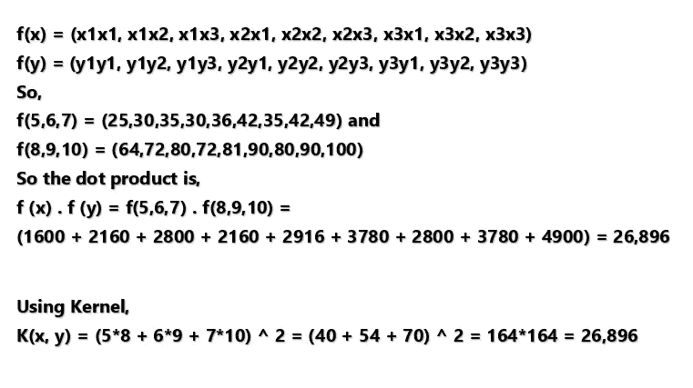

这正如我们发现的，f(x)。f(y)和 K(x，y)给出了相同的结果，但前一种方法在使用核时需要大量的计算(因为将 3 维投影到 9 维)，这要容易得多。

# SVM 常用的果仁类型

让我们来看看支持向量机使用的一些常见内核及其用途:

## 线性核

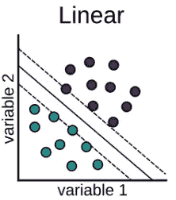

假设我们有两个名为 x1 和 Y1 的向量，那么线性核由这两个向量的点积定义:

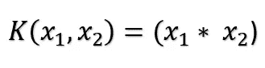

## 多项式核

多项式核由以下等式定义:

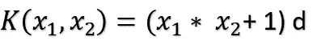

*where d is the degree of the polynomial and x1 and x2 are vectors.*

## 高斯核

这个核是径向基函数核的一个例子。下面是这个的方程式:

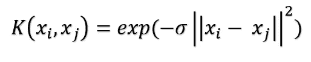

The given sigma plays a very important role in the performance of the Gaussian kernel and should neither be overestimated and nor be underestimated, it should be carefully tuned according to the problem.

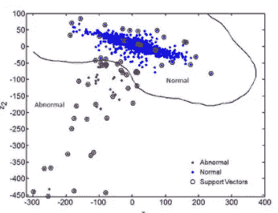

SVM Classification with a Gaussian Kernel Function

## 指数内核

这与之前的核密切相关，即高斯核的唯一区别是移除了范数的平方。

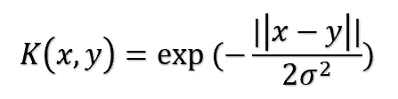

This is also a radial basis kernel function.

## 拉普拉斯核

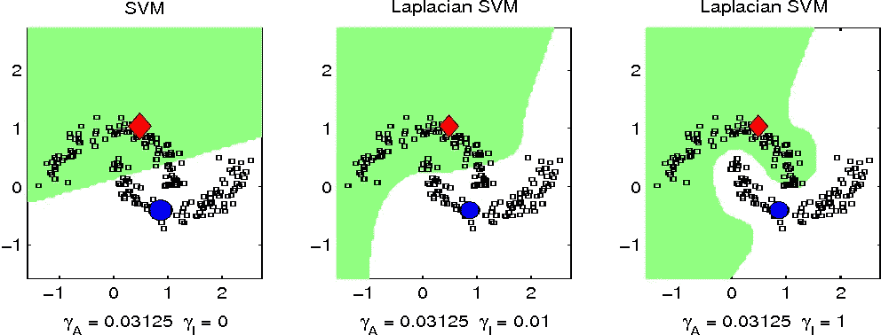

这种类型的核不太容易改变，并且完全等同于之前讨论的指数函数核，拉普拉斯核的等式给出为:

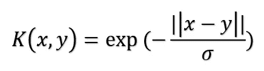

## 双曲线或 Sigmoid 核

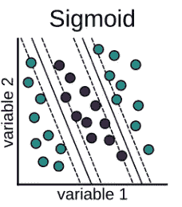

该核用于机器学习的神经网络领域。sigmoid 内核的激活函数是双极 sigmoid 函数。双曲线核函数的公式为:

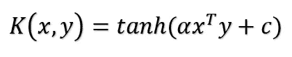

This kernel is very much used and popular among support vector machines.

## 方差分析径向基核

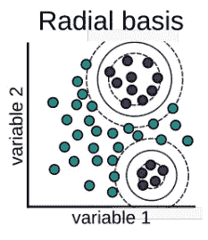

众所周知，这种核在多维回归问题中表现非常好，就像高斯核和拉普拉斯核一样。这也属于径向基核的范畴。方差分析内核的等式为:

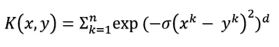

还有更多类型的内核。内核的选择完全取决于手边的数据类型。更多内核可以参考[这个](http://crsouza.com/2010/03/17/kernel-functions-for-machine-learning-applications/)资源。

感谢阅读！注意安全！

【参考文献:
[*https://www.educba.com/*](https://www.educba.com/)[*https://www.quora.com/*](https://www.quora.com/)