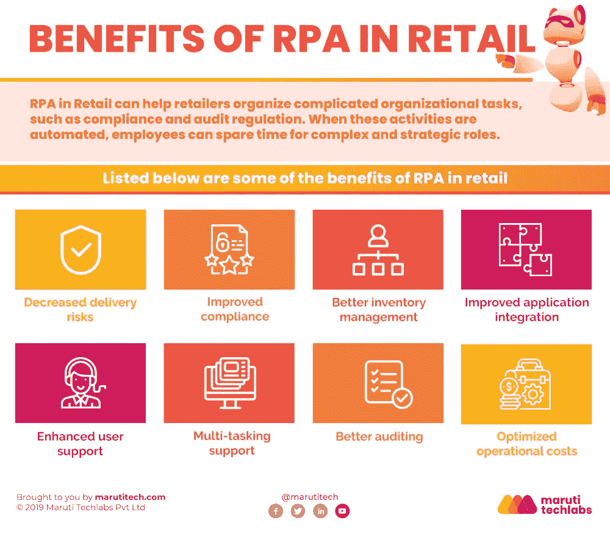

# RPA 在零售业中的主要优势

> 原文：<https://medium.com/geekculture/key-benefits-of-rpa-in-the-retail-industry-4a6e13ec2a?source=collection_archive---------17----------------------->

随着零售业在过去几年的飞速发展，零售商很难手动管理一切。[零售业中的机器人流程自动化](https://marutitech.com/robotic-process-automation-services/?utm_source=medium&utm_medium=content_promotion&utm_campaign=RPA_in_retail)已经成为零售业中改善服务交付和实现更高效率的最佳方式之一。

在这篇博客中，我们将探讨零售业自动化的范围和优势，以及零售业中 RPA 的主要使用案例。

# 零售中的 RPA 是什么？

零售业中的 RPA 本质上是一种自动化软件，需要最少的人工干预。它承担了人类完成的所有工作，精度更高，质量更好。

机器人流程自动化在零售业中的应用非常广泛，因为它可以在各种工作中实施。RPA 在零售业中的一些关键应用包括工作流管理、管理客户、处理退货、管理财务、分析市场流量、跟踪消费者行为等等。

# 零售中 RPA 的范围

总的来说，零售商面临着多重挑战，要求他们尽可能平稳高效地运营。这些挑战包括-

*   培训、留住和管理零售商店的关键员工。
*   保持大量库存，以确保按需无缝供应产品。
*   通过各种渠道为客户提供快速有效的服务和支持
*   按时处理和履行订单，以达到客户满意度

零售行业有一系列以客户为中心的流程，如发票、客户查询、库存管理和订单处理，因此有多个 RPA 使用案例来应对上述挑战并从自动化中受益。其中一些将在下面讨论

*   **管理库存**

零售业自动化通过自动化与警报相关的流程并实时监控客户响应，帮助公司改善部门间的协作，包括制造、R&D 和营销。此外，它还允许零售商更快地调整他们的定价、库存和生产。

*   **更好的销售分析**

RPA 使零售商能够尽快全面分析海量销售数据和需求。自动化分析还使他们能够更快地访问提供实时见解的报告，从而帮助他们探索最大限度地增加销售机会的方法。

*   **简化订单和退货处理**

RPA 通过避免处理这些活动中的任何延迟，使零售商能够更快地处理订单和退货。这导致更多的空闲时间和带宽来处理异常。

*   **改善店内规划**

RPA 使零售商能够使用数据来预测客户期望，并根据特定客户的偏好制定更好的商店特定商品处置计划。

# 零售领域的 RPA 有什么帮助？

除了简化零售行业的最基本任务，如数据分析、产品扫描和库存管理，RPA 还满足许多管理流程的需求。

这导致了更好的客户关系管理、成本降低、高级审计、生产力提高等等。

除此之外，零售中的 RPA 在用于消费者行为分析时，将有助于推动有效的贸易促销、管理订阅续订、网站客户登录、索赔处理、会员卡管理和客户投诉。

# 零售行业 RPA 的优势

RPA 在零售行业中的一些显著优势列举如下-

*   提高整体产品可用性以满足市场需求
*   减少业务操作中的错误几率
*   通过数据管理自动化帮助提高操作效率
*   提供销售和库存的实时分析，以实现高效规划
*   它有助于通过更快的订单和退货处理来提高客户满意度
*   通过更具创新性的促销活动为零售客户提供更多价值
*   释放管理人员的时间，以便他们能够专注于改善客户体验

# 包装

越来越多的零售企业整合了机器人流程自动化(RPA)等颠覆性技术，以实现高效无误的运营。如果您希望了解如何在业务中成功实施 RPA，请查看我们的[详细指南](https://marutitech.com/successful-rpa-implementation/?utm_source=medium&utm_medium=content_promotion&utm_campaign=RPA_in_retail)。

凭借发票处理、库存管理、业务分析等大量流程，零售行业的 RPA 拥有大量使用案例。它可以帮助实现更高的效率、更高的客户满意度和更低的成本。在[马鲁蒂技术实验室](https://marutitech.com/?utm_source=medium&utm_medium=content_promotion&utm_campaign=RPA_in_retail)，我们提供端到端的机器人过程自动化服务，我们关注功能和技术方面，从而产生高商业价值影响。