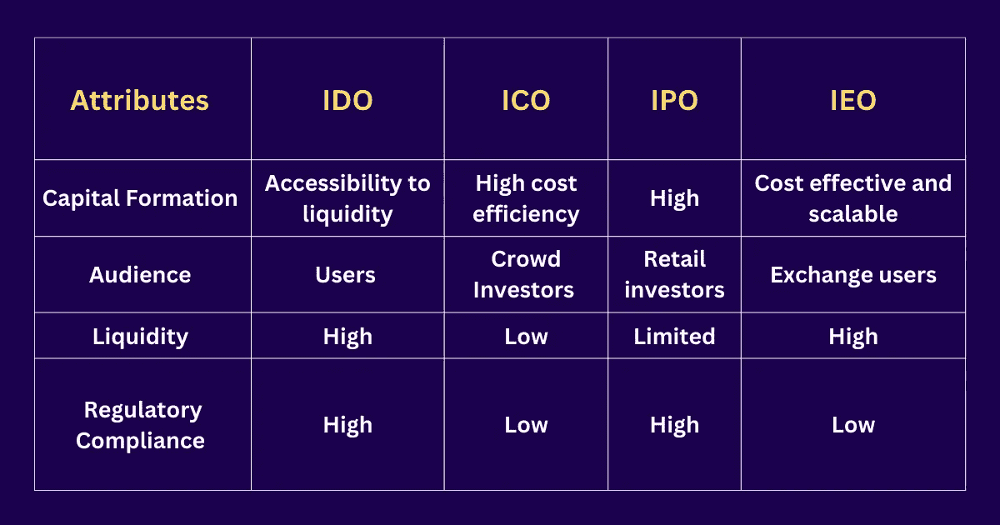

# IDO、ICO、IEO 和 IPO 之间的主要区别

> 原文：<https://medium.com/geekculture/key-differences-between-ido-ico-ieo-and-ipo-10dad82b9e5d?source=collection_archive---------9----------------------->

当谈到寻找资助新项目的方法时，密码行业是高度创新的。

密码行业充斥着看起来过于相似的混乱缩写。通过这篇博客，我们决定向你解释其中的一些。

让我们来看看 ico、IPO、ieo 和 ido 有什么不同。

## **什么是 ICO？**

首次发行硬币(简称 ICO)是一种团体为加密货币相关项目筹集资金的方式。它描述了一个团队创造基于区块链的代币，然后以折扣价出售给投资者以支持其运营。这个短语来源于传统的金融表达首次公开募股(IPO ),描述的是一家公司出售股票向公众募集资金。然而，这两种筹集资金的方法非常不同。

ico 是一种融资技术，使企业能够在非常早期的阶段，甚至在产品正式推出之前，为他们的想法筹集资金，适用于科技初创公司。通过 ICO 购买代币的投资者没有获得任何股权。

总的想法是，如果投资者认为项目有价值，他们会以较低的价格购买提前为项目提供动力的代币，一旦项目盈利，就以较高的价格出售。

ico 的主要好处之一是公司可以很容易地筹集资金。此外，它们为 ICO 管理提供了相当大的好处。这些经理人在按照 ICO 的要求创造代币后，将代币分发给个人投资者。

如果一个公司是可行的和有潜力的，ICO 可以为它提供成长所需的资金。以太坊就是这种情况；这个项目用这笔钱来发展。长期持有 ico 代币的投资者也获得了可观的收益。

继续，让我们讨论一下这个，

## **什么是首次公开募股？**

首次公开募股。这说明了一家公司如何通过出售其公司的股票来筹集资金。

与加密货币行业的对等物 ICO 相比，IPO 是普通公司获得资金的方式。投资者在 IPO 中获得一家公司的股票，而在 ICO 中，他们获得的是一个不反映公司任何股权的代币。这就是它们之间的不同之处。此外，IPO 比 ico 更受监管。

继续，让我们讨论一下，

## 什么是 IEO？

不断变化的数字资产世界最近出现了初始交换要约(ieo)。ieo 是首次发行数字资产(如硬币或代币)来筹集资金，与首次发行硬币(ico)非常相似。另一方面，ieo 被誉为对 ico 的改进，因为它们是由在线交易平台代表企业直接提供的——通常是收费的——为数字资产提供即时交易机会。

在 IEO 使用的交易平台必须符合证券法规。ieo 可能比 ico 具有更大的合法性，因为交易所在支持任何项目之前必须维护自己的声誉，这与少数几个可以监督 ico 的可信方形成对比。

继续，让我们讨论一下这个，

## **什么是 IDO？**

“DEX”是一个分散的交易所,“IDO”是一个首次发行的 DEX。类似于股票交易所，分散式交易所无人管理。因此，买家和卖家只是彼此做生意，而不是利用交易所从卖家那里购买硬币，然后卖给买家。

去中心化的交易所就像从跳蚤市场购买，ICO 就像从艺术家那里购买，交易所就像从拍卖行购买。与 ICOs 类似，它快速、简单、令人愉快，但也给消费者带来了许多负担和责任。分散式交易所实际上比现在更著名的控制式交易所还要古老。

继续，让我们讨论一下

## **IPO、ICO、IDO、IEO 的主要区别！**

它们之间的主要区别是:

## **结论**

在加密领域，新的企业不断涌现。这些企业大多需要资金，而 ico、ieo、IPOs 和 ido 提供了筹集成功所需资金的最佳机会。

由于从 ICO 到 IEO 以及从 IPO 到 IDO 的过渡，对于投资者和 [**加密项目**](https://coinfantasy.io/?utm_source=Medium&utm_medium=Blog&utm_campaign=Narmatha) 的所有者来说，业务动态都有了显著的改善。DeFi 行业正在迅速扩张，这对于发展中的 IDO 行业更为有利。

我们希望你喜欢这个博客中的信息。如果你发现这些信息有用，那就和其他可能也觉得这个博客有用的人分享吧。