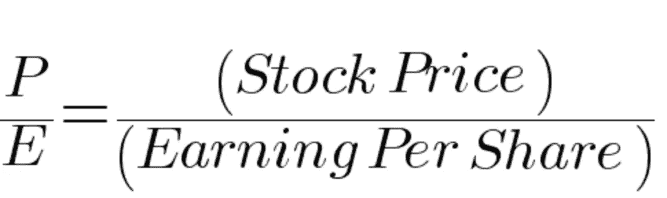
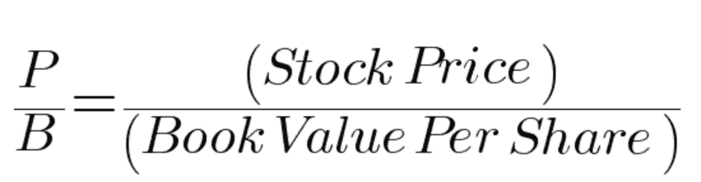
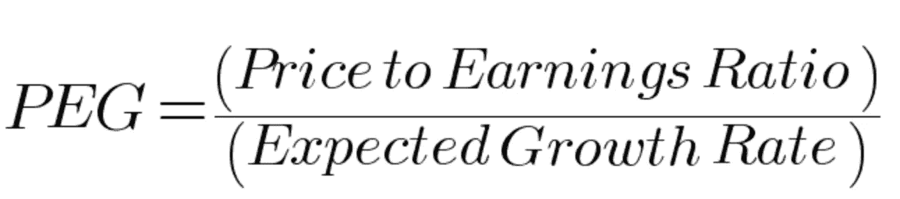
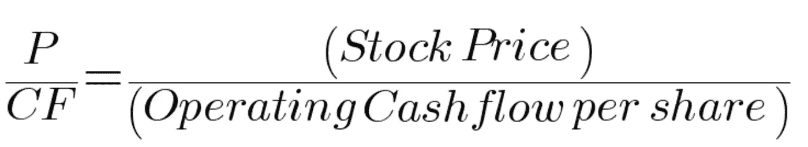
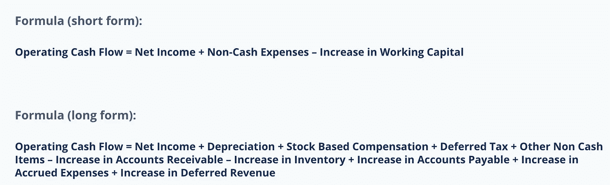
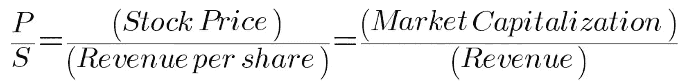
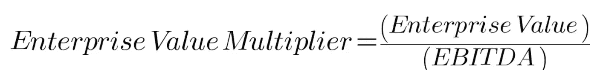
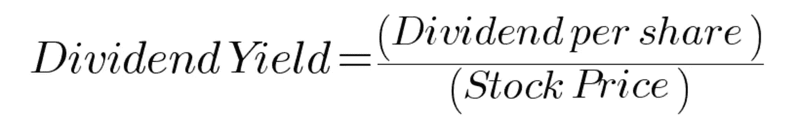

# 股票基本面分析的关键比率:投资估值(上)

> 原文：<https://medium.com/geekculture/key-ratios-for-fundamental-analysis-of-stocks-investment-valuation-part-1-99846ecd8ca8?source=collection_archive---------8----------------------->

介绍一组可能详尽的比率，用于评估股票市场中公司股票的质量和基本面。

Photo by [bantersnaps](https://unsplash.com/@bantersnaps?utm_source=medium&utm_medium=referral) on [Unsplash](https://unsplash.com?utm_source=medium&utm_medium=referral)

# **目标**

本文的主要目的是了解可用于判断股票内在价值/估值的各种财务比率(与股票/权益一起使用)，了解盈利能力、流动性、其他基本面及其长期前景。各种基金经理使用许多我们将会看到的比率，来更新(+/-)他们持有的股票的百分比分配，或者将任何新的预期股票添加到他们的各种基金中。我们要研究的每个比率都有不同的目标(即表明股票的特定特征)。多个比率的组合表现良好，将表明股票看起来适合投资，反之亦然。

# **先决条件**

***给定的先决条件都是好具备的。我会尽可能详细地解释大部分术语。***

1.  公司资产负债表中使用的基本术语(收入、资产、负债等)。
2.  对股票市场及其运作方式有基本的了解。

Let us put that lens (Photo by [Scott Graham](https://unsplash.com/@homajob?utm_source=medium&utm_medium=referral) on [Unsplash](https://unsplash.com?utm_source=medium&utm_medium=referral))

# **介绍性术语和要点**

1.  用于计算这些比率的时间段是每年一次(通常)。但是，可以计算任何时间段(季度、月等)的比率。某些比率也可以使用 TTM 方法计算(过去 12 个月)。还有各种其他方法可以计算和查看这些比率。
2.  如果你不熟悉基本的资产负债表术语，我建议你通读这篇快速的 [**文章**](https://www.inc.com/articles/2000/05/18941.html) 。它解释了我要写在这里的大部分术语。

# **投资估价**

投资评估基本上是用于确定资产价值的工具和技术(在我们的例子中是股票)。它基本上是一项资产的理想支付金额的推导。我们将着眼于各种比率，可以用来确定一只股票是否被高估或低估。

# 投资估值比率

1.  **市盈率(P/E 比率)**

每股收益(EPS)的计算方法是将公司利润除以当前股价。

众所周知的市盈率，是最常用的比率，它表明一只股票是被高估了还是被低估了。

市盈率有助于我们了解股票的市场价值与公司收益的对比。从本质上来说，市盈率指的是投资者为了从一家公司获得一美元的收益而期望在该公司投资的金额。

尽管对这一比率有许多解释，但最常见的是，高市盈率表明该股票被高估(与其收益相比，为该股票支付的价格更高)，低市盈率表明该股票被低估(与其收益相比，为该股票支付的价格更低)，并且更有增长潜力。还有，这个比例没有具体的范围。通常一家公司的市盈率是通过与同行业同行的平均市盈率进行比较来了解其估值。

**2。价格账面价值比率(市净率)**

[市值(公司的价值)是其股价乘以发行在外的股票数量。账面价值是总资产-总负债，可以在公司的资产负债表中找到。](https://www.investopedia.com/ask/answers/010915/what-considered-good-price-book-ratio.asp)

市净率将一家公司的市值或市场价值与其账面价值进行比较。具体来说，它将公司的股票价格与其每股账面价值进行比较(BVPS)。

[换句话说，如果一家公司清算了所有的资产，还清了所有的债务，剩余价值就是公司的账面价值。](https://www.investopedia.com/ask/answers/010915/what-considered-good-price-book-ratio.asp)

通常，该比率小于 1 的公司被认为被低估，但这也因行业而异，取决于该类型公司或行业的运营模式。

**3。市盈率增长比率(PEG)**

预期增长基本上是公司的 CAGR(复合年增长率)，或者简单地说，公司收益每年增长多少。

[**PEG 比率**(价格/收益与增长比率)是一种估值指标，用于确定股票价格、每股收益(EPS)和公司预期增长之间的相对权衡。](https://en.wikipedia.org/wiki/PEG_ratio)

[一般来说，增长率越高的公司，市盈率越高。因此，仅使用市盈率会让高增长公司相对于其他公司显得估值过高。假设用市盈率除以盈利增长率，得出的比率更适合比较不同增长率的公司。](https://en.wikipedia.org/wiki/PEG_ratio)

通常 PEG 值低于 1 表示股票被低估，高于 1 表示股票被高估，等于 1 表示股票价格合理。简单来说，如果公司的股价与其增长率同步上涨，就意味着市场正在将公司的实际增长复制到其股票的市值上。

**4。价格现金流比率(P/CF)**

经营性现金流是公司正常经营产生的现金量。如果一家公司能够产生正的现金流，这意味着它能够维持和发展其业务，否则它需要寻找外部融资来扩张。

Source: [https://corporatefinanceinstitute.com/resources/knowledge/accounting/operating-cash-flow/](https://corporatefinanceinstitute.com/resources/knowledge/accounting/operating-cash-flow/)

价格与现金流(P/CF)比率是衡量股票价格相对于其每股经营现金流的价值。

[价格与现金流比率衡量的是一家公司相对于其股价产生了多少现金，而不是它相对于其股价记录了多少收入，这是通过市盈率(P/E)来衡量的。据说，与市盈率相比，现金流价格比是一个更好的投资估值指标，因为现金流不像收益那样容易操纵，收益会受到折旧和其他非现金费用等项目的会计处理的影响。例如，一些公司可能因为大量的非现金支出而显得无利可图，尽管它们有正的现金流。](https://www.investopedia.com/terms/p/price-to-cash-flowratio.asp)

P/CF 在评估有正现金流但由于大量非现金费用而无利可图的股票时特别有用。这个比率没有具体的范围，因为它取决于公司的部门和行业。相对较低的比率表明股票被低估，反之亦然。

这是我最喜欢的比率之一，也是鲜为人知的比率。我喜欢这一点的主要原因是它包含了公司的经营现金流，这是公司发展是否顺利以及未来是否有增长前景的关键因素。停滞或减少的现金流对一个公司来说是非常危险的。

**5。价格销售比率(P/S)**

市净率非常简单。它是股票价格与每股年收入的比率，或者相当于公司市值与年销售额/收入的比率。

P/S 比率因行业而异，因此可以与同行进行比较。通常小于 1 的比率表明股票是一个好买卖，因为投资者为每单位销售支付的费用更少。

然而，一家公司可能是无利可图的，市盈率很低。因此，除了这个比率，还有其他指标需要考虑。这个比率可以用来比较股票在过去几年中与自身的表现，也可以与同行业的同行进行比较。

**6。企业价值乘数比率(EVM)**

**企业价值=市值+债务总额-现金/现金等价物**

**EBITDA =息税折旧摊销前收益**

[企业价值(EV)是一家公司经济价值的衡量标准。如果企业被收购，它经常被用来确定企业的价值。它被认为是比市值更好的并购估值指标，因为它包括了收购者必须承担的债务和他们将收到的现金。](https://www.investopedia.com/terms/e/ev-ebitda.asp)

EVM，也被称为 EV-EBITDA 倍数，是一个用来确定公司价值的比率。除了股价，EVM 还考虑公司的债务和现金水平，并将该价值与公司的现金盈利能力进行比较。

这个比例因行业而异。通常，高增长行业表现出高 EVM，低增长行业表现出低 EVM。

相对较低的 EVM 表明股票被低估。此外，为了更好地保证公司的前景，不仅要看这个比率的历史值，还要看未来的预期值。

**7。股息率**

投资不仅仅是基于增长。也有一组基于收入的投资者，他们更喜欢从公司获得一致的股息，这有助于保护资本，而且股票对他们来说也是一种固定资产(如 FD)。

股息收益率越高，股票的质量和增长前景就越好，因为它鼓励投资者继续投资股票，也有助于带来更多的资金/投资者。验证股息支付和收益在很长一段时间(几年)内保持一致是很重要的。

假设 FD 利率是 5%，CAGR = 3%的股票的股息率也是 5%(比如一家 PSU 公司)。投资这家公司并随着股票升值获得与股息相同的利息会更有意义。

# 摘要

我喜欢上市如何增加一家公司可能的增长前景的概念。这取决于公司和发起人如何接近散户投资者(一般公众)、fii、dii 的信仰，并更加努力地发展公司。这些比率和指标有助于我们作为普通公众了解一家公司是否表现出持续增长的良好前景，从而对其进行投资。

***免责声明:*** *这些比率并不是投资者投资前唯一看的。很多时候，情绪、发起人的长期目标和许多其他因素都起着重要的作用。如前所述，基本面分析主要用于长期投资，而不是短期投资。最后，投资市场是有风险的，人们应该对此保持警惕。我不是股票市场的专家，但我对它非常感兴趣，天生好奇，因此不断更新自己。*

***注 1:*** *由于这篇文章篇幅太大，我决定在接下来的部分讨论我学到的其他财务比率。我个人认为，一口气通读所有比率会变得令人不知所措。*

***注 2:*** *我正在考虑创建一个库/模块，可以计算所有上市公司的所有这些比率，我们可以以自动化的方式获得这些数据。如果有人有兴趣合作，请点击*[*Linkedin*](https://in.linkedin.com/in/priyansh-soni03a71)*联系我。*